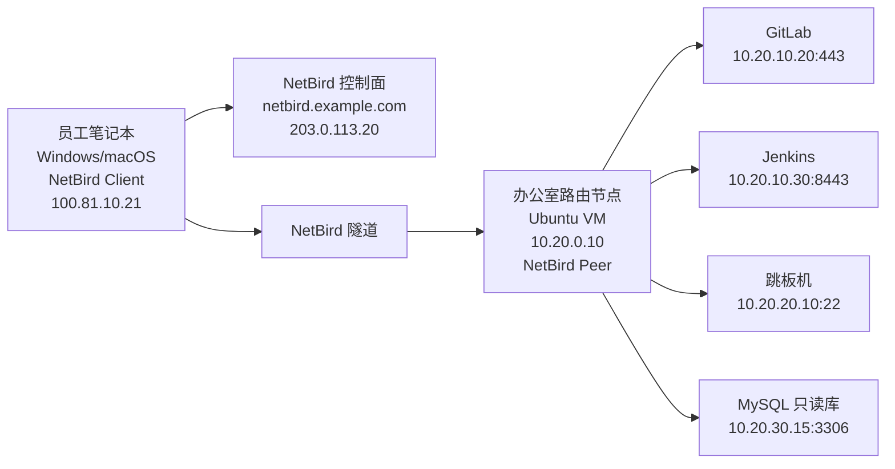

# 案例一：用 NetBird 替代 OpenVPN（远程办公接入企业内网）

> 本文适用于最常见的“员工笔记本访问办公室内网资源”场景。
> 示例中的公网 IP 使用 RFC 文档保留地址，内网使用 RFC1918 私网地址。复制时只需要替换域名、Setup Key、网段和目标主机即可。

## 1. 场景目标

原有环境：

- 公司原来使用 OpenVPN。
- 员工需要访问办公室里的 GitLab、Jenkins、跳板机、数据库读库。
- 运维希望去掉每人一份 `.ovpn` 配置文件和集中式大网段放行。

改造目标：

- 只允许员工访问必要资源，不默认全网互通。
- 新员工拿到客户端后，登录或导入 Setup Key 就能用。
- 办公网关只负责把企业网段接入 NetBird，不在每台内网主机上装客户端。

## 2. 示例拓扑



## 3. 工作原理

这一类场景在 NetBird 官方里属于 `VPN-to-Site`。

核心逻辑：

1. 员工笔记本安装 NetBird 客户端，作为真正的 `Peer` 加入网络。
2. 办公室内部放一台“路由节点”，它既能访问内网资源，也运行 NetBird 客户端。
3. 在 NetBird 控制台里把办公室资源声明成 `Networks / Resources`。
4. 再用 `Groups + Access Policies` 决定谁能访问哪些资源和端口。

和 OpenVPN 最大的区别：

- OpenVPN 往往是“连上就进整个内网”。
- NetBird 更适合“按资源、按端口、按用户组”放行。

## 4. 环境准备

### 4.1 你的示例参数

可直接替换为你自己的参数：

| 项目 | 示例值 |
| --- | --- |
| NetBird 域名 | `netbird.example.com` |
| NetBird 公网 IP | `203.0.113.20` |
| 办公室内网网段 | `10.20.0.0/16` |
| GitLab | `10.20.10.20:443` |
| Jenkins | `10.20.10.30:8443` |
| 跳板机 | `10.20.20.10:22` |
| 只读库 | `10.20.30.15:3306` |
| 办公室路由节点 | `10.20.0.10` |

### 4.2 路由节点要求

办公室路由节点需要满足：

- 能访问 `10.20.0.0/16` 内网。
- 能出公网访问 `netbird.example.com:443`。
- 已安装 NetBird 客户端。
- 建议固定 IP，不要频繁变更。

## 5. 控制台配置步骤

### 5.1 创建用户组

在 NetBird 控制台中：

1. 进入 `Access Control`。
2. 创建组 `employees`。
3. 创建组 `office-resources`。
4. 把员工笔记本加入 `employees`。

### 5.2 创建网络与资源

进入 `Networks`：

1. 创建网络：`office-hz`。
2. 添加路由节点：选择办公室路由节点 `10.20.0.10` 对应的 Peer。
3. 添加资源：

| 资源名 | 类型 | 值 |
| --- | --- | --- |
| `gitlab-prod` | Host | `10.20.10.20` |
| `jenkins-prod` | Host | `10.20.10.30` |
| `bastion-prod` | Host | `10.20.20.10` |
| `mysql-readonly` | Host | `10.20.30.15` |

4. 将这些资源归到资源组 `office-resources`。

### 5.3 配置访问策略

进入 `Access Control > Policies`，增加策略：

| 源组 | 目标组 | 协议 | 端口 |
| --- | --- | --- | --- |
| `employees` | `office-resources` | TCP | `22,443,8443,3306` |

如果你不想让所有员工访问数据库：

- 新建组 `db-readers`
- 把数据库只读用户的设备加入 `db-readers`
- 再额外创建：

| 源组 | 目标组 | 协议 | 端口 |
| --- | --- | --- | --- |
| `db-readers` | `office-resources` | TCP | `3306` |

更推荐的做法：

- `employees` 只放 `22,443,8443`
- `db-readers` 单独放 `3306`

## 6. 客户端加入方式

### 6.1 图形界面登录

适合员工电脑：

1. 安装官方客户端。
2. 打开客户端。
3. 点击登录。
4. 浏览器跳转到 `https://netbird.example.com`。
5. 完成组织登录后自动接入。

### 6.2 Setup Key 加入服务器

适合办公室路由节点：

```bash
curl -fsSL https://pkgs.netbird.io/install.sh | sh
sudo netbird up \
  --management-url https://netbird.example.com \
  --setup-key NBSETUP-EXAMPLE-REPLACE-ME
```

接入后检查：

```bash
netbird status
ip addr show wt0
```

## 7. 验证命令

员工笔记本上执行：

```bash
nc -vz 10.20.20.10 22
curl -I https://10.20.10.20
nc -vz 10.20.10.30 8443
nc -vz 10.20.30.15 3306
```

预期结果：

- 在授权策略内的端口应连通。
- 没有授权的端口应失败。
- 未加入 `employees` 的设备不应看到这些资源。

## 8. 为什么这套配置比 OpenVPN 更适合

### OpenVPN 常见问题

- 很多公司直接推一个大网段，例如 `10.20.0.0/16` 全放。
- 只要连上 VPN，内部很多服务默认就暴露给了用户。
- 新增资源常常要改 VPN 网段、再配额外防火墙。

### NetBird 改进点

- 路由和权限分开管理。
- 可以只让用户看到允许访问的资源。
- 用户组、资源组、策略天然适合团队增长。

## 9. 常见坑

### 9.1 路由节点能加入，但访问不到内网

检查项：

- 路由节点本机是否真能访问 `10.20.0.0/16`
- 路由节点是否加入了正确网络
- 资源是否分到了正确的资源组

### 9.2 用户已连上 NetBird，但看不到资源

检查项：

- 用户设备是否在 `employees`
- 策略的源组和目标组是否写反
- 目标资源是否真的在 `office-resources`

### 9.3 数据库访问超时

常见原因：

- 数据库本身只监听 `127.0.0.1`
- 数据库主机本机防火墙未放行来自路由节点的流量
- `3306` 没进 ACL

## 10. 你可以直接抄的最小配置清单

部署完成后，你至少要准备：

1. 一个路由节点
2. 一个员工组 `employees`
3. 一个资源组 `office-resources`
4. 一条 `employees -> office-resources` 的访问策略
5. 至少一个资源，比如 `10.20.10.20:443`

## 11. 官方参考

- Self-hosted Quickstart: [NetBird Docs](https://docs.netbird.io/selfhosted/selfhosted-quickstart)
- Networks: [NetBird Docs](https://docs.netbird.io/how-to/networks)
- Access Control: [NetBird Docs](https://docs.netbird.io/manage/access-control/manage-network-access)
- Site-to-Site / VPN-to-Site: [NetBird Docs](https://docs.netbird.io/use-cases/setup-site-to-site-access)
