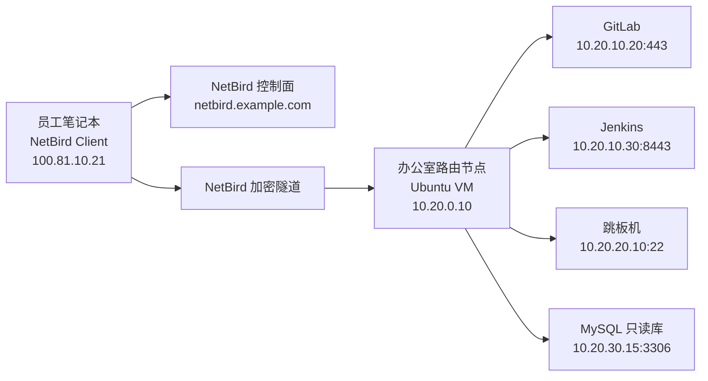

# 案例一：用 NetBird 替代 OpenVPN（远程办公接入企业内网）

> 本文适用于最常见的“员工笔记本访问办公室内网资源”场景。
> 示例中的公网 IP 使用 RFC 文档保留地址，内网使用 RFC1918 私网地址。复制时只需要替换域名、Setup Key、网段和目标主机即可。

## 1. 最终效果

完成后，员工电脑登录 NetBird，就可以访问公司内网里的指定资源：

- GitLab：`https://10.20.10.20`
- Jenkins：`https://10.20.10.30:8443`
- 跳板机：`10.20.20.10:22`
- MySQL 只读库：`10.20.30.15:3306`

同时满足：

- 普通员工不能默认访问整个 `10.20.0.0/16`。
- 数据库权限可以单独给 `db-readers`。
- 办公室内网不需要每台服务器都安装 NetBird。
- 后续新增系统时，只新增资源和策略，不重新发 `.ovpn` 文件。

## 2. 工作原理

传统 OpenVPN 经常是“员工连上 VPN 后进入一个大内网”。NetBird 推荐把事情拆成三层：

1. 路由节点：办公室内放一台 Linux VM，运行 NetBird Client，并能访问内网资源。
2. 网络资源：在 NetBird Dashboard 的 `Networks` 里声明 GitLab、Jenkins、跳板机、数据库这些目标。
3. 访问策略：用 `Groups + Policies` 控制哪些人能访问哪些资源和端口。

流量路径如下：


```mermaid
flowchart LR
    U["员工笔记本\nNetBird Client\n100.81.10.21"] --> NB["NetBird 控制面\nnetbird.example.com"]
    U --> WG["NetBird 加密隧道"]
    WG --> GW["办公室路由节点\nUbuntu VM\n10.20.0.10"]
    GW --> GIT["GitLab\n10.20.10.20:443"]
    GW --> JENKINS["Jenkins\n10.20.10.30:8443"]
    GW --> BASTION["跳板机\n10.20.20.10:22"]
    GW --> DB["MySQL 只读库\n10.20.30.15:3306"]
```

推荐优先使用 `Networks`，不要直接创建一个覆盖整个办公室网段的大 Route。`Networks` 会强制你把资源和策略分开，默认更适合最小权限。

## 3. 示例参数

| 项目 | 示例值 | 你需要替换成 |
| --- | --- | --- |
| NetBird 域名 | `netbird.example.com` | 你的自建 NetBird 域名 |
| 办公室路由节点 | `10.20.0.10` | 办公室内 Linux VM 固定 IP |
| 办公网段 | `10.20.0.0/16` | 你的办公室内网 CIDR |
| GitLab | `10.20.10.20:443` | 你的 GitLab 内网地址 |
| Jenkins | `10.20.10.30:8443` | 你的 Jenkins 内网地址 |
| 跳板机 | `10.20.20.10:22` | 你的 SSH 跳板机地址 |
| MySQL 只读库 | `10.20.30.15:3306` | 你的只读库地址 |
| 路由 Peer 组 | `office-routing-peers` | NetBird 路由节点组 |
| 员工组 | `employees` | 普通员工用户 / 设备组 |
| 数据库读者组 | `db-readers` | 能访问只读库的用户 / 设备组 |

## 4. 上线前检查

### 4.1 确认路由节点能访问内网资源

登录办公室路由节点 `10.20.0.10`：

```bash
ip addr
ip route
nc -vz 10.20.10.20 443
nc -vz 10.20.10.30 8443
nc -vz 10.20.20.10 22
nc -vz 10.20.30.15 3306
```

预期：

- 能连通 GitLab、Jenkins、跳板机。
- 数据库如果还没准备开放，可以先允许失败，但后续要单独处理数据库白名单。

如果路由节点自己都访问不了这些地址，先修办公室路由、交换机 ACL、服务器防火墙，不要继续配 NetBird。

### 4.2 确认服务监听地址

在目标服务器上检查服务是否只监听本机：

```bash
sudo ss -lntp
```

常见问题：

- GitLab / Jenkins 只监听 `127.0.0.1`。
- MySQL 的 `bind-address` 是 `127.0.0.1`。
- 服务器防火墙只允许旧 OpenVPN 网段。

如果 MySQL 只监听本机，需要把配置改成监听内网地址，例如：

```ini
[mysqld]
bind-address = 10.20.30.15
```

然后重启 MySQL，并只允许来自办公室路由节点或必要来源的访问。

## 5. 创建 Setup Key

进入 NetBird Dashboard：

1. 打开 `Settings > Setup Keys`。
2. 点击 `Create Setup Key`。
3. 名称填 `office-routing-peer`。
4. 类型建议选 `Reusable`，但限制使用次数，例如 `3`。
5. 设置过期时间，例如 `7 days`。
6. `Auto-assigned groups` 添加 `office-routing-peers`。
7. 复制 key，下面用 `NBSETUP-OFFICE-ROUTER-REPLACE-ME` 代替。

建议：

- 路由节点用单独 Setup Key，不要和员工电脑共用。
- Setup Key 不要写进公开仓库、脚本仓库或工单截图。
- key 用完后可以 revoke；已注册的 Peer 不会因为 key revoke 自动下线。

## 6. 部署办公室路由节点

在 `10.20.0.10` 上执行：

```bash
curl -fsSL https://pkgs.netbird.io/install.sh | sh
sudo netbird up \
  --management-url https://netbird.example.com \
  --setup-key NBSETUP-OFFICE-ROUTER-REPLACE-ME
```

检查状态：

```bash
netbird status
netbird status -d
ip addr show wt0
```

预期：

- `netbird status` 显示 `Connected`。
- Dashboard 的 `Peers > Servers` 能看到这台路由节点。
- Peer 自动加入 `office-routing-peers`。

持久化 Linux 转发配置：

```bash
sudo tee /etc/sysctl.d/99-netbird-router.conf >/dev/null <<'EOF'
net.ipv4.ip_forward=1
net.ipv6.conf.all.forwarding=1
EOF
sudo sysctl --system
sysctl net.ipv4.ip_forward
```

预期：

```text
net.ipv4.ip_forward = 1
```

## 7. 在 NetBird 创建办公室 Network

进入 `Networks`。

### 7.1 创建 Network

1. 点击 `Add Network`。
2. 名称填 `office-hz`。
3. Routing Peer 选择 `office-routing-peers`，或选择 `10.20.0.10` 对应的 Peer。
4. Masquerade / NAT 建议先开启。

为什么开启 Masquerade：

- 内网服务器看到的来源是 `10.20.0.10`，回程最简单。
- 不需要在办公室网关添加回程到 NetBird Overlay CIDR 的路由。
- 后续如果要审计真实客户端 IP，再关闭 Masquerade，并补回程路由。

### 7.2 添加 Resources

按单个系统拆资源，不要先放整个 `10.20.0.0/16`。

| 资源名 | 类型 | 值 | 资源组 |
| --- | --- | --- | --- |
| `office-gitlab-prod` | IP | `10.20.10.20/32` | `office-web-systems` |
| `office-jenkins-prod` | IP | `10.20.10.30/32` | `office-web-systems` |
| `office-bastion-prod` | IP | `10.20.20.10/32` | `office-ssh-systems` |
| `office-mysql-readonly` | IP | `10.20.30.15/32` | `office-db-systems` |

如果你的 NetBird UI 使用 `Host` 类型，填单个 IP 即可；如果使用 `IP` 类型，建议写成 `/32`。

## 8. 创建用户组和策略

进入 `Access Control > Groups`，创建：

| 组名 | 用途 |
| --- | --- |
| `employees` | 普通员工电脑 |
| `db-readers` | 允许访问只读库的员工 |
| `office-routing-peers` | 办公室路由节点 |
| `office-web-systems` | GitLab、Jenkins 等 Web 系统 |
| `office-ssh-systems` | 跳板机 |
| `office-db-systems` | 数据库 |

进入 `Access Control > Policies`，创建：

| 策略名 | 源组 | 目标组 | 协议 | 端口 |
| --- | --- | --- | --- | --- |
| `employees-to-office-web` | `employees` | `office-web-systems` | TCP | `443,8443` |
| `employees-to-office-bastion` | `employees` | `office-ssh-systems` | TCP | `22` |
| `db-readers-to-office-db` | `db-readers` | `office-db-systems` | TCP | `3306` |

策略原则：

- 不要用 `All -> office-*`。
- 数据库不要混在普通员工策略里。
- 如果你删除默认 `All -> All` 策略，记得为管理员和运维保留必要访问策略。

## 9. 员工电脑接入

### 9.1 图形界面登录

适合 Windows / macOS 员工电脑：

1. 安装官方客户端：https://docs.netbird.io/get-started/install
2. 打开 NetBird 客户端。
3. 点击登录。
4. 浏览器跳转到 `https://netbird.example.com`。
5. 登录成功后，客户端显示已连接。

检查：

```bash
netbird status
```

### 9.2 员工设备分组

进入 Dashboard：

1. 打开 `Peers`。
2. 找到员工电脑。
3. `Assigned Groups` 加入 `employees`。
4. 需要访问数据库的人，再加入 `db-readers`。

建议结合设备管理：

- 公司受管设备加入 `managed-laptops`。
- 私人设备不要加入生产资源策略。
- 后续可以配合 posture checks 做更细限制。

## 10. 验证

员工电脑执行：

```bash
netbird status
nc -vz 10.20.20.10 22
curl -k -I https://10.20.10.20
curl -k -I https://10.20.10.30:8443
nc -vz 10.20.30.15 3306
```

预期：

- `employees` 能访问 GitLab、Jenkins、跳板机。
- 不在 `db-readers` 的员工访问 `10.20.30.15:3306` 应失败。
- 加入 `db-readers` 后，访问数据库端口应成功。

在路由节点上辅助观察：

```bash
sudo tcpdump -ni any host 10.20.10.20 or host 10.20.30.15
```

如果开启 Masquerade，目标服务器日志里看到的来源通常是 `10.20.0.10`。

## 11. 使用域名访问内部系统

如果 GitLab 证书只签给域名，例如：

```text
gitlab.corp.internal
```

不要让员工用 IP 访问。推荐：

1. 确保办公室路由节点能解析内部域名：

```bash
getent hosts gitlab.corp.internal
curl -k -I https://gitlab.corp.internal
```

2. 在 `Networks` 里添加 Domain Resource：

| 资源名 | 类型 | 值 | 资源组 |
| --- | --- | --- | --- |
| `office-gitlab-domain` | Domain | `gitlab.corp.internal` | `office-web-systems` |
| `office-jenkins-domain` | Domain | `jenkins.corp.internal` | `office-web-systems` |

3. 员工电脑验证：

```bash
nc -vz gitlab.corp.internal 443
curl -I https://gitlab.corp.internal
```

注意：域名资源建议和大 IP 网段分开管理，避免域名解析到某个大网段后被其他策略间接放行。

## 12. 常见问题排查

### 12.1 员工已连接 NetBird，但 GitLab 不通

按顺序查：

1. 员工设备是否在 `employees`。
2. `employees-to-office-web` 策略是否启用。
3. `office-gitlab-prod` 是否在 `office-web-systems`。
4. 路由节点能否 `curl -k -I https://10.20.10.20`。
5. GitLab 主机防火墙是否允许来自 `10.20.0.10`。

### 12.2 SSH 跳板机不通

检查：

```bash
nc -vz 10.20.20.10 22
ssh -vvv user@10.20.20.10
```

常见原因：

- 没有 `employees -> office-ssh-systems -> TCP 22` 策略。
- 跳板机只允许旧 VPN 网段。
- 跳板机 `sshd_config` 限制了来源或用户。

### 12.3 数据库所有人都能连

检查：

- 是否还保留默认 `All -> All` 策略。
- 数据库资源是否误加入 `office-web-systems`。
- `employees` 策略是否误写了 `3306`。
- 用户设备是否被加入了 `db-readers`。

### 12.4 关闭 Masquerade 后访问失败

关闭 Masquerade 后，目标服务器看到的来源会是 NetBird Overlay IP，例如 `100.64.0.0/10` 中的地址。你必须在办公室网关添加回程路由：

```text
目的网段：100.64.0.0/10
下一跳：10.20.0.10
```

如果不会改办公室核心路由，先保持 Masquerade 开启。

## 13. 回滚

紧急回滚按影响面从小到大：

1. 在 `Access Control > Policies` 禁用新策略。
2. 在 `Networks` 禁用或删除对应资源。
3. 在员工设备上从 `employees` / `db-readers` 移除。
4. 在路由节点执行：

```bash
sudo netbird down
sudo systemctl stop netbird
```

5. 在 Dashboard 清理离线 Peer 和不再使用的 Setup Key。

## 14. 扩展做法

### 14.1 按部门拆权限

可以进一步拆：

| 用户组 | 允许访问 |
| --- | --- |
| `dev-team` | GitLab、Jenkins |
| `ops-team` | GitLab、Jenkins、跳板机 |
| `db-readers` | 只读库 |
| `security-auditors` | 审计平台、日志平台 |

### 14.2 路由节点高可用

准备两台办公室路由节点：

- `10.20.0.10`
- `10.20.0.11`

都加入 `office-routing-peers`，在 Network 里使用 routing peer group。优先级由 metric 控制：低 metric 是主节点，高 metric 是备用；相同 metric 时客户端倾向选择低延迟节点。

### 14.3 从 OpenVPN 平滑迁移

建议顺序：

1. 先只接入 GitLab。
2. 再接入 Jenkins。
3. 再接入跳板机。
4. 最后接入数据库。
5. 确认 1 到 2 周后再下线旧 OpenVPN。

每次新增资源，都先验证路由节点能访问目标，再配置 NetBird 资源和策略。

## 15. 官方参考

- Routing Peers 原理：https://docs.netbird.io/manage/networks/how-routing-peers-work
- Networks：https://docs.netbird.io/manage/networks
- Access Control：https://docs.netbird.io/manage/access-control/manage-network-access
- Setup Keys：https://docs.netbird.io/manage/peers/register-machines-using-setup-keys
- Site-to-Site：https://docs.netbird.io/use-cases/remote-access/site-to-site
