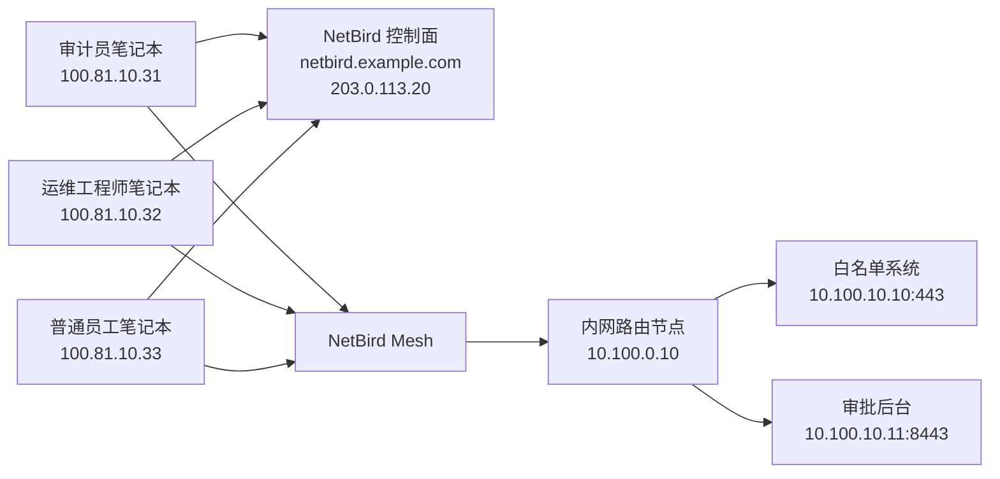

# 案例二：企业内部白名单系统接入（最小权限精细控制）

> 这是很多企业都会遇到的真实场景：内部白名单系统、财务审批系统、风控后台、审计平台不允许公网开放，但又需要一部分员工在外网办公时访问。

## 1. 场景目标

希望只允许如下用户访问内部系统：

- `sec-audit-team`
- `ops-team`

目标系统：

- 风控白名单后台：`10.100.10.10:443`
- 审批管理后台：`10.100.10.11:8443`

要求：

- 只有指定组可访问
- 只开放指定端口
- 非授权用户即使加入了 NetBird 也不能访问

## 2. 示例拓扑



## 3. 工作原理

在 NetBird 里，这类场景推荐用：

- `Networks` 定义内部资源
- `Groups` 定义人和设备
- `Policies` 控制哪些组能看到哪些资源和端口

重点不是“连进内网”，而是“只放行最少必要资源”。

## 4. 示例参数

| 项目 | 示例值 |
| --- | --- |
| 控制面域名 | `netbird.example.com` |
| 路由节点 | `10.100.0.10` |
| 白名单系统 | `10.100.10.10:443` |
| 审批后台 | `10.100.10.11:8443` |
| 资源网段 | `10.100.10.0/24` |

## 5. 实施步骤

### 5.1 创建用户组

进入 `Access Control > Groups`：

1. 创建组 `sec-audit-team`
2. 创建组 `ops-team`
3. 创建组 `internal-whitelist-systems`

### 5.2 创建网络资源

进入 `Networks`：

1. 新建网络：`internal-whitelist-zone`
2. 绑定路由节点：`10.100.0.10`
3. 添加资源：

| 资源名 | 类型 | 值 |
| --- | --- | --- |
| `risk-whitelist-ui` | Host | `10.100.10.10` |
| `approval-ui` | Host | `10.100.10.11` |

4. 将资源加入组 `internal-whitelist-systems`

### 5.3 创建访问策略

进入 `Access Control > Policies`，创建两条策略：

| 源组 | 目标组 | 协议 | 端口 |
| --- | --- | --- | --- |
| `sec-audit-team` | `internal-whitelist-systems` | TCP | `443,8443` |
| `ops-team` | `internal-whitelist-systems` | TCP | `443,8443` |

如果你希望审计组只能看白名单系统，运维组只能看审批后台，推荐拆成两个目标组：

- `risk-whitelist-group`
- `approval-group`

然后分别建策略，而不是共用一个资源组。

## 6. 推荐配置方式

### 方式 A：单资源单组

适合权限要求严格的团队：

- 每个系统单独建资源组
- 每条策略只对应一个系统

优点：

- 最容易审计
- 最不容易误放行

### 方式 B：多个系统合并一组

适合系统非常少的小团队：

- 两三个系统归一个资源组
- 用一条策略统一放行

优点：

- 配置快

缺点：

- 后续系统增多后容易失控

## 7. 客户端验证

授权用户执行：

```bash
curl -I https://10.100.10.10
nc -vz 10.100.10.11 8443
```

非授权用户执行同样命令，应该失败。

## 8. 真实上线建议

### 8.1 给 HTTPS 系统加域名

如果你不想让用户直接记 IP，建议配内网域名：

- `risk-ui.corp.internal`
- `approval.corp.internal`

然后在 NetBird 中把它们做成 `Domain Resource`。

这样用户访问体验更接近正常办公系统。

### 8.2 搭配设备组做双重约束

推荐同时满足：

- 人属于 `sec-audit-team`
- 设备属于 `managed-laptops`

这样离职员工或者私有设备不会误拿到权限。

## 9. 常见坑

### 9.1 用户能连 NetBird，但网页打不开

常见原因：

- 策略只放了 `443`，系统实际跑在 `8443`
- 后台服务只信任内网源地址，需要把路由节点地址加白名单
- 后端 TLS 证书不受信任

### 9.2 资源能 ping 通，但 HTTPS 失败

检查：

- 应用是否必须依赖特定域名
- 是否需要把内网域名做成 Domain Resource
- 是否需要启用后端反向代理信任

### 9.3 普通员工也能访问

检查：

- 资源是否被错误加入 `All` 组
- 策略是否误用了过大的源组
- 是否有旧策略未清理

## 10. 可直接替换的最小示例

如果你今天要先跑通一个系统，最小可以这样做：

1. 路由节点：`10.100.0.10`
2. 资源：`10.100.10.10`
3. 用户组：`sec-audit-team`
4. 资源组：`risk-whitelist-group`
5. 策略：`sec-audit-team -> risk-whitelist-group -> TCP 443`

## 11. 官方参考

- Networks: [NetBird Docs](https://docs.netbird.io/how-to/networks)
- Routing IP resources: [NetBird Docs](https://docs.netbird.io/manage/networks/routing-traffic-to-multiple-resources)
- Access Control: [NetBird Docs](https://docs.netbird.io/manage/access-control/manage-network-access)
