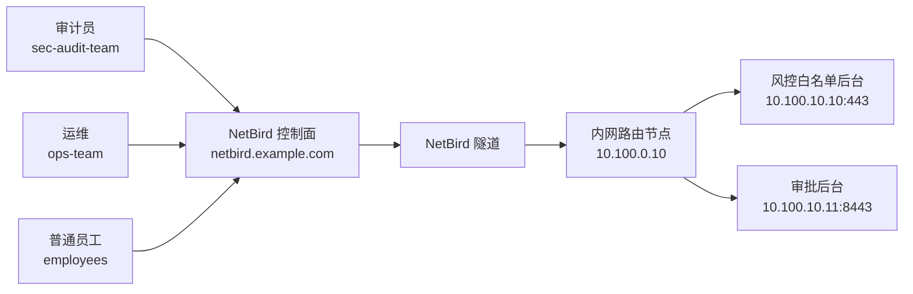

# 案例二：企业内部白名单系统接入（最小权限精细控制）

> 这是很多企业都会遇到的真实场景：风控后台、财务审批、审计平台、运维控制台不能公网开放，但外部办公时又需要少数人员访问。

## 1. 最终效果

完成后：

- `sec-audit-team` 可以访问风控白名单后台：`10.100.10.10:443`
- `ops-team` 可以访问审批管理后台：`10.100.10.11:8443`
- 普通员工即使登录了 NetBird，也不能访问这两个系统。
- 如果系统依赖 HTTPS 域名，也可以用 `risk-ui.corp.internal`、`approval.corp.internal` 访问。

这个案例的重点不是“打通内网”，而是“只放行最少必要资源”。

## 2. 工作原理

这类场景推荐使用 `Networks + Network Resources + Access Policies`：

1. 内网路由节点负责把企业内部系统接入 NetBird。
2. 每个敏感系统单独创建资源组。
3. 用户组只被授权访问指定资源组和指定端口。
4. 非授权用户没有匹配策略，即使能登录 NetBird，也访问不到目标系统。


```mermaid
flowchart LR
    Audit["审计员\nsec-audit-team"] --> NB["NetBird 控制面\nnetbird.example.com"]
    Ops["运维\nops-team"] --> NB
    Staff["普通员工\nemployees"] --> NB
    NB --> Tunnel["NetBird 隧道"]
    Tunnel --> Router["内网路由节点\n10.100.0.10"]
    Router --> Risk["风控白名单后台\n10.100.10.10:443"]
    Router --> Approval["审批后台\n10.100.10.11:8443"]
```

## 3. 示例参数

| 项目 | 示例值 | 你需要替换成 |
| --- | --- | --- |
| NetBird 域名 | `netbird.example.com` | 你的自建 NetBird 域名 |
| 内网路由节点 | `10.100.0.10` | 能访问敏感系统的 Linux VM |
| 风控白名单后台 | `10.100.10.10:443` | 你的风控系统地址 |
| 审批管理后台 | `10.100.10.11:8443` | 你的审批系统地址 |
| 风控内网域名 | `risk-ui.corp.internal` | 可选 |
| 审批内网域名 | `approval.corp.internal` | 可选 |
| 路由 Peer 组 | `whitelist-routing-peers` | 路由节点组 |
| 审计组 | `sec-audit-team` | 审计人员和设备 |
| 运维组 | `ops-team` | 运维人员和设备 |
| 受管设备组 | `managed-laptops` | 公司受管终端 |

## 4. 上线前检查

### 4.1 路由节点到系统连通性

登录内网路由节点 `10.100.0.10`：

```bash
ip route
nc -vz 10.100.10.10 443
nc -vz 10.100.10.11 8443
curl -k -I https://10.100.10.10
curl -k -I https://10.100.10.11:8443
```

预期：

- TCP 端口连通。
- HTTPS 返回 `200`、`302`、`401`、`403` 都可以，说明到应用层了。
- 如果这里失败，先修内网防火墙或应用监听地址。

### 4.2 检查后端系统白名单

很多白名单系统本身会限制来源 IP。开启 Masquerade 时，后端看到的来源通常是路由节点内网 IP：

```text
10.100.0.10
```

请在后端系统白名单中加入：

```text
10.100.0.10/32
```

如果你关闭 Masquerade，后端看到的来源会是 NetBird Overlay IP，例如 `100.64.0.0/10` 中的地址。这种模式需要额外回程路由，新手不建议第一天就这么做。

## 5. 创建 Setup Key 和路由节点

进入 Dashboard：

1. 打开 `Settings > Setup Keys`。
2. 创建 `whitelist-routing-peer`。
3. 类型选 `Reusable`，限制使用次数，例如 `2`。
4. 设置过期时间，例如 `7 days`。
5. `Auto-assigned groups` 加入 `whitelist-routing-peers`。
6. 复制 key，下面用 `NBSETUP-WHITELIST-ROUTER-REPLACE-ME` 代替。

在路由节点上执行：

```bash
curl -fsSL https://pkgs.netbird.io/install.sh | sh
sudo netbird up \
  --management-url https://netbird.example.com \
  --setup-key NBSETUP-WHITELIST-ROUTER-REPLACE-ME
```

检查：

```bash
netbird status
netbird status -d
ip addr show wt0
```

持久化转发：

```bash
sudo tee /etc/sysctl.d/99-netbird-router.conf >/dev/null <<'EOF'
net.ipv4.ip_forward=1
net.ipv6.conf.all.forwarding=1
EOF
sudo sysctl --system
```

## 6. 创建 Network 和资源

进入 `Networks`。

### 6.1 创建 Network

1. 点击 `Add Network`。
2. 名称填 `internal-whitelist-zone`。
3. Routing Peer 选择 `whitelist-routing-peers` 或 `10.100.0.10` 对应 Peer。
4. Masquerade / NAT 先开启。

### 6.2 添加单系统资源

推荐每个系统单独资源组。

| 资源名 | 类型 | 值 | 资源组 |
| --- | --- | --- | --- |
| `risk-whitelist-ui` | IP | `10.100.10.10/32` | `risk-whitelist-group` |
| `approval-ui` | IP | `10.100.10.11/32` | `approval-group` |

不要把两个系统都塞进一个大组，除非它们权限完全相同。

## 7. 创建用户组和策略

进入 `Access Control > Groups`，创建：

| 组名 | 用途 |
| --- | --- |
| `sec-audit-team` | 审计人员 |
| `ops-team` | 运维人员 |
| `managed-laptops` | 公司受管设备 |
| `risk-whitelist-group` | 风控白名单后台资源 |
| `approval-group` | 审批后台资源 |
| `whitelist-routing-peers` | 内网路由节点 |

进入 `Access Control > Policies`：

| 策略名 | 源组 | 目标组 | 协议 | 端口 |
| --- | --- | --- | --- | --- |
| `audit-to-risk-ui` | `sec-audit-team` | `risk-whitelist-group` | TCP | `443` |
| `ops-to-approval-ui` | `ops-team` | `approval-group` | TCP | `8443` |

如果你想同时要求“人属于审计组，设备属于公司受管设备”，可以先用分组运营约束：只把通过资产检查的设备加入 `sec-audit-team`。后续再结合 NetBird posture checks 做自动化设备姿态检查。

重要提醒：

- 如果账号里还保留默认 `All -> All` 策略，普通员工可能仍能访问。生产环境做最小权限时，必须审计默认策略。
- 新建策略后，如果资源仍然被 `All` 组覆盖，等于绕过了细分策略。

## 8. 可选：使用内网域名访问

如果后端 HTTPS 证书签给域名，不要让用户用 IP 访问。

先在路由节点确认域名可解析：

```bash
getent hosts risk-ui.corp.internal
getent hosts approval.corp.internal
curl -I https://risk-ui.corp.internal
curl -I https://approval.corp.internal:8443
```

在 NetBird `Networks` 中增加 Domain Resource：

| 资源名 | 类型 | 值 | 资源组 |
| --- | --- | --- | --- |
| `risk-whitelist-domain` | Domain | `risk-ui.corp.internal` | `risk-whitelist-group` |
| `approval-domain` | Domain | `approval.corp.internal` | `approval-group` |

用户端验证：

```bash
nc -vz risk-ui.corp.internal 443
curl -I https://risk-ui.corp.internal
nc -vz approval.corp.internal 8443
curl -I https://approval.corp.internal:8443
```

## 9. 授权用户验证

审计用户设备加入 `sec-audit-team` 后执行：

```bash
netbird status
curl -k -I https://10.100.10.10
nc -vz 10.100.10.10 443
nc -vz 10.100.10.11 8443
```

预期：

- `10.100.10.10:443` 成功。
- `10.100.10.11:8443` 失败，除非该用户也在 `ops-team`。

运维用户设备加入 `ops-team` 后执行：

```bash
curl -k -I https://10.100.10.11:8443
nc -vz 10.100.10.11 8443
```

预期成功。

## 10. 非授权用户验证

普通员工设备只登录 NetBird，但不加入 `sec-audit-team` 或 `ops-team`：

```bash
curl -k -I --connect-timeout 5 https://10.100.10.10
nc -vz -w 5 10.100.10.11 8443
```

预期：

- 请求超时或连接失败。
- 不应该返回应用登录页。

如果普通员工成功访问，立即检查：

```text
Access Control > Policies
Access Control > Groups
Networks > internal-whitelist-zone > Resources
```

优先查是否有 `All`、过大源组、过大资源组。

## 11. 后端配置示例

### 11.1 Nginx 只允许路由节点访问

如果白名单系统前面有 Nginx，可以加：

```nginx
server {
    listen 443 ssl;
    server_name risk-ui.corp.internal;

    allow 10.100.0.10;
    deny all;

    location / {
        proxy_pass http://127.0.0.1:8080;
        proxy_set_header Host $host;
        proxy_set_header X-Real-IP $remote_addr;
        proxy_set_header X-Forwarded-For $proxy_add_x_forwarded_for;
        proxy_set_header X-Forwarded-Proto $scheme;
    }
}
```

检查并重载：

```bash
sudo nginx -t
sudo systemctl reload nginx
```

### 11.2 应用白名单写法

如果应用后台支持来源 IP 白名单，先写：

```text
10.100.0.10/32
```

不要第一天就写：

```text
0.0.0.0/0
10.100.0.0/16
100.64.0.0/10
```

除非你已经明确关闭 Masquerade 并配置了回程路由。

## 12. 常见问题排查

### 12.1 用户能连 NetBird，但网页打不开

按顺序查：

1. 用户设备是否在正确组。
2. 策略源组和目标组是否写反。
3. 端口是否写错，例如系统实际跑 `8443`，策略只放了 `443`。
4. 路由节点是否能访问目标系统。
5. 后端系统是否只允许旧白名单来源。

### 12.2 浏览器提示证书错误

常见原因：

- 用 IP 访问了只签给域名的证书。
- 内网 CA 没装到员工电脑。
- 应用强制跳转到内部域名，但 NetBird 没添加 Domain Resource。

处理：

1. 优先使用内网域名。
2. 在 NetBird 创建 Domain Resource。
3. 给员工电脑安装企业根 CA。

### 12.3 `ping` 不通但 HTTPS 正常

这是正常现象。你的策略可能只放了 TCP `443` / `8443`，没有放 ICMP。验证 Web 系统不要依赖 `ping`，用：

```bash
curl -I https://10.100.10.10
nc -vz 10.100.10.10 443
```

### 12.4 普通员工也能打开系统

马上检查：

- 是否存在默认 `All -> All` 策略。
- 资源是否被加入 `All`。
- 普通员工是否被误加入 `sec-audit-team` 或 `ops-team`。
- 是否还有旧 VPN 或公网入口没有关闭。

## 13. 回滚

按这个顺序撤回：

1. 禁用 `audit-to-risk-ui`、`ops-to-approval-ui` 策略。
2. 从敏感用户组移除测试设备。
3. 禁用 `internal-whitelist-zone` 里的资源。
4. 后端白名单移除 `10.100.0.10/32`。
5. 路由节点下线：

```bash
sudo netbird down
sudo systemctl stop netbird
```

## 14. 扩展情况

### 14.1 临时授权

给临时审计人员创建单独组：

```text
temp-audit-202607
```

创建单独策略，设置到期后直接禁用策略并移除人员。

### 14.2 更细粒度拆分

推荐拆成：

| 资源组 | 系统 |
| --- | --- |
| `risk-whitelist-group` | 风控白名单 |
| `finance-approval-group` | 财务审批 |
| `security-audit-group` | 审计平台 |
| `ops-console-group` | 运维控制台 |

每个组只对应一类业务，审计时最清楚。

### 14.3 和企业身份源联动

如果接了 Google Workspace、Entra ID、Okta 等 IdP，可以把身份源组同步到 NetBird，再用这些组建策略。这样员工入职、转岗、离职后，权限能跟组织关系一起变化。

### 14.4 公网白名单使用 Kubernetes 固定出口

如果白名单目标是公网 IP 或域名，只有这些目标需要从 Kubernetes 指定节点的
固定公网 IP 出口，使用
[案例 18：Kubernetes 定向公网资源固定出口](./18-kubernetes-targeted-public-egress.md)。
该场景使用精确 Network Resource，不应创建接管其他互联网流量的 Exit Node。

## 15. 官方参考

- Routing Peers 原理：https://docs.netbird.io/manage/networks/how-routing-peers-work
- Networks：https://docs.netbird.io/manage/networks
- Access Control：https://docs.netbird.io/manage/access-control/manage-network-access
- Setup Keys：https://docs.netbird.io/manage/peers/register-machines-using-setup-keys
