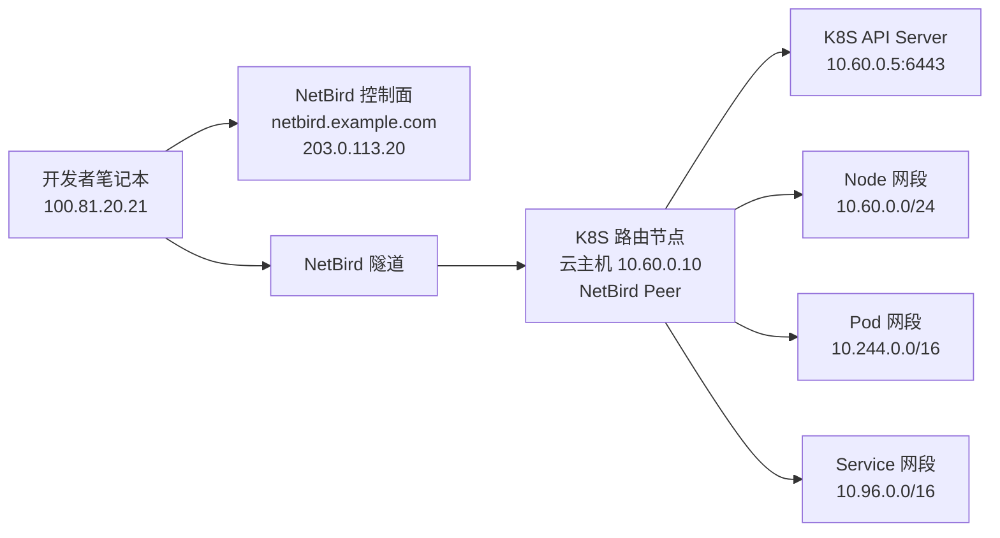

# 案例三：本地办公打通云上 K8S 集群网络和 Pod 网络

> 这是最容易“看上去很简单，实际上最容易踩坑”的场景。
> 你们的标准是：NetBird 服务端继续使用 `docker-compose`；K8S 这里只把 NetBird 用作“路由节点接入集群网络”的方案。

## 1. 场景目标

本地办公人员需要：

- 访问 K8S API Server
- 访问集群 Node 网段
- 访问 Pod 网段
- 按需访问 Service 网段中的内部服务

不希望：

- 在每个 Pod 里都装 NetBird
- 把整个集群暴露到公网

## 2. 示例拓扑



## 3. 示例参数

| 项目 | 示例值 |
| --- | --- |
| NetBird 域名 | `netbird.example.com` |
| K8S 路由节点 | `10.60.0.10` |
| API Server | `10.60.0.5:6443` |
| Node 网段 | `10.60.0.0/24` |
| Pod 网段 | `10.244.0.0/16` |
| Service 网段 | `10.96.0.0/16` |

## 4. 推荐做法

### 4.1 不把 NetBird 装进每个 Pod

更推荐：

- 在 K8S 所在 VPC / 子网里放一台路由节点
- 由这台路由节点把集群网段导入 NetBird

原因：

- 维护成本更低
- 升级更简单
- 更容易和现有云路由、安全组、NACL 对齐

### 4.2 资源按层次拆开

建议在 NetBird 里至少拆成三类资源：

| 资源组 | 内容 |
| --- | --- |
| `k8s-api` | `10.60.0.5/32` |
| `k8s-nodes` | `10.60.0.0/24` |
| `k8s-pods` | `10.244.0.0/16` |

如果你还需要访问 Service CIDR，再加：

| 资源组 | 内容 |
| --- | --- |
| `k8s-services` | `10.96.0.0/16` |

## 5. 配置步骤

### 5.1 部署 K8S 路由节点

在 K8S 所在云网络里准备一台 Linux 虚机：

```bash
curl -fsSL https://pkgs.netbird.io/install.sh | sh
sudo netbird up \
  --management-url https://netbird.example.com \
  --setup-key NBSETUP-K8S-GW-REPLACE-ME
```

要求：

- 能访问 API Server
- 能访问 Pod 网段
- 能访问 Service 网段

### 5.2 在控制台创建网络

进入 `Networks`：

1. 创建网络 `k8s-prod-vpc`
2. 绑定路由节点 `10.60.0.10`
3. 添加资源：

| 资源名 | 类型 | 值 |
| --- | --- | --- |
| `k8s-api-prod` | Host | `10.60.0.5` |
| `k8s-node-range` | Subnet | `10.60.0.0/24` |
| `k8s-pod-range` | Subnet | `10.244.0.0/16` |
| `k8s-svc-range` | Subnet | `10.96.0.0/16` |

### 5.3 创建访问组

建议最少建这几个组：

- `platform-admins`
- `developers`
- `readonly-observers`

### 5.4 创建访问策略

推荐策略：

| 源组 | 目标组 | 协议 | 端口 |
| --- | --- | --- | --- |
| `platform-admins` | `k8s-api` | TCP | `6443` |
| `platform-admins` | `k8s-nodes` | TCP | `22,10250` |
| `developers` | `k8s-api` | TCP | `6443` |
| `developers` | `k8s-pods` | TCP | `80,443,8080,8443` |
| `readonly-observers` | `k8s-services` | TCP | `80,443` |

## 6. 本地开发机怎么接入

开发者电脑安装 NetBird 客户端并登录后，检查：

```bash
netbird status
kubectl --kubeconfig ~/.kube/config cluster-info
nc -vz 10.60.0.5 6443
```

如果你希望用域名访问 API Server：

- 在 kubeconfig 中把 `server` 改成内网域名
- 并在 NetBird 里增加 Domain Resource

## 7. 真实可用的 kubeconfig 示例

```yaml
apiVersion: v1
clusters:
- cluster:
    certificate-authority-data: REPLACE_ME
    server: https://10.60.0.5:6443
  name: prod-k8s
contexts:
- context:
    cluster: prod-k8s
    user: dev-user
  name: prod-k8s
current-context: prod-k8s
kind: Config
users:
- name: dev-user
  user:
    token: REPLACE_ME
```

如果 API 服务器证书里没有这个 IP，建议改成证书中的域名，并让该域名通过 NetBird 可解析。

## 8. 常见坑

### 8.1 Pod 网段不通

最常见原因：

- 路由节点虽然能访问 Node，但本机没有到 Pod CIDR 的路由
- CNI 插件网络未允许来自路由节点的流量
- 云安全组 / VPC 路由没打通

### 8.2 Service 网段可达但服务超时

原因通常是：

- 访问的是 ClusterIP，但回程路径不完整
- kube-proxy / CNI 对来源网段有限制

建议：

- 先验证 Pod IP
- 再验证 Service IP
- 最后再验证域名

### 8.3 本地 `kubectl` 能连，浏览器打不开 Pod 服务

原因通常是：

- ACL 只放了 `6443`
- 没放应用的真实端口，如 `8080`、`8443`

## 9. 推荐上线顺序

1. 先只打通 `10.60.0.5:6443`
2. 再打通 Node 网段
3. 再打通 Pod 网段
4. 最后按需开放 Service 网段

这样排障最容易。

## 10. 官方参考

- Networks: [NetBird Docs](https://docs.netbird.io/how-to/networks)
- Site-to-Site / VPN-to-Site: [NetBird Docs](https://docs.netbird.io/use-cases/setup-site-to-site-access)
- Routing IP resources: [NetBird Docs](https://docs.netbird.io/manage/networks/routing-traffic-to-multiple-resources)
