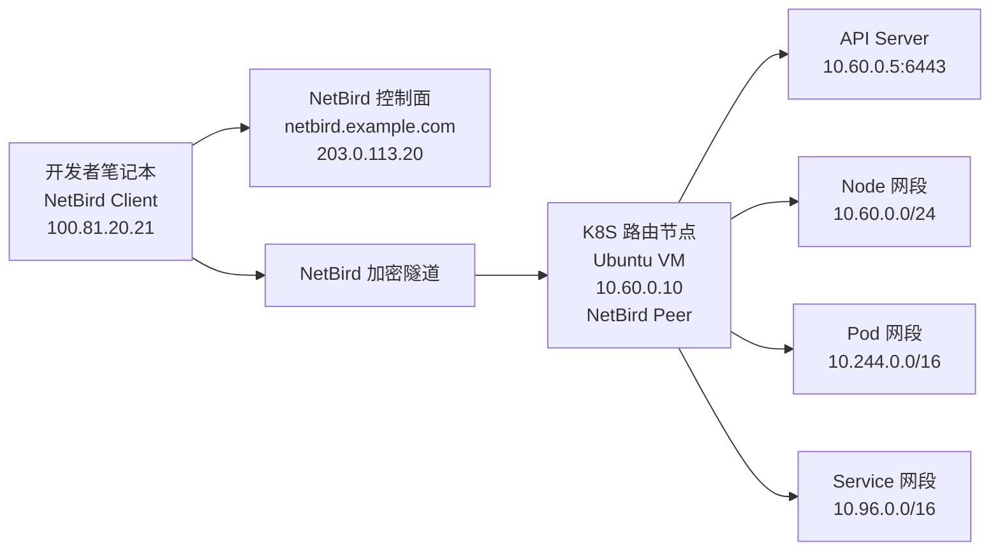

# 案例三：本地办公打通云上 K8S 集群网络和 Pod 网络

> 这是最容易“看上去很简单，实际上最容易踩坑”的场景。
> 本仓库的标准是：NetBird 服务端继续使用 `docker-compose`；K8S 这里只把 NetBird 用作“路由节点接入集群网络”的方案。

## 1. 本案例最终要实现什么

本地开发者电脑接入 NetBird 后，可以在不暴露 K8S 到公网的情况下访问：

- K8S API Server，例如 `10.60.0.5:6443`
- 集群 Node 网段，例如 `10.60.0.0/24`
- Pod 网段，例如 `10.244.0.0/16`
- Service 网段，例如 `10.96.0.0/16`
- 指定内部服务，例如 `nginx.default.svc.cluster.local` 对应的 ClusterIP

不做这些事：

- 不在每个 Pod 里都安装 NetBird。
- 不把 API Server、NodePort、Ingress 直接开放到公网。
- 不默认给所有 NetBird 用户放通整个集群。
- 不使用旧的“全网段一把梭”VPN 思路。

## 2. 推荐架构

推荐优先使用“集群同 VPC 的 Linux 路由节点”。

这个方案最适合新手，因为它最容易排查：路由节点能访问什么，NetBird 客户端就能按策略访问什么。


```mermaid
flowchart LR
    U["开发者笔记本\nNetBird Client\n100.81.20.21"] --> NB["NetBird 控制面\nnetbird.example.com\n203.0.113.20"]
    U --> T["NetBird 加密隧道"]
    T --> GW["K8S 路由节点\nUbuntu VM\n10.60.0.10\nNetBird Peer"]
    GW --> API["API Server\n10.60.0.5:6443"]
    GW --> NODE["Node 网段\n10.60.0.0/24"]
    GW --> POD["Pod 网段\n10.244.0.0/16"]
    GW --> SVC["Service 网段\n10.96.0.0/16"]
```

你也可以把 NetBird 路由 Peer 以 Deployment 形式跑在 K8S 集群里。本文后面提供完整 YAML，但它要求集群允许容器使用 `NET_ADMIN`、`SYS_ADMIN`、`SYS_RESOURCE` 能力，并且 CNI 允许这个 Pod 转发到 Pod / Service 网段。新手第一次落地，建议先用 VM 路由节点跑通，再考虑集群内 Deployment。

## 3. 示例参数

复制本文时，先把下面这些示例值换成你的真实值。

| 项目 | 示例值 | 你需要替换成 |
| --- | --- | --- |
| NetBird 域名 | `netbird.example.com` | 你的 NetBird 管理端域名 |
| NetBird 控制面公网 IP | `203.0.113.20` | 你的服务器公网 IP |
| K8S 路由节点 | `10.60.0.10` | 和集群同 VPC / 同内网的 Linux VM |
| API Server | `10.60.0.5:6443` | 你的 API Server 内网地址 |
| Node 网段 | `10.60.0.0/24` | 你的节点内网 CIDR |
| Pod 网段 | `10.244.0.0/16` | 你的 CNI Pod CIDR |
| Service 网段 | `10.96.0.0/16` | 你的 Service CIDR |
| 路由 Peer 组 | `k8s-routing-peers` | NetBird 里给路由节点用的组 |
| 开发者组 | `developers` | 允许访问 K8S 的用户 / 设备组 |
| 管理员组 | `platform-admins` | 平台管理员组 |

## 4. 上线前检查清单

先不要急着配置 NetBird，先确认基础网络。

### 4.1 确认 K8S 网段

在已经能管理集群的电脑上执行：

```bash
kubectl cluster-info
kubectl get nodes -o wide
kubectl get svc kubernetes -o wide
```

如果你是 kubeadm 集群，可以继续看控制面配置：

```bash
kubectl -n kube-system get configmap kubeadm-config -o yaml | grep -E "podSubnet|serviceSubnet|controlPlaneEndpoint"
```

如果你不是 kubeadm，例如 ACK、EKS、GKE、AKS，可以在云厂商控制台查看：

- VPC / VNet CIDR
- Node 子网 CIDR
- Pod CIDR
- Service CIDR
- API Server 内网访问地址

把查到的值填回第 3 节表格。

### 4.2 确认路由节点能访问集群

登录准备作为路由节点的 Linux VM：

```bash
ip addr
ip route
nc -vz 10.60.0.5 6443
curl -k https://10.60.0.5:6443/version
```

预期：

- `nc` 能连上 `10.60.0.5:6443`。
- `curl -k` 至少能返回 Kubernetes API 的版本信息或认证错误。
- 如果这里都不通，先修云安全组、VPC 路由、NACL、防火墙，不要继续配 NetBird。

### 4.3 确认路由节点能访问 Pod / Service 网段

先创建一个验证用服务。

保存为 `k8s-demo-nginx.yaml`：

```yaml
apiVersion: apps/v1
kind: Deployment
metadata:
  name: netbird-demo-nginx
  namespace: default
  labels:
    app: netbird-demo-nginx
spec:
  replicas: 1
  selector:
    matchLabels:
      app: netbird-demo-nginx
  template:
    metadata:
      labels:
        app: netbird-demo-nginx
    spec:
      containers:
        - name: nginx
          image: nginx:1.27-alpine
          ports:
            - name: http
              containerPort: 80
---
apiVersion: v1
kind: Service
metadata:
  name: netbird-demo-nginx
  namespace: default
  labels:
    app: netbird-demo-nginx
spec:
  type: ClusterIP
  selector:
    app: netbird-demo-nginx
  ports:
    - name: http
      port: 80
      targetPort: 80
      protocol: TCP
```

应用并查看 Pod IP / Service IP：

```bash
kubectl apply -f k8s-demo-nginx.yaml
kubectl get pod -l app=netbird-demo-nginx -o wide
kubectl get svc netbird-demo-nginx -o wide
```

假设查到：

```text
Pod IP:     10.244.1.23
Service IP: 10.96.120.88
```

回到路由节点测试：

```bash
curl -I http://10.244.1.23
curl -I http://10.96.120.88
```

预期：

- 如果 Pod IP 和 Service IP 都能返回 HTTP 头，说明路由节点具备转发基础。
- 如果只能访问 Node / API Server，不能访问 Pod 或 Service，先检查 CNI、云路由和安全组。

## 5. 在 NetBird 创建 Setup Key

进入 NetBird Dashboard：

1. 打开 `Settings > Setup Keys`。
2. 点击 `Create Setup Key`。
3. 名称填 `k8s-prod-routing-peer`。
4. 类型建议选可复用，但设置合理的过期时间和使用次数。
5. `Auto-assigned groups` 添加或创建 `k8s-routing-peers`。
6. 复制生成的 Setup Key，下面用 `NBSETUP-K8S-GW-REPLACE-ME` 代替。

建议：

- 生产环境不要把这个 key 发给普通开发者。
- 每个环境单独建 key，例如 `k8s-dev-routing-peer`、`k8s-prod-routing-peer`。
- 如果 key 泄露，立刻在 Dashboard 里 revoke。

## 6. 方案 A：使用 Linux VM 作为 K8S 路由节点

这是本文推荐方案。

### 6.1 安装 NetBird 客户端

在路由节点 `10.60.0.10` 上执行：

```bash
curl -fsSL https://pkgs.netbird.io/install.sh | sh
sudo netbird up \
  --management-url https://netbird.example.com \
  --setup-key NBSETUP-K8S-GW-REPLACE-ME
```

检查状态：

```bash
netbird status
ip addr show wt0
```

预期：

- Dashboard 的 `Peers > Servers` 能看到这台机器。
- 机器自动加入 `k8s-routing-peers`。
- `netbird status` 显示 `Connected`。

### 6.2 持久化 Linux 转发配置

NetBird 在 Linux 上通常会自动处理转发，但生产环境建议显式写入 sysctl 文件，便于审计和重启后保持一致。

创建 `/etc/sysctl.d/99-netbird-router.conf`：

```conf
net.ipv4.ip_forward=1
net.ipv6.conf.all.forwarding=1
```

应用配置：

```bash
sudo tee /etc/sysctl.d/99-netbird-router.conf >/dev/null <<'EOF'
net.ipv4.ip_forward=1
net.ipv6.conf.all.forwarding=1
EOF
sudo sysctl --system
sysctl net.ipv4.ip_forward
```

预期：

```text
net.ipv4.ip_forward = 1
```

### 6.3 路由节点本机防火墙建议

如果路由节点使用 `ufw`，先确认不会挡住转发：

```bash
sudo ufw status verbose
```

最小建议：

- 路由节点出方向允许访问 `netbird.example.com:443`。
- 路由节点出方向允许访问 `3478/udp`，用于 STUN。
- 路由节点到 API Server、Node、Pod、Service 网段允许访问。
- 不要把路由节点的 SSH 开到公网，优先走云厂商安全组白名单或堡垒机。

## 7. 在 NetBird 创建 K8S 网络资源

NetBird 新环境建议优先使用 `Networks`，不要新建旧版 `Network Routing > Routes`。旧版 Routes 对新手最大的风险是访问控制容易漏配，导致整个 CIDR 被分发组直接访问。

进入 `Networks`：

### 7.1 创建 Network

1. 点击 `Add Network`。
2. 名称填 `k8s-prod-vpc`。
3. Routing Peer 选择 `k8s-routing-peers` 组，或选择刚才的路由节点 Peer。
4. Masquerade / NAT 建议先开启。

为什么先开启 Masquerade：

- 回程最简单，K8S 侧看到来源是路由节点的内网 IP。
- 不需要立刻给 K8S VPC 添加回程到 NetBird Overlay CIDR 的路由。
- 等你需要审计真实 NetBird 客户端 IP 时，再考虑关闭，并补充回程路由。

### 7.2 添加 Resources

按资源拆开，不要只建一个大网段。

| 资源名 | 类型 | 值 | 资源组 |
| --- | --- | --- | --- |
| `k8s-prod-apiserver` | IP | `10.60.0.5/32` | `k8s-api` |
| `k8s-prod-nodes` | IP Range | `10.60.0.0/24` | `k8s-nodes` |
| `k8s-prod-pods` | IP Range | `10.244.0.0/16` | `k8s-pods` |
| `k8s-prod-services` | IP Range | `10.96.0.0/16` | `k8s-services` |

如果你只想先打通 `kubectl`，第一天只添加：

| 资源名 | 类型 | 值 | 资源组 |
| --- | --- | --- | --- |
| `k8s-prod-apiserver` | IP | `10.60.0.5/32` | `k8s-api` |

等 API Server 验证成功后，再逐步增加 Pod / Service 网段。

## 8. 创建用户组和访问策略

进入 `Access Control > Groups`，建议创建：

| 组名 | 放什么 |
| --- | --- |
| `platform-admins` | 平台管理员的用户和设备 |
| `developers` | 需要 kubectl 或访问内部服务的开发者 |
| `readonly-observers` | 只读观察人员 |
| `k8s-routing-peers` | K8S 路由节点 |
| `k8s-api` | API Server 资源 |
| `k8s-nodes` | Node 网段资源 |
| `k8s-pods` | Pod 网段资源 |
| `k8s-services` | Service 网段资源 |

进入 `Access Control > Policies`，按最小权限创建：

| 策略名 | 源组 | 目标组 | 协议 | 端口 |
| --- | --- | --- | --- | --- |
| `platform-admins-to-k8s-api` | `platform-admins` | `k8s-api` | TCP | `6443` |
| `developers-to-k8s-api` | `developers` | `k8s-api` | TCP | `6443` |
| `platform-admins-to-k8s-nodes` | `platform-admins` | `k8s-nodes` | TCP | `22,10250` |
| `developers-to-k8s-pods-web` | `developers` | `k8s-pods` | TCP | `80,443,8080,8443` |
| `developers-to-k8s-services-web` | `developers` | `k8s-services` | TCP | `80,443,8080,8443` |
| `readonly-to-k8s-services` | `readonly-observers` | `k8s-services` | TCP | `80,443` |

如果刚开始只验证 `kubectl`，只建前两条即可。

## 9. 本地开发机接入和验证

开发者电脑安装 NetBird 客户端并登录后，先检查 NetBird：

```bash
netbird status
```

测试 API Server：

```bash
nc -vz 10.60.0.5 6443
curl -k https://10.60.0.5:6443/version
```

测试 Demo 服务：

```bash
curl -I http://10.244.1.23
curl -I http://10.96.120.88
```

如果 `10.60.0.5:6443` 通，但 Pod / Service 不通，说明 NetBird 基础接入没问题，继续排查路由节点到 Pod / Service 的路径。

## 10. 真实可用的 kubeconfig 配置

NetBird 只解决网络连通。`kubectl` 能不能操作集群，还取决于 Kubernetes 认证和 RBAC。

### 10.1 只读账号 RBAC 完整 YAML

下面示例创建一个只读 ServiceAccount，适合给新手先验证 `kubectl get`。

保存为 `k8s-netbird-readonly-rbac.yaml`：

```yaml
apiVersion: v1
kind: Namespace
metadata:
  name: platform-access
---
apiVersion: v1
kind: ServiceAccount
metadata:
  name: netbird-readonly
  namespace: platform-access
---
apiVersion: rbac.authorization.k8s.io/v1
kind: ClusterRole
metadata:
  name: netbird-readonly
rules:
  - apiGroups: [""]
    resources:
      - namespaces
      - nodes
      - pods
      - services
      - endpoints
      - configmaps
      - events
    verbs: ["get", "list", "watch"]
  - apiGroups: ["apps"]
    resources:
      - deployments
      - daemonsets
      - statefulsets
      - replicasets
    verbs: ["get", "list", "watch"]
  - apiGroups: ["batch"]
    resources:
      - jobs
      - cronjobs
    verbs: ["get", "list", "watch"]
  - apiGroups: ["networking.k8s.io"]
    resources:
      - ingresses
      - networkpolicies
    verbs: ["get", "list", "watch"]
---
apiVersion: rbac.authorization.k8s.io/v1
kind: ClusterRoleBinding
metadata:
  name: netbird-readonly
subjects:
  - kind: ServiceAccount
    name: netbird-readonly
    namespace: platform-access
roleRef:
  apiGroup: rbac.authorization.k8s.io
  kind: ClusterRole
  name: netbird-readonly
```

应用：

```bash
kubectl apply -f k8s-netbird-readonly-rbac.yaml
```

生成 token：

```bash
kubectl -n platform-access create token netbird-readonly
```

把输出保存下来，下面用 `REPLACE_WITH_TOKEN` 代替。

### 10.2 kubeconfig 完整示例

保存为 `prod-k8s-netbird.kubeconfig`：

```yaml
apiVersion: v1
kind: Config
clusters:
  - name: prod-k8s
    cluster:
      server: https://10.60.0.5:6443
      certificate-authority-data: REPLACE_WITH_CA_DATA
users:
  - name: netbird-readonly
    user:
      token: REPLACE_WITH_TOKEN
contexts:
  - name: prod-k8s-netbird-readonly
    context:
      cluster: prod-k8s
      user: netbird-readonly
      namespace: default
current-context: prod-k8s-netbird-readonly
```

你必须修改两处：

1. `server`
   - 如果 API Server 证书包含 `10.60.0.5`，可以用 `https://10.60.0.5:6443`。
   - 如果证书只包含域名，例如 `k8s-api.prod.internal`，这里必须改成 `https://k8s-api.prod.internal:6443`。

2. `certificate-authority-data`
   - 从现有管理员 kubeconfig 复制对应集群的 CA。
   - 不要为了省事写 `insecure-skip-tls-verify: true`，生产环境不要这么做。

从当前 kubeconfig 提取 CA 的示例：

```bash
kubectl config view --raw -o jsonpath='{.clusters[0].cluster.certificate-authority-data}'
```

验证：

```bash
kubectl --kubeconfig ./prod-k8s-netbird.kubeconfig get ns
kubectl --kubeconfig ./prod-k8s-netbird.kubeconfig get nodes -o wide
kubectl --kubeconfig ./prod-k8s-netbird.kubeconfig get svc -A
```

如果你不希望开发者看到 Node，可以把 RBAC 里的 `nodes` 删除，再重新 `kubectl apply`。

## 11. 如果 API Server 必须用域名访问

很多集群的 API Server 证书不包含内网 IP，只包含域名。

例如 kubeconfig 原来是：

```yaml
server: https://k8s-api.prod.internal:6443
```

这种情况下不要强行改成 IP。推荐做法：

1. 确保路由节点能解析 `k8s-api.prod.internal`。
2. 在 NetBird 的 `Networks` 中添加 Domain Resource：

| 资源名 | 类型 | 值 | 资源组 |
| --- | --- | --- | --- |
| `k8s-prod-apiserver-domain` | Domain | `k8s-api.prod.internal` | `k8s-api` |

3. 访问策略仍然使用：

| 源组 | 目标组 | 协议 | 端口 |
| --- | --- | --- | --- |
| `developers` | `k8s-api` | TCP | `6443` |

4. 本地验证：

```bash
nc -vz k8s-api.prod.internal 6443
kubectl --kubeconfig ./prod-k8s-netbird.kubeconfig get ns
```

注意：不要把大量不同用途的域名资源和大 CIDR 资源混在同一个 Network 里。域名资源建议单独管理，避免策略边界变得模糊。

## 12. 方案 B：把 NetBird 路由 Peer 跑在 K8S 集群里

这个方案适合你想让集群内的 Pod 作为路由 Peer，专门暴露 Pod / Service 资源。

使用前确认：

- 集群允许创建带 `NET_ADMIN`、`SYS_RESOURCE`、`SYS_ADMIN` capabilities 的 Pod。
- CNI 允许这个 Pod 访问目标 Pod / Service。
- 你已经在 NetBird 中创建了 Setup Key，并自动加入 `k8s-routing-peers`。
- 如果是生产环境，建议先在测试 namespace 验证。

### 12.1 完整 Deployment YAML

保存为 `k8s-netbird-router.yaml`：

```yaml
apiVersion: v1
kind: Namespace
metadata:
  name: netbird
---
apiVersion: v1
kind: Secret
metadata:
  name: netbird-setup-key
  namespace: netbird
type: Opaque
stringData:
  NB_SETUP_KEY: "NBSETUP-K8S-GW-REPLACE-ME"
---
apiVersion: apps/v1
kind: Deployment
metadata:
  name: netbird-k8s-router
  namespace: netbird
  labels:
    app: netbird-k8s-router
spec:
  replicas: 1
  selector:
    matchLabels:
      app: netbird-k8s-router
  template:
    metadata:
      labels:
        app: netbird-k8s-router
    spec:
      terminationGracePeriodSeconds: 30
      containers:
        - name: netbird
          image: netbirdio/netbird:v0.73.2
          imagePullPolicy: IfNotPresent
          env:
            - name: NB_SETUP_KEY
              valueFrom:
                secretKeyRef:
                  name: netbird-setup-key
                  key: NB_SETUP_KEY
            - name: NB_MANAGEMENT_URL
              value: "https://netbird.example.com"
            - name: NB_HOSTNAME
              valueFrom:
                fieldRef:
                  fieldPath: metadata.name
            - name: NB_LOG_LEVEL
              value: "info"
          securityContext:
            allowPrivilegeEscalation: true
            capabilities:
              add:
                - NET_ADMIN
                - SYS_RESOURCE
                - SYS_ADMIN
          resources:
            requests:
              cpu: 100m
              memory: 128Mi
            limits:
              cpu: 500m
              memory: 512Mi
          livenessProbe:
            exec:
              command:
                - netbird
                - status
                - --check
                - live
            initialDelaySeconds: 10
            periodSeconds: 20
            timeoutSeconds: 5
            failureThreshold: 3
          readinessProbe:
            exec:
              command:
                - netbird
                - status
                - --check
                - ready
            initialDelaySeconds: 10
            periodSeconds: 20
            timeoutSeconds: 5
            failureThreshold: 3
          startupProbe:
            exec:
              command:
                - netbird
                - status
                - --check
                - startup
            periodSeconds: 5
            timeoutSeconds: 10
            failureThreshold: 30
```

必须修改：

- `NB_SETUP_KEY`：换成你自己的 Setup Key。
- `NB_MANAGEMENT_URL`：换成你的 NetBird 域名。
- `image`：如果你明确要跟随最新版，可以改成 `netbirdio/netbird:latest`；生产环境建议固定到已验证版本。

应用：

```bash
kubectl apply -f k8s-netbird-router.yaml
kubectl -n netbird rollout status deployment/netbird-k8s-router
kubectl -n netbird get pod -l app=netbird-k8s-router -o wide
kubectl -n netbird logs -l app=netbird-k8s-router --tail=100
```

Dashboard 中应该能看到新的 Peer，主机名类似：

```text
netbird-k8s-router-xxxxxxxxxx-yyyyy
```

### 12.2 高可用副本数

验证单副本稳定后，可以改：

```yaml
spec:
  replicas: 3
```

然后执行：

```bash
kubectl apply -f k8s-netbird-router.yaml
kubectl -n netbird rollout status deployment/netbird-k8s-router
```

注意：

- 多副本必须配合 NetBird 里的 routing peer group 使用。
- 如果不开 Masquerade，多副本回程会复杂很多，新手不要这样做。
- Pod 重建后 Peer 名称会变化，建议 Setup Key 使用 ephemeral peers，避免离线旧 Peer 堆积。

### 12.3 什么时候不适合用集群内 Deployment

下面任一条件成立，就先用方案 A：

- 集群禁止特权能力或 PodSecurity 拦截 `NET_ADMIN`。
- 你不确定 CNI 是否允许该 Pod 转发到目标网段。
- 你还没有跑通 API Server 内网访问。
- 你需要同时访问大量 Node 级别地址、云数据库、VPC 内其他服务。

## 13. 可选：使用 NetBird Kubernetes Operator

如果你的团队已经熟悉 Helm 和 CRD，可以使用 NetBird Kubernetes Operator。它可以通过 `NetworkRouter` 和 `NetworkResource` 自动在 NetBird 里创建网络和资源。

基础安装命令：

```bash
kubectl apply -f https://github.com/cert-manager/cert-manager/releases/download/v1.17.0/cert-manager.yaml
kubectl create namespace netbird
kubectl -n netbird create secret generic netbird-mgmt-api-key --from-literal=NB_API_KEY="${NB_API_KEY}"
helm upgrade --install --create-namespace -n netbird netbird-operator oci://ghcr.io/netbirdio/helm-charts/netbird-operator
kubectl get pods -n netbird
```

示例 `NetworkRouter`：

```yaml
apiVersion: netbird.io/v1alpha1
kind: NetworkRouter
metadata:
  name: prod
  namespace: netbird
spec:
  dnsZoneRef:
    name: prod.company.internal
```

示例 `NetworkResource` 暴露一个 Service：

```yaml
apiVersion: netbird.io/v1alpha1
kind: NetworkResource
metadata:
  name: netbird-demo-nginx
  namespace: default
spec:
  networkRouterRef:
    name: prod
    namespace: netbird
  serviceRef:
    name: netbird-demo-nginx
  groups:
    - name: developers
```

Operator 更自动，但依赖 NetBird API token、CRD、webhook、DNS Zone。新手第一次上线建议先按方案 A 跑通，再评估是否引入 Operator。

## 14. 常见问题和排查

### 14.1 `netbird status` 已连接，但 `kubectl` 连接超时

按顺序查：

1. 本地开发机是否在 `developers` 或 `platform-admins`。
2. `developers -> k8s-api` 是否放通 TCP `6443`。
3. `k8s-prod-apiserver` 是否写成 `10.60.0.5/32`。
4. 路由节点本机是否能 `nc -vz 10.60.0.5 6443`。
5. 云安全组是否允许路由节点访问 API Server。

### 14.2 API Server 通了，Pod IP 不通

按顺序查：

1. 路由节点本机能不能 `curl http://PodIP`。
2. CNI 是否允许来自路由节点的流量。
3. NetBird 是否添加了 `10.244.0.0/16` 资源。
4. 策略是否放通了应用真实端口，例如 `8080` 或 `8443`。
5. Pod 是否有 NetworkPolicy 拦截。

### 14.3 Service IP 不通

按顺序查：

1. 先确认 Pod IP 通，再查 Service IP。
2. `kubectl get endpoints netbird-demo-nginx` 是否有后端。
3. kube-proxy / CNI 是否支持从路由节点访问 ClusterIP。
4. 如果只需要 Web 访问，优先考虑暴露具体 Service IP，不要一开始放整个 Service CIDR。

### 14.4 浏览器访问 HTTPS 内部服务证书报错

原因通常是你用 IP 访问了只签给域名的证书。

处理：

1. 给服务保留内部域名，例如 `grafana.prod.internal`。
2. 在 NetBird 里添加 Domain Resource。
3. kubeconfig 或浏览器都用域名，不用裸 IP。

### 14.5 关闭 Masquerade 后全部不通

这是正常的常见坑。

关闭 Masquerade 后，后端资源看到的来源会是 NetBird Overlay IP，例如 `100.64.0.0/10` 中的地址。你必须在 K8S 所在网络里添加回程路由：

```text
目的网段：100.64.0.0/10
下一跳：10.60.0.10
```

如果不确定怎么配置云路由表，先保持 Masquerade 开启。

## 15. 推荐上线顺序

按这个顺序来，最容易定位问题：

1. 路由节点能访问 API Server。
2. NetBird 开通 `developers -> k8s-api -> TCP 6443`。
3. 本地 `kubectl get ns` 成功。
4. 路由节点能访问 Demo Pod IP。
5. NetBird 开通 `developers -> k8s-pods -> TCP 80`。
6. 本地 `curl http://PodIP` 成功。
7. 路由节点能访问 Demo Service IP。
8. NetBird 开通 `developers -> k8s-services -> TCP 80`。
9. 本地 `curl http://ServiceIP` 成功。
10. 再替换成真实业务服务和真实 RBAC。

不要第一天就把 Node、Pod、Service 三个大网段全部放给所有人。

## 16. 回滚和清理

删除 Demo 服务：

```bash
kubectl delete -f k8s-demo-nginx.yaml
```

删除只读 RBAC：

```bash
kubectl delete -f k8s-netbird-readonly-rbac.yaml
```

如果使用方案 B，删除集群内路由 Peer：

```bash
kubectl delete -f k8s-netbird-router.yaml
```

如果使用方案 A，在 Linux 路由节点退出 NetBird：

```bash
sudo netbird down
sudo systemctl stop netbird
```

同时在 NetBird Dashboard 中：

- 删除或禁用相关 Network Resource。
- 删除临时测试策略。
- Revoke 不再使用的 Setup Key。
- 清理离线 Peer。

## 17. 官方参考

- Networks / Routing Peer 原理：https://docs.netbird.io/manage/networks/how-routing-peers-work
- Network Routes 说明：https://docs.netbird.io/manage/network-routes
- Kubernetes Routing Peers：https://docs.netbird.io/use-cases/cloud/routing-peers-and-kubernetes
- Kubernetes Operator：https://docs.netbird.io/manage/integrations/kubernetes
- Kubernetes Operator Routing Peer：https://docs.netbird.io/manage/integrations/kubernetes/routing-peer
- Access Control：https://docs.netbird.io/manage/access-control/manage-network-access
