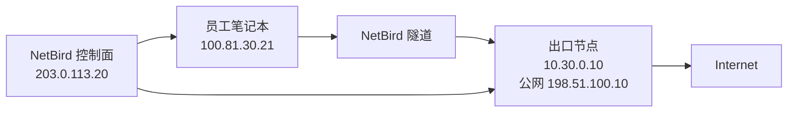
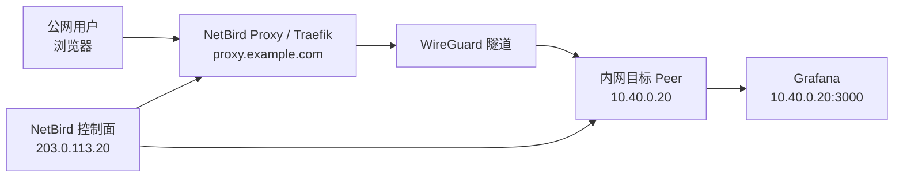

# 案例四：把 NetBird 当作统一出口和代理发布入口

> 这篇文档包含两个强相关场景：
> 1. `Exit Node`，让客户端统一走指定出口上网
> 2. `Reverse Proxy`，把内网服务通过 NetBird 代理发布出去

## 1. 场景一：Exit Node 统一出口

### 1.1 适用场景

- 员工出差时，希望统一从公司出口 IP 上网
- 某些 SaaS 白名单只接受固定公网出口
- 希望所有访问互联网的流量都经过公司审计出口

### 1.2 示例拓扑



### 1.3 示例参数

| 项目 | 示例值 |
| --- | --- |
| 出口节点内网 IP | `10.30.0.10` |
| 出口节点公网 IP | `198.51.100.10` |
| 客户端组 | `office-team` |
| 默认路由 | `0.0.0.0/0` |

### 1.4 配置方法

官方文档里，Exit Node 属于 `Network Routes` 场景。

核心配置：

1. 准备一台出口节点，要求能访问公网。
2. 该节点安装 NetBird 并保持在线。
3. 在 `Network Routes` 中创建默认路由：

| 项目 | 示例值 |
| --- | --- |
| Network | `0.0.0.0/0` |
| Routing Peer | 出口节点 |
| Distribution Groups | `office-team` |
| Masquerade | 开启 |

为什么建议开启 `Masquerade`：

- 这样互联网看到的源 IP 都是出口节点公网 IP
- 不需要额外在下游网络回指每个 NetBird 客户端地址

### 1.5 客户端验证

客户端开启后执行：

```bash
curl https://ifconfig.me
```

预期返回：

```text
198.51.100.10
```

如果返回的还是本地网络出口 IP，说明默认路由没有生效。

### 1.6 常见坑

- 没开 `Masquerade`，导致回程流量不通
- 路由只下发到部分组，用户设备不在该组里
- 出口节点本机没有开启公网转发/NAT

## 2. 场景二：Reverse Proxy 发布内部服务

### 2.1 适用场景

- 你想把内网的 Jenkins、Grafana、GitLab 通过 NetBird 对外发布
- 不想给目标主机开公网端口
- 想用 NetBird 自带认证或 SSO 保护入口

### 2.2 示例拓扑



### 2.3 关键前提

根据官方文档，自建环境要用 Reverse Proxy，需要：

- 自建环境使用 Traefik
- 至少有一个 `netbird-proxy` 实例
- 至少有一个 Peer 或 Network Resource 可以作为目标

### 2.4 示例参数

| 项目 | 示例值 |
| --- | --- |
| Proxy 基础域名 | `proxy.example.com` |
| 发布域名 | `grafana.proxy.example.com` |
| 目标主机 | `10.40.0.20` |
| 目标端口 | `3000` |
| 协议 | `HTTP` |

### 2.5 控制台配置

进入 `Reverse Proxy > Services`：

1. 点击 `Add Service`
2. 子域名填 `grafana`
3. 选择基础域名 `proxy.example.com`
4. 添加 Target：

| 字段 | 示例值 |
| --- | --- |
| Type | `Peer` |
| Peer | `grafana-peer` |
| Protocol | `HTTP` |
| Port | `3000` |
| Path | `/` |

5. 认证方式建议至少开启一个：
   - `SSO`
   - `Password`
   - `PIN`

### 2.6 后端服务注意事项

如果后端服务有以下配置，一定要补齐：

- Trusted Proxies
- Allowed Hosts
- Known Networks

否则可能出现：

- 302 跳转到内网地址
- Host 校验失败
- 后端认为请求来源不可信

### 2.7 验证方法

```bash
curl -I https://grafana.proxy.example.com
```

预期：

- 返回 200 / 302
- 如果启用了认证，会先跳转到认证页

## 3. 什么时候用 Exit Node，什么时候用 Reverse Proxy

### 用 Exit Node

当你要的是：

- 员工“从固定出口 IP 上网”
- 把浏览器和所有外部流量走同一个出口

### 用 Reverse Proxy

当你要的是：

- 把某个内部 Web 服务安全地对外发布
- 不希望开放目标主机公网端口

## 4. 官方参考

- Site-to-Site / Exit Node: [NetBird Docs](https://docs.netbird.io/use-cases/setup-site-to-site-access)
- Reverse Proxy: [NetBird Docs](https://docs.netbird.io/manage/reverse-proxy)
- Expose from CLI: [NetBird Docs](https://docs.netbird.io/manage/reverse-proxy/expose-from-cli)
- Reverse Proxy backend config: [NetBird Docs](https://docs.netbird.io/manage/reverse-proxy/service-configuration)
