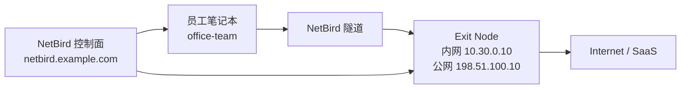
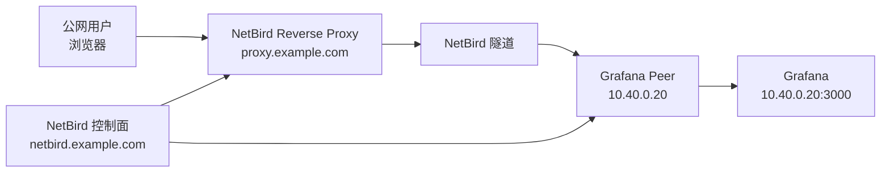

# 案例四：统一出口（Exit Node）与反向代理发布入口（Reverse Proxy）

> 这篇文档覆盖两个常用场景：
> 1. Exit Node：让指定用户统一从公司或云服务器固定公网 IP 出口上网。
> 2. Reverse Proxy：把内网 Web 服务安全发布到公网域名，并可加认证。

## 1. 什么时候用哪个

| 需求 | 推荐能力 |
| --- | --- |
| 员工访问互联网时使用固定出口 IP | Exit Node |
| SaaS 只允许公司固定公网 IP | Exit Node |
| 需要审计员工外网访问路径 | Exit Node |
| 把内网 Grafana / Jenkins / GitLab 发布给外部用户 | Reverse Proxy |
| 临时把本地开发服务给同事或 webhook 访问 | `netbird expose` |

简单判断：

- 你要改变“用户访问互联网的出口”，用 Exit Node。
- 你要发布“某个内部 Web 服务”，用 Reverse Proxy。
- 只有指定公网 IP 或域名需要走白名单出口时，使用
  [Kubernetes 定向公网资源固定出口](./18-kubernetes-targeted-public-egress.md)，
  不要下发默认路由。

## 2. 场景 A：配置 Exit Node 固定公网出口

### 2.1 最终效果

员工电脑加入 `office-team` 后，访问公网时出口 IP 变成出口节点的公网 IP：

```text
198.51.100.10
```

验证命令：

```bash
curl https://ifconfig.me
```

预期输出：

```text
198.51.100.10
```

### 2.2 工作原理

Exit Node 本质上是一个带默认路由的 Routing Peer：

- NetBird 给客户端下发 `0.0.0.0/0` 默认路由。
- 客户端把互联网流量送到出口节点。
- 出口节点开启 Masquerade，公网看到的源地址是出口节点公网 IP。
- 如果启用 IPv6 overlay，NetBird 会配套处理 `::/0`；未启用时会阻止 IPv6 泄漏。


```mermaid
flowchart LR
    U["员工笔记本\noffice-team"] --> T["NetBird 隧道"]
    T --> E["Exit Node\n内网 10.30.0.10\n公网 198.51.100.10"]
    E --> Internet["Internet / SaaS"]
    NB["NetBird 控制面\nnetbird.example.com"] --> U
    NB --> E
```

### 2.3 示例参数

| 项目 | 示例值 | 你需要替换成 |
| --- | --- | --- |
| NetBird 域名 | `netbird.example.com` | 你的自建 NetBird 域名 |
| 出口节点内网 IP | `10.30.0.10` | 出口节点内网地址 |
| 出口节点公网 IP | `198.51.100.10` | 出口节点公网地址 |
| 出口节点组 | `exit-nodes` | Routing Peer 组 |
| 使用出口的用户组 | `office-team` | 员工设备组 |
| 默认路由 | `0.0.0.0/0` | IPv4 默认路由 |

### 2.4 准备出口节点

出口节点建议使用稳定的 Linux VM：

- 有固定公网 IP。
- 能访问公网。
- 不跑重要业务应用。
- 安全组只开放必要管理端口。

安装 NetBird：

```bash
curl -fsSL https://pkgs.netbird.io/install.sh | sh
sudo netbird up \
  --management-url https://netbird.example.com \
  --setup-key NBSETUP-EXIT-NODE-REPLACE-ME
```

持久化转发：

```bash
sudo tee /etc/sysctl.d/99-netbird-exit-node.conf >/dev/null <<'EOF'
net.ipv4.ip_forward=1
net.ipv6.conf.all.forwarding=1
EOF
sudo sysctl --system
```

验证出口节点本机公网 IP：

```bash
curl https://ifconfig.me
```

预期是：

```text
198.51.100.10
```

### 2.5 Dashboard 配置 Exit Node

官方当前推荐路径：

1. 打开 `Peers > Servers`。
2. 找到出口节点。
3. 点击 `Add Exit Node`。
4. Distribution Groups 选择 `office-team`。
5. Masquerade 保持开启。
6. 按需选择 Auto Apply：
   - 开启：客户端自动使用出口节点。
   - 关闭：客户端可手动选择。
7. 保存。

最少还需要一条访问策略：

| 策略名 | 源组 | 目标组 | 协议 | 端口 |
| --- | --- | --- | --- | --- |
| `office-team-to-exit-node-icmp` | `office-team` | `exit-nodes` | ICMP | `Any` |

官方 Exit Node 文档指出，客户端使用 Exit Node 至少需要 `Users -> Routing Peer` 的 ICMP 策略。实际环境里，如果你还需要管理出口节点本机的 SSH，可以单独加：

| 策略名 | 源组 | 目标组 | 协议 | 端口 |
| --- | --- | --- | --- | --- |
| `ops-to-exit-node-ssh` | `ops-team` | `exit-nodes` | TCP | `22` |

不要把 `office-team -> exit-nodes -> ALL` 当成默认策略。

### 2.6 DNS 防泄漏配置

建议在 NetBird DNS 中配置一个 DNS server，match domain 设置为：

```text
ALL
```

原因：

- 让 DNS 查询也跟随出口链路。
- 避免浏览器 DNS 泄漏到本地网络。
- 避免本地 DNS 返回地区不一致结果。

如果你使用公共 DNS，可以先用：

```text
1.1.1.1
8.8.8.8
```

如果公司有审计 DNS，则使用公司指定 DNS。

### 2.7 客户端验证

员工电脑执行：

```bash
netbird status
curl https://ifconfig.me
curl https://ipinfo.io/ip
```

预期：

- 返回出口节点公网 IP `198.51.100.10`。
- Dashboard 中该设备属于 `office-team`。
- 如果 Auto Apply 关闭，需要在客户端手动选择 Exit Node。

再测 DNS：

```bash
nslookup example.com
```

确认 DNS 服务器符合预期。

### 2.8 Exit Node 排障

#### 客户端出口 IP 没变

按顺序查：

1. 客户端是否在 `office-team`。
2. Exit Node 是否显示在线。
3. Auto Apply 是否关闭，客户端是否手动选择了出口。
4. 是否存在 `office-team -> exit-nodes -> ICMP` 策略。
5. 出口节点本机是否能访问公网。

#### 开启后网页打不开

检查：

```bash
netbird status -d
curl -v https://ifconfig.me
```

常见原因：

- 出口节点防火墙阻止转发。
- 本机 `ip_forward` 没开。
- 云安全组限制了出口流量。
- DNS 没配置，浏览器解析失败。

#### IPv6 泄漏

如果你还没完整测试 IPv6，客户端可以先禁用：

```bash
sudo netbird down
sudo netbird up --disable-ipv6
```

生产环境建议在 NetBird Dashboard 的 IPv6 设置中按测试组逐步启用。

### 2.9 Exit Node 回滚

1. Dashboard 里禁用或删除 Exit Node。
2. 从 `office-team` 移除测试设备。
3. 禁用 `office-team-to-exit-node-icmp` 策略。
4. 出口节点下线：

```bash
sudo netbird down
sudo systemctl stop netbird
```

## 3. 场景 B：Reverse Proxy 发布内部 Grafana

### 3.1 最终效果

公网用户访问：

```text
https://grafana.proxy.example.com
```

请求进入 NetBird Reverse Proxy，再通过 NetBird 隧道到内网 Grafana：

```text
10.40.0.20:3000
```


```mermaid
flowchart LR
    User["公网用户\n浏览器"] --> Proxy["NetBird Reverse Proxy\nproxy.example.com"]
    Proxy --> Tunnel["NetBird 隧道"]
    Tunnel --> Peer["Grafana Peer\n10.40.0.20"]
    Peer --> App["Grafana\n10.40.0.20:3000"]
    NB["NetBird 控制面\nnetbird.example.com"] --> Proxy
    NB --> Peer
```

### 3.2 前置条件

自建环境使用 Reverse Proxy 前，先确认：

- 自建 NetBird 已按官方脚本部署完成。
- 已使用 Traefik 做 TLS passthrough，并启用独立 NetBird Proxy 实例；其他外部
  反向代理不能替代该 TLS passthrough 要求。
- Management 侧容器与 Proxy 使用同一个经过核对的 NetBird 固定版本。
- `proxy.example.com` 或对应基础域名已解析到代理入口。
- 至少有一个目标 Peer 在线，例如 `grafana-peer`。
- 目标 Peer 能访问后端服务端口 `3000`。
- 如果计划使用 NetBird-only Access，Proxy 必须向 Management 通告 `Private`
  capability。标准自建 `netbirdio/reverse-proxy` 必须明确设置
  `NB_PROXY_PRIVATE=true`（或等价的 `--private`），并确认 embedded client /
  cluster 实际通告 `Private`；仅在 quickstart 中打开
  `NETBIRD_ENABLE_PROXY`，或只运行默认 embedded client，都不等于已经具备该
  capability。

如果你的自建环境还没启用 Reverse Proxy，不要只改案例文档里的目标服务配置；先按官方自建 Reverse Proxy 文档完成服务端代理组件配置。

### 3.3 准备 Grafana 测试服务

如果你还没有内部 Web 服务，可以先在目标主机 `10.40.0.20` 上跑一个 Grafana。

下面的端口映射只适用于没有公网 `3000/tcp` 入站规则的受控测试主机。生产环境
必须让该端口只可从专用 Proxy 的 NetBird 路径到达，不能把 `3000/tcp` 暴露给
公网或所有 NetBird Peer。

保存为 `docker-compose.grafana.yml`：

```yaml
services:
  grafana:
    image: grafana/grafana-oss:11.5.2
    container_name: grafana-demo
    restart: unless-stopped
    ports:
      - "3000:3000"
    environment:
      GF_SECURITY_ADMIN_USER: admin
      GF_SECURITY_ADMIN_PASSWORD: change-me-now
      GF_SERVER_ROOT_URL: https://grafana.proxy.example.com
      GF_SERVER_DOMAIN: grafana.proxy.example.com
      GF_SERVER_SERVE_FROM_SUB_PATH: "false"
    volumes:
      - grafana-data:/var/lib/grafana

volumes:
  grafana-data:
```

启动：

```bash
docker compose -f docker-compose.grafana.yml up -d
docker compose -f docker-compose.grafana.yml ps
curl -I http://127.0.0.1:3000
curl -I http://10.40.0.20:3000
```

预期：

- 本机 `127.0.0.1:3000` 可访问。
- 内网 `10.40.0.20:3000` 可访问。

### 3.4 目标主机加入 NetBird

在 `10.40.0.20` 上安装 NetBird：

```bash
(
  set -euo pipefail
  INSTALLER="$(mktemp)"
  trap 'rm -f "$INSTALLER"' EXIT
  curl -fsSL https://pkgs.netbird.io/install.sh --output "$INSTALLER"
  chmod 700 "$INSTALLER"
  sh "$INSTALLER"
)

sudo netbird up \
  --management-url https://netbird.example.com \
  --setup-key NBSETUP-GRAFANA-PEER-REPLACE-ME
```

检查：

```bash
netbird status
ip addr show wt0
```

在 Dashboard 中把这个 Peer 命名为：

```text
grafana-peer
```

并加入组：

```text
internal-web-peers
```

### 3.5 Dashboard 创建 Reverse Proxy Service

进入 `Reverse Proxy > Services`：

1. 点击 `Add Service`。
2. Service 名称填 `grafana-demo`。
3. 域名选择或填写 `grafana.proxy.example.com`。
4. Target 类型选择 `Peer`。
5. Peer 选择 `grafana-peer`。
6. Protocol 选择 `HTTP`。
7. Port 填 `3000`。
8. Path 填 `/`。
9. 打开 `Pass Host Header`。
10. 认证方式建议至少选择一个：
    - SSO / User Groups
    - Password
    - PIN
    - NetBird-only Access（只允许 NetBird 内身份访问）

只有 Dashboard 从已连接 Proxy 的 cluster capabilities 中看到 `Private` 时，
NetBird-only Access 才会出现。创建 Service 前先确认该选项可见，并在 Proxy
日志中确认已连接当前 Management；如果不可见，先修复 capability 通告，或改用
SSO、Password、PIN，不能把普通 Reverse Proxy 误当成 NetBird-only 入口。

示例策略：

| 访问方式 | 建议 |
| --- | --- |
| 临时演示 | PIN + 短期域名 |
| 内部员工访问 | SSO user groups |
| 私有管理系统 | NetBird-only Access |
| 公开服务 | 仍建议接入后端自己的登录和限流 |

NetBird-only Access 与 SSO、Password、PIN、Header Auth 不能在同一个 Service
上混用。选择前者时必须明确允许的用户组；选择后者时仍应保留 Grafana 自己的
授权、审计和最小权限。

### 3.6 后端 trusted proxy 配置

NetBird Reverse Proxy 到后端时，后端看到的来源通常是 NetBird CGNAT 网段：

```text
100.64.0.0/10
```

如果后端需要记录真实用户 IP，官方建议把这个范围配置为 trusted proxy，而
不要固定某一个会变化的 `100.64.x.x` 地址。

Grafana 示例配置可以追加：

```ini
[server]
root_url = https://grafana.proxy.example.com
domain = grafana.proxy.example.com
serve_from_sub_path = false

[security]
allow_embedding = false
```

如果后端是 Nginx，则可以这样处理真实 IP：

```nginx
set_real_ip_from 100.64.0.0/10;
real_ip_header X-Forwarded-For;
real_ip_recursive on;
```

如果后端是 Home Assistant：

```yaml
http:
  use_x_forwarded_for: true
  trusted_proxies:
    - 100.64.0.0/10
```

这里有两个不能省略的信任边界：

1. `X-Forwarded-For` 只是代理转发的来源元数据，不能充当登录身份、授权条件或
   “请求一定经过 NetBird”的安全证明。只有当 TCP 连接确实来自受信代理时，
   后端才能采用该 Header；任何能直连后端端口的客户端都可能自行伪造它。
2. NetBird-only Access 会由 Proxy 移除客户端伪造的 `X-NetBird-User` 和
   `X-NetBird-Groups`，再写入已验证的身份。后端只有在自身仅能通过该
   NetBird-only Service 到达时才能信任这些身份 Header；绕过代理的请求缺少
   Header 时必须按未认证处理。

后端端口还要形成独立的网络边界：

- 云安全组和公网防火墙不得开放 `3000/tcp`。
- 不保留 `All -> internal-web-peers -> 3000` 一类直连策略。按部署模型把专用
  Proxy 路径作为唯一来源，并只允许到 `internal-web-peers` 的 TCP `3000`。
- 同机 Docker 或内网中如存在绕过路径，要用容器网络、主机防火墙或后端自身
  认证关闭绕过；trusted proxy 配置不能替代这些控制。
- 在变更记录中保存允许路径、代理实例和回滚前的防火墙/策略快照。

### 3.7 验证 Reverse Proxy

先从未授权的公网电脑验证 TLS 和认证闸门。不要加 `-k`，否则会跳过证书验证：

```bash
curl --silent --show-error \
  --output /dev/null \
  --write-out 'http=%{http_code} remote=%{remote_ip} tls=%{ssl_verify_result}\n' \
  https://grafana.proxy.example.com/api/health
```

预期不能得到后端 `/api/health` 的成功 `2xx` 响应：

- SSO、Password 或 PIN 入口可能返回登录跳转或认证拒绝。
- NetBird-only Access 对无 Peer 身份或不在允许组内的 Peer 应拒绝；Proxy
  Access Logs 中应记录 `401`/`403` 和拒绝原因。
- 如果未授权请求得到 Grafana 的健康 JSON，说明认证或绕过路径配置错误，停止
  上线。

再执行授权测试。SSO、Password、PIN 或 NetBird-only Access 使用符合条件的
浏览器/Peer 完成登录后，实际请求：

```text
https://grafana.proxy.example.com/api/health
```

预期返回 Grafana 健康 JSON，而不是只看到认证页。若为自动化临时启用了 Header
Auth，可从标准输入把 Header 传给 `curl`，避免 token 出现在 shell 历史和
`curl` 进程参数中：

```bash
(
  set -euo pipefail
  set +x

  read -rsp 'Temporary proxy test token: ' PROXY_TEST_TOKEN
  echo
  cleanup_proxy_test_token() {
    unset PROXY_TEST_TOKEN
  }
  trap cleanup_proxy_test_token EXIT

  [[ "$PROXY_TEST_TOKEN" =~ ^[A-Za-z0-9._~+/=-]+$ ]] || {
    echo "Unexpected token characters" >&2
    exit 1
  }
  printf 'header = "Authorization: Bearer %s"\n' "$PROXY_TEST_TOKEN" |
    curl --fail --show-error --config - \
      https://grafana.proxy.example.com/api/health
)
```

Header Auth 测试只适用于 Service 已配置匹配的临时 Bearer 值；测试后立即移除。
不要把 token 写入文档、命令历史或日志。

然后从不在允许组内的 NetBird Peer 重复无凭据 GET，必须被拒绝。最后验证后端
直连旁路：

```bash
: "${TARGET_PUBLIC_IP:?set the target host public IP}"
: "${GRAFANA_PEER_IP:?set the Grafana peer NetBird IP}"

# 从公网执行，预期连接失败
nc -vz "$TARGET_PUBLIC_IP" 3000

# 从普通、未授权的 NetBird Peer 执行，预期连接失败
nc -vz "$GRAFANA_PEER_IP" 3000
```

在 `Reverse Proxy > Access Logs` 中核对同一时间窗内至少一条 allowed 和一条 denied
事件，并在目标 Peer 查看后端日志：

```bash
docker logs --since=10m grafana-demo
```

allowed 请求应出现在后端日志；被 Proxy 认证闸门拒绝的请求不应到达 Grafana。
如果应用依赖 WebSocket、SSE 或上传，再用浏览器开发者工具或对应协议客户端走
一次真实业务流；`curl -I` 只能验证 HEAD，不能证明这些协议可用。

### 3.8 Reverse Proxy 排障

#### 域名打不开

检查：

```bash
dig +short grafana.proxy.example.com
curl -vk https://grafana.proxy.example.com
```

常见原因：

- DNS 没解析到代理入口。
- 证书还没签发完成。
- Reverse Proxy 服务没创建成功。
- 代理基础域名和发布域名不一致。

#### 502 / 504

检查目标 Peer：

```bash
netbird status
curl -I http://127.0.0.1:3000
curl -I http://10.40.0.20:3000
```

常见原因：

- `grafana-peer` 离线。
- 端口填错。
- Grafana 只监听 `127.0.0.1`，但代理访问的是内网地址。
- 主机防火墙阻止了 NetBird 来源。

#### 登录后跳回内网地址

检查后端应用的外部 URL：

- Grafana：`GF_SERVER_ROOT_URL`
- GitLab：`external_url`
- Jenkins：`Jenkins URL`
- Nextcloud：`overwrite.cli.url` 和 trusted domains

后端必须知道它的公网访问地址是 `https://grafana.proxy.example.com`。

### 3.9 Reverse Proxy 回滚

按以下顺序回滚，避免先拆后端保护却继续保留公网入口：

1. 在 `Reverse Proxy > Services` 先禁用 `grafana-demo`，不要立即删除。
2. 从授权和未授权客户端重复访问，确认入口均不再转发到 Grafana；在 Proxy
   Access Logs 和 Grafana 日志中记录时间点。
3. 恢复上线前的后端外部 URL、trusted proxy、NetBird 策略、主机防火墙和容器
   网络配置。若其他代理仍使用这些配置，不要共用回滚。
4. 测试服务不再需要时停止容器，但保留数据卷：

```bash
docker compose -f docker-compose.grafana.yml down
```

5. 确认公网和普通 NetBird Peer 均不能直连 `3000/tcp`，内部原有访问路径无
   回归。
6. 观察窗口结束后再删除 Reverse Proxy Service 和专用 DNS 记录。Proxy 集群若
   还承载其他 Service，不要停止或删除共享 Proxy 容器、token、证书卷。

如果回滚原因是 Management / Proxy 版本不匹配或持久存储迁移，不能只降其中一个
镜像；按升级前的版本矩阵、配置和数据备份整体恢复。

## 4. 场景 C：用 `netbird expose` 临时发布本地服务

`netbird expose` 适合临时共享，不适合长期生产服务。它的服务是 ephemeral：命令停掉后，服务会自动删除。

前提：

- 管理员已在 `Settings > Clients > Peer Expose` 启用该能力。
- 当前 Peer 所在组被允许 expose。
- 本机 NetBird 已连接。

本地启动一个测试服务：

```bash
python3 -m http.server 8080
```

另开一个终端：

```bash
netbird expose 8080 --with-name-prefix demo --with-pin 123456
```

命令会输出类似：

```text
Service exposed successfully!
URL: https://demo-a1b2c3.proxy.example.com
```

验证：

```bash
curl -I https://demo-a1b2c3.proxy.example.com
```

停止：

```text
Ctrl+C
```

注意：

- 不加 `--with-pin`、`--with-password` 或 `--with-user-groups` 时，知道 URL 的人可能都能访问。
- L4 协议如 TCP / UDP 不支持 HTTP 登录页认证。
- 临时服务适合演示、Webhook、短时联调，不要当生产入口。

## 5. 安全建议

- Exit Node 不要和核心业务服务跑在同一台机器。
- Exit Node 必须配置 DNS，避免 DNS 泄漏。
- Reverse Proxy 发布管理后台时，至少启用一种认证。
- 后端应用必须配置外部 URL，避免跳转到内网地址。
- 后端应用需要 trusted proxy 时，使用官方建议的 `100.64.0.0/10`，不要写死
  单个 NetBird IP；同时关闭所有绕过 Proxy 的后端端口路径。
- `X-Forwarded-For` 只用于来源记录，不能替代用户身份和授权。
- 所有临时 expose 服务结束后确认命令已停止。

## 6. 官方参考

- Exit Nodes：https://docs.netbird.io/use-cases/remote-access/exit-nodes
- Routing Peers 原理：https://docs.netbird.io/manage/networks/how-routing-peers-work
- Reverse Proxy：https://docs.netbird.io/manage/reverse-proxy
- Reverse Proxy Authentication：https://docs.netbird.io/manage/reverse-proxy/authentication
- Reverse Proxy Access Logs：https://docs.netbird.io/manage/reverse-proxy/access-logs
- Expose from CLI：https://docs.netbird.io/manage/reverse-proxy/expose-from-cli
- Backend Service Configuration：https://docs.netbird.io/manage/reverse-proxy/service-configuration
