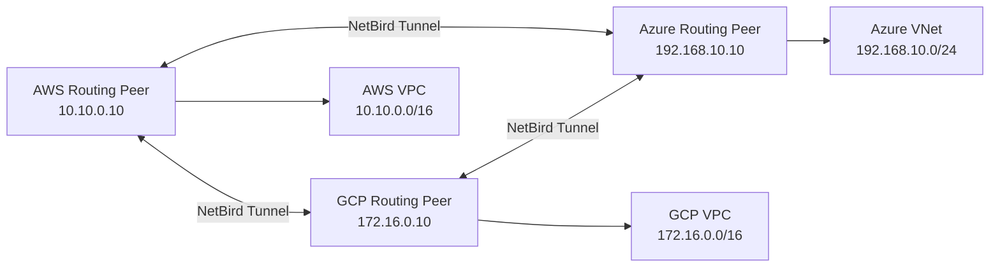

# 案例五：打通多云内网（AWS / GCP / Azure）

> 这个场景非常适合“多云资源互访”但又不想为每对网络单独维护传统 VPN 的团队。

## 1. 场景目标

你有三套环境：

- AWS 生产 VPC
- GCP 数据分析 VPC
- Azure 办公网 VNet

希望做到：

- 三边内网可以互通
- 但不是全网放通
- 只允许必要的应用和端口访问

## 2. 示例拓扑



## 3. 示例网段

| 环境 | 路由节点 | 资源网段 |
| --- | --- | --- |
| AWS | `10.10.0.10` | `10.10.0.0/16` |
| GCP | `172.16.0.10` | `172.16.0.0/16` |
| Azure | `192.168.10.10` | `192.168.10.0/24` |

## 4. 为什么这里推荐 Site-to-Site

因为这个需求本质上不是“一个人远程连进去”，而是“多个网络互相通信”。

按 NetBird 官方分类，它属于：

- `Site-to-Site`
- 一般使用 `Network Routes`

## 5. 配置步骤

### 5.1 三边都部署路由节点

每个云里各准备一台 Linux 虚机：

```bash
curl -fsSL https://pkgs.netbird.io/install.sh | sh
sudo netbird up \
  --management-url https://netbird.example.com \
  --setup-key NBSETUP-MULTICLOUD-REPLACE-ME
```

### 5.2 建立组

建议至少建立：

- `aws-routing-peers`
- `gcp-routing-peers`
- `azure-routing-peers`
- `app-cross-cloud`

### 5.3 创建网络路由

分别创建三条路由：

| Route | Network | Routing Peer | Distribution Groups | Masquerade |
| --- | --- | --- | --- | --- |
| `aws-vpc` | `10.10.0.0/16` | AWS Peer | `app-cross-cloud` | 开启 |
| `gcp-vpc` | `172.16.0.0/16` | GCP Peer | `app-cross-cloud` | 开启 |
| `azure-vnet` | `192.168.10.0/24` | Azure Peer | `app-cross-cloud` | 开启 |

为什么推荐先开 `Masquerade`：

- 多云环境回程路由通常最复杂
- 先开 NAT 能快速跑通
- 等你完全掌握回程网络后，再考虑关闭做端到端源地址保留

### 5.4 创建 ACL

不要直接全开，推荐按业务流拆开。

例如：

| 源组 | 目标组 | 协议 | 端口 |
| --- | --- | --- | --- |
| `aws-apps` | `gcp-data-services` | TCP | `5432,443` |
| `azure-office` | `aws-apps` | TCP | `443,22` |
| `gcp-analysts` | `azure-office-services` | TCP | `443` |

## 6. 验证方法

在 AWS 节点验证到 GCP：

```bash
nc -vz 172.16.20.15 5432
```

在 Azure 办公网节点验证到 AWS：

```bash
curl -I https://10.10.20.30
```

## 7. 真实实施建议

### 7.1 先只打通两个云

不要一开始三边全上。

建议顺序：

1. AWS <-> GCP
2. AWS <-> Azure
3. 最后加第三边联通

### 7.2 每个云至少保留一个“网络边界说明”

例如：

- 哪个节点是路由节点
- 哪个子网允许转发
- 哪些安全组或 VPC 防火墙允许来自路由节点的流量

### 7.3 避免网段重叠

一定要先核对：

- AWS VPC CIDR
- GCP VPC CIDR
- Azure VNet CIDR
- 办公网本地网段

如果有重叠，必须先调整或使用官方的路由重叠处理能力。

## 8. 常见坑

### 8.1 表面连通，应用不通

原因通常是：

- 路由通了，但云厂商安全组没开
- 应用层只监听本地
- 目标数据库只接受特定源地址

### 8.2 某一边永远回不来

大概率是：

- 没开 `Masquerade`
- 对端子网不知道怎么回 NetBird 客户端网段

### 8.3 网段重叠

这是多云场景最大坑之一。

示例：

- AWS `10.10.0.0/16`
- 本地办公也用了 `10.10.0.0/16`

这种情况下客户端会优先命中本地路由，NetBird 路由可能不生效。

## 9. 官方参考

- Site-to-Site Connectivity: [NetBird Docs](https://docs.netbird.io/use-cases/setup-site-to-site-access)
- Networks: [NetBird Docs](https://docs.netbird.io/how-to/networks)
- Resolve Overlapping Routes: [NetBird Docs](https://docs.netbird.io/how-to/resolve-overlapping-routes)
