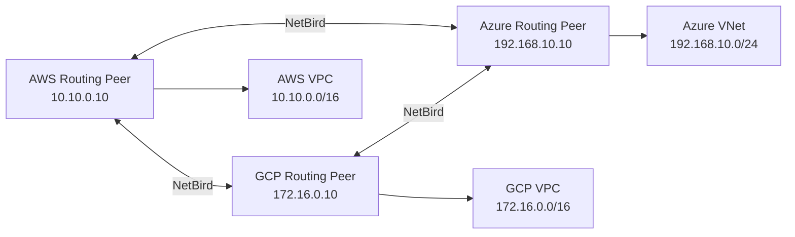

# 案例五：打通多云内网（阿里云 / 华为云 / AWS / GCP / Azure）

> 这个场景适合已经有多套云网络，但不想为每对网络维护传统 IPSec VPN、专线或复杂路由表的团队。
> 本文按“先打通 AWS 与 GCP，再扩展 Azure”的顺序写，便于新手排障。

阿里云、华为云、腾讯云和自建机房使用相同模型：每个 VPC 放置独立 Routing Peer，再用 Network、Resource Group 和 Policy 建立最小权限边界。需要在老 Linux 服务器上用 Docker Compose 部署常驻路由节点时，直接参考 [云 VPC 容器化 Routing Peer 运维手册](../operations/containerized-routing-peer-runbook.md)。

## 1. 最终效果

完成后可以实现：

- AWS 应用访问 GCP PostgreSQL：`172.16.20.15:5432`
- Azure 办公网访问 AWS 内部 Web：`10.10.20.30:443`
- GCP 分析任务访问 Azure 内部 API：`192.168.10.40:443`

同时满足：

- 不默认三云全网互通。
- 每个方向按业务端口放行。
- 云安全组 / 防火墙只信任本云路由节点或必要来源。
- 先开启 Masquerade 快速跑通，后续再按需保留真实源 IP。

## 2. 工作原理

多云互通本质上是多个 Routing Peer 互相桥接各自私网。

推荐用 `Networks` 表达每个云里的资源：

1. 每个云部署一台 Linux Routing Peer。
2. Routing Peer 加入对应云的 peer group。
3. 在 NetBird 中创建每个云的 Network Resources。
4. 通过 Access Policies 控制哪个业务组能访问哪个资源和端口。


```mermaid
flowchart LR
    AWSRP["AWS Routing Peer\n10.10.0.10"] <-->|NetBird| GCPRP["GCP Routing Peer\n172.16.0.10"]
    GCPRP <-->|NetBird| AZRP["Azure Routing Peer\n192.168.10.10"]
    AWSRP <-->|NetBird| AZRP
    AWSRP --> AWS["AWS VPC\n10.10.0.0/16"]
    GCPRP --> GCP["GCP VPC\n172.16.0.0/16"]
    AZRP --> AZ["Azure VNet\n192.168.10.0/24"]
```

## 3. 示例参数

| 云 | 路由节点 | 资源网段 | 示例服务 |
| --- | --- | --- | --- |
| AWS | `10.10.0.10` | `10.10.0.0/16` | `10.10.20.30:443` |
| GCP | `172.16.0.10` | `172.16.0.0/16` | `172.16.20.15:5432` |
| Azure | `192.168.10.10` | `192.168.10.0/24` | `192.168.10.40:443` |

NetBird 相关组：

| 组名 | 用途 |
| --- | --- |
| `aws-routing-peers` | AWS 路由节点 |
| `gcp-routing-peers` | GCP 路由节点 |
| `azure-routing-peers` | Azure 路由节点 |
| `aws-apps` | AWS 应用服务器 |
| `gcp-data-services` | GCP 数据服务资源 |
| `azure-office` | Azure 办公网用户 / 设备 |
| `cross-cloud-admins` | 多云运维管理员 |

## 4. 上线前检查

### 4.1 先检查网段是否重叠

把所有网络列出来：

```text
AWS VPC:      10.10.0.0/16
GCP VPC:      172.16.0.0/16
Azure VNet:   192.168.10.0/24
Office LAN:   10.1.0.0/16
NetBird CIDR: 100.64.0.0/10
```

如果出现重叠，例如 AWS 和办公室都用 `10.10.0.0/16`，先不要上线。重叠网段会让客户端不知道该走本地网络还是 NetBird 路由。

### 4.2 检查每个路由节点本机连通性

AWS 路由节点：

```bash
ip addr
ip route
nc -vz 10.10.20.30 443
```

GCP 路由节点：

```bash
ip addr
ip route
nc -vz 172.16.20.15 5432
```

Azure 路由节点：

```bash
ip addr
ip route
nc -vz 192.168.10.40 443
```

如果路由节点访问不了本云目标服务，先修本云防火墙、子网路由、应用监听，不要继续配 NetBird。

## 5. 创建 Setup Keys

建议每个云单独一个 Setup Key。

Setup Key 只负责首次注册。它过期或被撤销后，不会让已经注册成功的 Routing Peer 失效；长期身份来自客户端状态目录。容器部署必须持久化 `/var/lib/netbird`，注册完成后清空容器环境中的 Setup Key，并做一次无 Key 重建演练。

| Key 名称 | Auto-assigned groups | 使用次数 |
| --- | --- | --- |
| `nb-aws-routing-peer` | `aws-routing-peers` | `2` |
| `nb-gcp-routing-peer` | `gcp-routing-peers` | `2` |
| `nb-azure-routing-peer` | `azure-routing-peers` | `2` |

创建路径：

1. `Settings > Setup Keys`
2. `Create Setup Key`
3. 设置名称、过期时间、使用次数
4. 添加对应 Auto-assigned group
5. 复制 key

下面分别用：

```text
NBSETUP-AWS-ROUTER-REPLACE-ME
NBSETUP-GCP-ROUTER-REPLACE-ME
NBSETUP-AZURE-ROUTER-REPLACE-ME
```

## 6. 部署三台路由节点

### 6.1 AWS 路由节点

```bash
curl -fsSL https://pkgs.netbird.io/install.sh | sh
sudo netbird up \
  --management-url https://netbird.example.com \
  --setup-key NBSETUP-AWS-ROUTER-REPLACE-ME
```

### 6.2 GCP 路由节点

```bash
curl -fsSL https://pkgs.netbird.io/install.sh | sh
sudo netbird up \
  --management-url https://netbird.example.com \
  --setup-key NBSETUP-GCP-ROUTER-REPLACE-ME
```

### 6.3 Azure 路由节点

```bash
curl -fsSL https://pkgs.netbird.io/install.sh | sh
sudo netbird up \
  --management-url https://netbird.example.com \
  --setup-key NBSETUP-AZURE-ROUTER-REPLACE-ME
```

### 6.4 三台都持久化转发

每台路由节点都执行：

```bash
sudo tee /etc/sysctl.d/99-netbird-router.conf >/dev/null <<'EOF'
net.ipv4.ip_forward=1
net.ipv6.conf.all.forwarding=1
EOF
sudo sysctl --system
netbird status
netbird status -d
```

Dashboard 预期：

- AWS Peer 在 `aws-routing-peers`
- GCP Peer 在 `gcp-routing-peers`
- Azure Peer 在 `azure-routing-peers`

## 7. 云防火墙最小规则

先按 Masquerade 模式跑通。此时目标服务看到的来源是“本云路由节点的内网 IP”。

### 7.1 AWS 安全组示例

允许 AWS 内部 Web 只接受 AWS 路由节点：

```text
Type: HTTPS
Protocol: TCP
Port: 443
Source: 10.10.0.10/32
```

如果 AWS 应用要访问 GCP 数据库，则 GCP 数据库侧要允许 GCP 路由节点：

```text
TCP 5432 from 172.16.0.10/32
```

### 7.2 GCP Firewall 示例

允许 GCP PostgreSQL 接受 GCP 路由节点来源：

```bash
gcloud compute firewall-rules create allow-netbird-router-to-postgres \
  --network=default \
  --allow=tcp:5432 \
  --source-ranges=172.16.0.10/32 \
  --target-tags=postgres
```

### 7.3 Azure NSG 示例

允许 Azure API 接受 Azure 路由节点来源：

```bash
az network nsg rule create \
  --resource-group rg-prod \
  --nsg-name nsg-prod \
  --name Allow-NetBird-Router-HTTPS \
  --priority 300 \
  --direction Inbound \
  --access Allow \
  --protocol Tcp \
  --source-address-prefixes 192.168.10.10/32 \
  --destination-port-ranges 443
```

云命令里的资源组、网络名、tag、NSG 名要替换成你的实际值。

## 8. 在 NetBird 创建 Networks

进入 `Networks`，分别创建三个 Network。

### 8.1 AWS Network

| 字段 | 值 |
| --- | --- |
| Network name | `aws-prod-vpc` |
| Routing peer | `aws-routing-peers` |
| Masquerade | 开启 |

Resources：

| 资源名 | 类型 | 值 | 资源组 |
| --- | --- | --- | --- |
| `aws-prod-web` | IP | `10.10.20.30/32` | `aws-web-services` |
| `aws-prod-vpc-range` | IP Range | `10.10.0.0/16` | `aws-vpc-range` |

第一天建议只添加 `aws-prod-web`，不要直接放大网段。

### 8.2 GCP Network

| 字段 | 值 |
| --- | --- |
| Network name | `gcp-data-vpc` |
| Routing peer | `gcp-routing-peers` |
| Masquerade | 开启 |

Resources：

| 资源名 | 类型 | 值 | 资源组 |
| --- | --- | --- | --- |
| `gcp-postgres` | IP | `172.16.20.15/32` | `gcp-data-services` |
| `gcp-data-vpc-range` | IP Range | `172.16.0.0/16` | `gcp-vpc-range` |

### 8.3 Azure Network

| 字段 | 值 |
| --- | --- |
| Network name | `azure-office-vnet` |
| Routing peer | `azure-routing-peers` |
| Masquerade | 开启 |

Resources：

| 资源名 | 类型 | 值 | 资源组 |
| --- | --- | --- | --- |
| `azure-office-api` | IP | `192.168.10.40/32` | `azure-office-services` |
| `azure-office-vnet-range` | IP Range | `192.168.10.0/24` | `azure-vnet-range` |

## 9. 创建访问策略

先只配业务真实需要的方向：

| 策略名 | 源组 | 目标组 | 协议 | 端口 |
| --- | --- | --- | --- | --- |
| `aws-apps-to-gcp-postgres` | `aws-apps` | `gcp-data-services` | TCP | `5432` |
| `azure-office-to-aws-web` | `azure-office` | `aws-web-services` | TCP | `443` |
| `gcp-admins-to-azure-api` | `cross-cloud-admins` | `azure-office-services` | TCP | `443` |

管理员排障可临时加：

| 策略名 | 源组 | 目标组 | 协议 | 端口 |
| --- | --- | --- | --- | --- |
| `admins-to-cloud-routing-peers-ssh` | `cross-cloud-admins` | `aws-routing-peers,gcp-routing-peers,azure-routing-peers` | TCP | `22` |

排障完成后建议禁用或收紧。

## 10. 分阶段验证

### 10.1 第一阶段：AWS 到 GCP PostgreSQL

在 AWS 应用服务器或 AWS 测试 Peer 上执行：

```bash
netbird status
nc -vz 172.16.20.15 5432
```

如果有数据库账号，可以进一步：

```bash
psql "host=172.16.20.15 port=5432 dbname=app user=readonly sslmode=require"
```

预期：

- TCP `5432` 成功。
- 非 `aws-apps` 组的设备访问失败。

### 10.2 第二阶段：Azure 到 AWS Web

在 Azure 办公网 Peer 上：

```bash
curl -k -I https://10.10.20.30
nc -vz 10.10.20.30 443
```

预期成功。

### 10.3 第三阶段：GCP 管理员到 Azure API

在 `cross-cloud-admins` 设备上：

```bash
curl -k -I https://192.168.10.40
nc -vz 192.168.10.40 443
```

预期成功。

## 11. 排障

### 11.1 NetBird 显示 Connected，但业务不通

从源端开始：

```bash
netbird status -d
netbird networks ls
nc -vz 172.16.20.15 5432
```

在目标云路由节点上：

```bash
ip route
sysctl net.ipv4.ip_forward
nc -vz 172.16.20.15 5432
```

如果路由节点本机不通，问题在云网络或目标服务，不在 NetBird。

### 11.2 只有一个方向通

常见原因：

- 策略是单向的，源组和目标组写反。
- 目标云安全组只允许了错误来源。
- Masquerade 关闭后没有回程路由。

先保持 Masquerade 开启，再确认目标服务看到的来源是本云路由节点。

### 11.3 关闭 Masquerade 后不通

关闭 Masquerade 后，目标网络需要知道怎么回 NetBird Overlay CIDR：

```text
目的网段：100.64.0.0/10
下一跳：本云路由节点内网 IP
```

示例：

| 云 | 下一跳 |
| --- | --- |
| AWS | `10.10.0.10` |
| GCP | `172.16.0.10` |
| Azure | `192.168.10.10` |

没有回程路由时，目标服务会收到请求，但响应不知道怎么回去。

### 11.4 网段重叠

示例：

```text
AWS VPC: 10.10.0.0/16
办公室: 10.10.0.0/16
```

处理优先级：

1. 新环境优先换 CIDR。
2. 能拆小网段就拆小网段。
3. 最后再考虑 NetBird 的 overlapping route 处理能力。

不要在重叠网段里配置大范围默认资源，否则排障会非常痛苦。

## 12. 回滚

按顺序撤回：

1. 禁用跨云访问策略。
2. 禁用对应 Network Resources。
3. 从业务服务器组移除测试设备。
4. 云安全组 / 防火墙删除临时规则。
5. 路由节点下线：

```bash
sudo netbird down
sudo systemctl stop netbird
```

每次只回滚一层，方便确认问题来源。

## 13. 扩展做法

### 13.1 路由节点高可用

每个云至少两台 Routing Peer：

| 云 | 主节点 | 备用节点 |
| --- | --- | --- |
| AWS | `10.10.0.10` | `10.10.0.11` |
| GCP | `172.16.0.10` | `172.16.0.11` |
| Azure | `192.168.10.10` | `192.168.10.11` |

不同 metric：主备模式。

相同 metric：客户端选择低延迟节点。

不要把主备放在同一个可用区。

### 13.2 按业务域拆资源

推荐：

| 资源组 | 内容 |
| --- | --- |
| `aws-web-services` | AWS Web |
| `aws-db-services` | AWS DB |
| `gcp-data-services` | GCP 数据库 |
| `gcp-analytics-services` | GCP 分析系统 |
| `azure-office-services` | Azure 办公网系统 |

不要用一个 `app-cross-cloud` 包住所有资源，否则后续审计困难。

### 13.3 引入域名资源

如果服务证书依赖域名：

| 资源名 | 类型 | 值 | 资源组 |
| --- | --- | --- | --- |
| `gcp-postgres-domain` | Domain | `postgres.gcp.internal` | `gcp-data-services` |
| `aws-web-domain` | Domain | `web.aws.internal` | `aws-web-services` |

要求：对应 Routing Peer 能解析这些域名。

### 13.4 先按主机授权，再扩成子网

多云接入不要从“三朵云全网互通”起步。建议按以下阶段推进：

1. 每朵云先部署一台独立 Routing Peer，只发布一个测试主机 `/32`。
2. 分别完成授权用户成功、非授权用户失败和真实 TCP/HTTPS 验证。
3. 按业务域增加 `/32` 资源，并记录负责人、端口和有效期。
4. 只有同一子网内大多数主机确实共享相同授权边界时，才合并为小 CIDR。
5. 最后增加第二台 Routing Peer，验证主备切换和故障恢复。

为后续阿里云、腾讯云、华为云或自建机房扩展，维护一份不含凭据的资源台账：

| 字段 | 示例 |
| --- | --- |
| Cloud / Account | `cloud-a / production` |
| Region / VPC | `region-1 / vpc-app` |
| Resource | `10.20.30.11/32` |
| Owner | `team-app` |
| Protocol / Port | `TCP 443` |
| Routing Peer Group | `routing-peers-cloud-a-region-1` |
| User Group | `users-app-readonly` |
| Policy | `allow-app-readonly` |
| Review Date | `YYYY-MM-DD` |

每个云或区域的 Routing Peer 使用独立 Compose 项目、持久卷和 Setup Key。镜像固定版本，注册完成后清除 Setup Key。这样管理面升级不会把所有云的数据面同时重建。

对容器化节点，优先把状态绑定到明确目录，例如 `/data/netbird-client/data:/var/lib/netbird`。备份的是身份目录，而不是已经过期的 Setup Key。

### 13.5 多云变更验收

每次新增云、VPC 或资源时记录：

- 客户端到目标的实际 DNS 解析和路由。
- Routing Peer 请求前后的传输计数。
- 目标云安全组看到的源地址是否符合 Masquerade 设计。
- 主 Routing Peer 停止后，备用节点是否在预期时间内接管。
- 与本机其他 VPN 是否存在相同 CIDR 或 `/32` 路由冲突。
- 非授权组访问同一目标是否失败。
- 授权账号对应的实际 Peer 是否进入访问组并收到 Network；不要只检查账号是否存在。
- Routing Peer 本机 LAN IP 是否属于自访问需求；若是，需另建 peer-to-peer Policy，并评估 userspace 节点的 `NB_ENABLE_LOCAL_FORWARDING`。

这份验收记录应和资源台账一起更新，避免多云规模扩大后只剩 Dashboard 中无法解释的历史配置。

## 14. 官方参考

- Routing Peers 原理：https://docs.netbird.io/manage/networks/how-routing-peers-work
- Networks：https://docs.netbird.io/manage/networks
- Site-to-Site：https://docs.netbird.io/use-cases/remote-access/site-to-site
- Access Control：https://docs.netbird.io/manage/access-control/manage-network-access
- Resolve Overlapping Routes：https://docs.netbird.io/manage/network-routes/overlapping-routes
