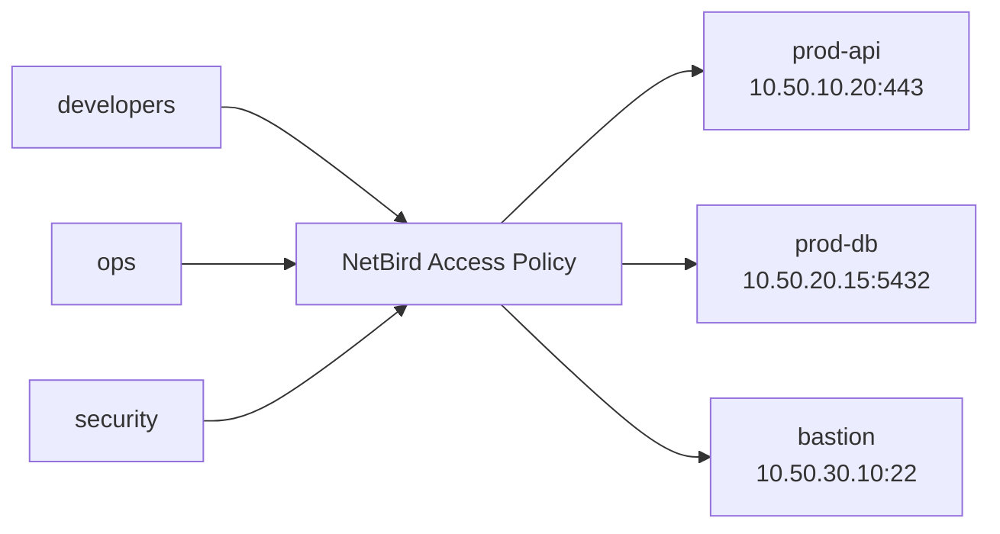
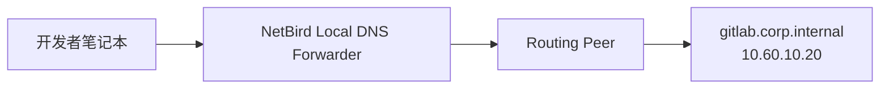
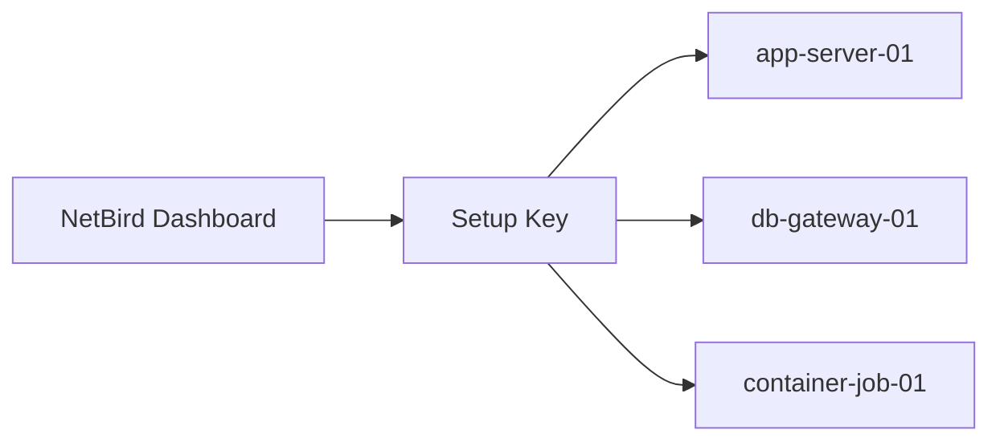
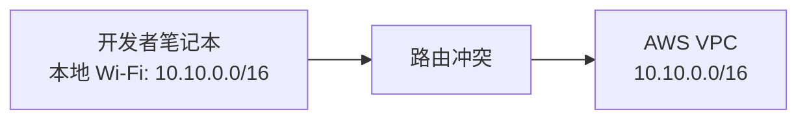

# 案例六：官方推荐的高级最佳实践合集

> 这一篇不是单一场景，而是把最值得做、最容易提升稳定性和安全性的 4 组实践放在一起。
> 每一组都给出适合团队直接落地的说明。

## 1. 最佳实践一：按“人组 + 资源组 + 端口”建策略

### 1.1 架构图



### 1.2 推荐分组

用户组：

- `developers`
- `ops`
- `security`

资源组：

- `prod-api-group`
- `prod-db-group`
- `bastion-group`

### 1.3 推荐策略

| 源组 | 目标组 | 协议 | 端口 |
| --- | --- | --- | --- |
| `developers` | `prod-api-group` | TCP | `443` |
| `ops` | `bastion-group` | TCP | `22` |
| `security` | `prod-api-group` | TCP | `443` |
| `security` | `prod-db-group` | TCP | `5432` |

原则：

- 不要直接放大网段
- 不要把资源都塞进 `All`
- 不要把 `SSH`、`DB`、`Web` 混在一条大策略里

## 2. 最佳实践二：用 Domain Resource 替代难记 IP

### 2.1 架构图



### 2.2 适用场景

- 内部系统有固定域名
- 证书校验依赖域名
- 不想让用户记 IP

### 2.3 示例

把这些域名做成资源：

- `gitlab.corp.internal`
- `jenkins.corp.internal`
- `grafana.corp.internal`

好处：

- 浏览器证书体验更好
- 不会因为 IP 变化导致培训文档失效

### 2.4 注意事项

- 路由节点必须能解析这些域名
- 如果使用 wildcard domain，要确保官方要求的能力已开启

## 3. 最佳实践三：给服务器和容器统一发 Setup Key

### 3.1 架构图



### 3.2 适用场景

- 新服务器频繁创建
- IaC / 自动化部署较多
- 不想每台机器都手工扫码登录

### 3.3 推荐方式

为不同用途创建不同 Setup Key：

| Key 名称 | 用途 |
| --- | --- |
| `nb-dev-servers` | 开发服务器 |
| `nb-prod-routing-peers` | 生产路由节点 |
| `nb-ci-runners` | CI Runner |

示例：

```bash
sudo netbird up \
  --management-url https://netbird.example.com \
  --setup-key NBSETUP-PROD-ROUTER-REPLACE-ME
```

### 3.4 安全建议

- 给 Setup Key 设置过期时间
- 不同环境不要共用同一个 Key
- 路由节点使用专用 Key

## 4. 最佳实践四：路线冲突和重叠网段预防

### 4.1 架构图



### 4.2 为什么这是大坑

如果你的本地网络和远端网络都叫：

```text
10.10.0.0/16
```

那客户端会不知道该走本地还是走 NetBird。

### 4.3 解决建议

上线前就做网段盘点：

| 网络 | CIDR |
| --- | --- |
| 办公网 | `10.1.0.0/16` |
| AWS 生产 | `10.10.0.0/16` |
| GCP 数据 | `172.16.0.0/16` |
| Azure 办公网 | `192.168.10.0/24` |

如果已经重叠：

- 优先调整新环境 CIDR
- 无法调整时，再用 NetBird 官方的 overlap route 选择能力处理

## 5. 给团队的最终落地建议

如果你希望这个仓库真正能指导别人落地，推荐团队内部先统一以下约定：

1. 所有资源必须先分组，再建策略。
2. 所有服务器接入尽量用 Setup Key，不要人工逐台登录。
3. 能用域名资源就尽量不用裸 IP。
4. 所有新网络上线前先做 CIDR 冲突检查。

## 6. 官方参考

- Access Control Overview: [NetBird Docs](https://docs.netbird.io/manage/access-control)
- Manage Network Access: [NetBird Docs](https://docs.netbird.io/manage/access-control/manage-network-access)
- Networks: [NetBird Docs](https://docs.netbird.io/how-to/networks)
- Setup Keys: [NetBird Docs](https://docs.netbird.io/manage/peers/register-machines-using-setup-keys)
- Resolve Overlapping Routes: [NetBird Docs](https://docs.netbird.io/how-to/resolve-overlapping-routes)
