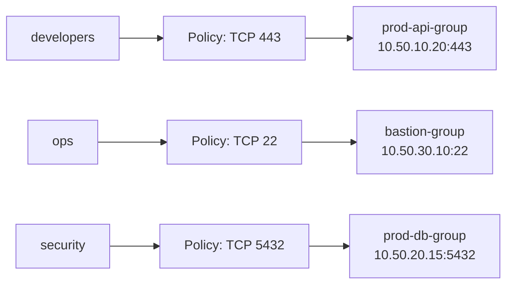
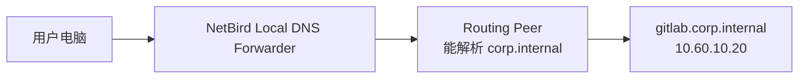

# 案例六：NetBird 进阶最佳实践手册

> 这一篇不是单一业务场景，而是把真实生产环境最常见、最值得长期沉淀的实践整理成手册。
> 适合在完成前 5 个案例后，用来制定团队内部 NetBird 使用规范。

## 1. 实践一：按“人组 + 资源组 + 端口”建策略

### 1.1 最终效果

你可以清楚回答：

- 谁能访问生产 API？
- 谁能 SSH 到跳板机？
- 谁能连生产数据库？
- 哪些权限是临时的？
- 普通员工是否还被默认 `All -> All` 放行？

### 1.2 原理

NetBird 访问控制的核心是：

```text
源组 -> 目标组 -> 协议/端口
```

不要把“人、设备、资源、端口”混成一条大策略。


```mermaid
flowchart LR
    DEV["developers"] --> P1["Policy: TCP 443"]
    OPS["ops"] --> P2["Policy: TCP 22"]
    SEC["security"] --> P3["Policy: TCP 5432"]
    P1 --> API["prod-api-group\n10.50.10.20:443"]
    P2 --> SSH["bastion-group\n10.50.30.10:22"]
    P3 --> DB["prod-db-group\n10.50.20.15:5432"]
```

### 1.3 推荐分组模板

用户 / 设备组：

| 组名 | 放什么 |
| --- | --- |
| `developers` | 开发人员受管设备 |
| `ops` | 运维人员受管设备 |
| `security` | 安全审计人员 |
| `contractors` | 外包 / 临时人员 |
| `managed-laptops` | 公司受管终端 |
| `prod-admins` | 生产管理员 |

资源组：

| 组名 | 放什么 |
| --- | --- |
| `prod-api-group` | 生产 API |
| `prod-db-group` | 生产数据库 |
| `bastion-group` | 跳板机 |
| `observability-group` | Grafana / Prometheus / Loki |
| `ci-cd-group` | Jenkins / GitLab Runner |

### 1.4 策略模板

| 策略名 | 源组 | 目标组 | 协议 | 端口 | 说明 |
| --- | --- | --- | --- | --- | --- |
| `developers-to-prod-api` | `developers` | `prod-api-group` | TCP | `443` | 开发访问 API |
| `ops-to-bastion` | `ops` | `bastion-group` | TCP | `22` | 运维 SSH |
| `security-to-prod-db-readonly` | `security` | `prod-db-group` | TCP | `5432` | 审计只读 |
| `ops-to-observability` | `ops` | `observability-group` | TCP | `443,3000` | 运维观测 |

### 1.5 上线步骤

1. 进入 `Access Control > Groups`。
2. 创建用户组和资源组。
3. 把用户设备加入对应用户组。
4. 在 `Networks` 里把资源加入对应资源组。
5. 进入 `Access Control > Policies` 创建策略。
6. 确认默认 `All -> All` 是否仍存在。
7. 用授权设备和非授权设备分别验证。

授权设备验证：

```bash
curl -k -I https://10.50.10.20
nc -vz 10.50.30.10 22
nc -vz 10.50.20.15 5432
```

非授权设备验证：

```bash
curl -k -I --connect-timeout 5 https://10.50.10.20
nc -vz -w 5 10.50.20.15 5432
```

预期：非授权设备失败。

### 1.6 排障

如果非授权用户也能访问：

- 检查默认 `All -> All` 策略。
- 检查资源是否被放入 `All`。
- 检查用户是否被误加入目标源组。
- 检查是否还有旧 VPN / 公网入口。

## 2. 实践二：用 Domain Resource 替代难记 IP

### 2.1 适用场景

- 内部服务证书签给域名。
- 服务 IP 会变化。
- 用户应该访问 `gitlab.corp.internal`，而不是 `10.60.10.20`。

### 2.2 原理

Domain Resource 会让客户端把特定域名解析交给 Routing Peer。Routing Peer 在内网解析域名，然后把流量路由到解析出的目标。


```mermaid
flowchart LR
    User["用户电脑"] --> DNS["NetBird Local DNS Forwarder"]
    DNS --> RP["Routing Peer\n能解析 corp.internal"]
    RP --> APP["gitlab.corp.internal\n10.60.10.20"]
```

### 2.3 上线前检查

在 Routing Peer 上执行：

```bash
getent hosts gitlab.corp.internal
getent hosts jenkins.corp.internal
curl -I https://gitlab.corp.internal
curl -I https://jenkins.corp.internal
```

如果 Routing Peer 解析不了，先配置它的 DNS，例如 `/etc/resolv.conf`、systemd-resolved 或云内 DNS。

### 2.4 创建资源

进入 `Networks`，创建或选择网络 `corp-internal-domains`。

添加资源：

| 资源名 | 类型 | 值 | 资源组 |
| --- | --- | --- | --- |
| `gitlab-domain` | Domain | `gitlab.corp.internal` | `dev-tools` |
| `jenkins-domain` | Domain | `jenkins.corp.internal` | `dev-tools` |
| `grafana-domain` | Domain | `grafana.corp.internal` | `observability-group` |

策略：

| 策略名 | 源组 | 目标组 | 协议 | 端口 |
| --- | --- | --- | --- | --- |
| `developers-to-dev-tools-domains` | `developers` | `dev-tools` | TCP | `443,8443` |
| `ops-to-observability-domains` | `ops` | `observability-group` | TCP | `443,3000` |

### 2.5 验证

在授权客户端：

```bash
netbird status
nc -vz gitlab.corp.internal 443
curl -I https://gitlab.corp.internal
```

如果证书正常，浏览器不应提示域名不匹配。

### 2.6 常见坑

- Routing Peer 解析不了内部域名。
- 域名资源和大 IP Range 放在同一个 Network，导致策略边界变模糊。
- 客户端版本太旧，DNS forwarder 行为与新版本不一致。
- 后端证书缺少用户访问的域名。

建议：域名资源尽量独立 Network 管理，尤其不要和 `10.0.0.0/8` 这种大范围资源混放。

## 3. 实践三：用 Setup Key 自动接入服务器、容器和路由节点

### 3.1 适用场景

- 新服务器经常创建。
- 需要 Terraform / Ansible / Cloud-init 自动接入。
- CI Runner、容器任务、K8S 路由 Pod 需要非交互式接入。

### 3.2 Key 规划

不要全公司共用一个 Key。

| Key 名称 | 用途 | Auto-assigned groups | 建议 |
| --- | --- | --- | --- |
| `nb-dev-servers` | 开发服务器 | `dev-servers` | 可复用，限制次数 |
| `nb-prod-routing-peers` | 生产路由节点 | `prod-routing-peers` | 严格限制次数 |
| `nb-ci-runners` | CI Runner | `ci-runners` | 开启 ephemeral peers |
| `nb-k8s-routing-peers` | K8S 路由 Pod | `k8s-routing-peers` | 开启 ephemeral peers |

### 3.3 Linux 服务器接入脚本

保存为 `install-netbird-peer.sh`：

```bash
#!/usr/bin/env bash
set -euo pipefail

NETBIRD_MANAGEMENT_URL="${NETBIRD_MANAGEMENT_URL:-https://netbird.example.com}"
NETBIRD_SETUP_KEY="${NETBIRD_SETUP_KEY:?missing NETBIRD_SETUP_KEY}"

curl -fsSL https://pkgs.netbird.io/install.sh | sh
sudo netbird up \
  --management-url "$NETBIRD_MANAGEMENT_URL" \
  --setup-key "$NETBIRD_SETUP_KEY"

netbird status
```

执行：

```bash
chmod +x install-netbird-peer.sh
NETBIRD_SETUP_KEY="NBSETUP-PROD-ROUTER-REPLACE-ME" ./install-netbird-peer.sh
```

### 3.4 systemd 环境文件示例

如果你需要把环境变量集中管理，创建：

```bash
sudo tee /etc/netbird/netbird.env >/dev/null <<'EOF'
NETBIRD_MANAGEMENT_URL=https://netbird.example.com
NETBIRD_SETUP_KEY=NBSETUP-PROD-ROUTER-REPLACE-ME
EOF
sudo chmod 600 /etc/netbird/netbird.env
```

注意：Setup Key 是敏感信息，只能 root 读。

### 3.5 验证和清理

验证：

```bash
netbird status
netbird status -d
```

Dashboard 中确认：

- Peer 名称正确。
- 自动加入了预期组。
- 不在 `All` 之外的错误大权限组。

清理失效 key：

1. `Settings > Setup Keys`
2. 找到旧 key
3. Revoke

Revoke key 不会让已注册 Peer 自动下线。要下线 Peer，需要在 `Peers` 中删除或在机器上执行：

```bash
sudo netbird down
```

## 4. 实践四：重叠网段预防和处理

### 4.1 为什么危险

如果用户家里 Wi-Fi 和 AWS VPC 都是：

```text
10.10.0.0/16
```

客户端访问 `10.10.20.30` 时，可能优先走本地 Wi-Fi，而不是 NetBird。

### 4.2 上线前 CIDR 盘点模板

保存为 `network-cidr-inventory.yaml`：

```yaml
netbird:
  overlay_cidr: 100.64.0.0/10
office:
  hz_office: 10.1.0.0/16
cloud:
  aws_prod: 10.10.0.0/16
  gcp_data: 172.16.0.0/16
  azure_office: 192.168.10.0/24
kubernetes:
  prod_nodes: 10.60.0.0/24
  prod_pods: 10.244.0.0/16
  prod_services: 10.96.0.0/16
reserved:
  documentation_public_1: 203.0.113.0/24
  documentation_public_2: 198.51.100.0/24
```

人工检查原则：

- 新建 VPC / VNet 不要复用办公室 CIDR。
- K8S Pod CIDR 不要和 VPC、办公室、其他集群冲突。
- 尽量不要把 `10.0.0.0/8` 当作一个资源放行。

### 4.3 发现重叠后的处理顺序

1. 新环境优先改 CIDR。
2. 只暴露单个 Host `/32`，不要暴露整个重叠网段。
3. 使用域名资源替代 IP Range。
4. 最后再评估官方 overlapping route 能力。

### 4.4 验证路由命中

在客户端：

```bash
netbird networks ls
ip route get 10.10.20.30
traceroute 10.10.20.30
```

如果 `ip route get` 指向本地 Wi-Fi 网关，不是 NetBird 接口，说明存在路由冲突。

## 5. 实践五：路由节点高可用

### 5.1 适用场景

- 办公室核心资源不能因为一台路由节点宕机而不可访问。
- 多可用区云环境。
- K8S 或多云资源访问需要稳定入口。

### 5.2 部署模板

每个网络至少两台 Routing Peer：

| 网络 | 主节点 | 备用节点 | 组 |
| --- | --- | --- | --- |
| office-hz | `10.20.0.10` | `10.20.0.11` | `office-routing-peers` |
| aws-prod | `10.10.0.10` | `10.10.0.11` | `aws-routing-peers` |
| k8s-prod | `10.60.0.10` | `10.60.0.11` | `k8s-routing-peers` |

两个节点都执行：

```bash
curl -fsSL https://pkgs.netbird.io/install.sh | sh
sudo netbird up \
  --management-url https://netbird.example.com \
  --setup-key NBSETUP-ROUTER-HA-REPLACE-ME
```

并开启转发：

```bash
sudo tee /etc/sysctl.d/99-netbird-router.conf >/dev/null <<'EOF'
net.ipv4.ip_forward=1
net.ipv6.conf.all.forwarding=1
EOF
sudo sysctl --system
```

### 5.3 Metric 选择

| 模式 | Metric 设置 | 效果 |
| --- | --- | --- |
| 主备 | 主节点低，备用高 | 主节点优先，故障时切备用 |
| 就近 | 多节点相同 | 客户端选择低延迟节点 |

注意：

- Masquerade 关闭时，高可用会复杂很多，因为回程路由必须指向特定节点。
- 新手生产环境先保持 Masquerade 开启。
- 主备不要放同一台宿主机或同一可用区。

### 5.4 故障演练

在客户端持续请求：

```bash
while true; do date; curl -k -I --connect-timeout 3 https://10.20.10.20; sleep 2; done
```

停掉主路由节点：

```bash
sudo systemctl stop netbird
```

观察客户端是否恢复。TCP 长连接可能断开重连，这是正常现象。

恢复：

```bash
sudo systemctl start netbird
netbird status
```

## 6. 实践六：上线审计和回滚模板

### 6.1 上线前审计清单

保存为 `netbird-change-checklist.md`：

````markdown
# NetBird 变更检查单

## 基本信息

- 变更日期：
- 变更人：
- 业务系统：
- 涉及 Network：
- 涉及资源：
- 涉及用户组：

## 上线前检查

- [ ] 路由节点能访问目标资源
- [ ] 目标服务只监听预期端口
- [ ] 云安全组 / 防火墙已按最小来源放行
- [ ] NetBird 资源未加入 All
- [ ] 策略未使用 All 作为源组
- [ ] 默认 All -> All 策略已确认是否保留
- [ ] 非授权用户验证会失败
- [ ] 回滚步骤已写好

## 验证命令

```bash
netbird status
nc -vz <target-ip> <port>
curl -k -I https://<target>
```

## 回滚步骤

1. 禁用策略：
2. 禁用资源：
3. 移除用户组：
4. 下线路由节点：

```bash
sudo netbird down
sudo systemctl stop netbird
```
````

### 6.2 变更后检查

授权设备：

```bash
netbird status
nc -vz <target-ip> <port>
curl -k -I https://<target>
```

非授权设备：

```bash
nc -vz -w 5 <target-ip> <port>
curl -k -I --connect-timeout 5 https://<target>
```

日志留存：

- Dashboard 活动日志
- 路由节点 `netbird status -d`
- 后端服务访问日志
- 云防火墙变更记录

## 7. 团队约定建议

建议把下面这些写进团队规范：

1. 新资源必须先进资源组，再建策略。
2. 生产环境不允许直接用 `All` 作为源组。
3. 数据库、SSH、Web 分开资源组。
4. 所有路由节点必须用专用 Setup Key。
5. 所有新网络上线前先做 CIDR 盘点。
6. 所有临时策略必须写失效日期。
7. 生产路由节点至少两台，分布在不同故障域。
8. 每次变更必须包含授权用户验证和非授权用户验证。

## 8. 官方参考

- Access Control：https://docs.netbird.io/manage/access-control/manage-network-access
- Setup Keys：https://docs.netbird.io/manage/peers/register-machines-using-setup-keys
- Routing Peers 原理：https://docs.netbird.io/manage/networks/how-routing-peers-work
- Networks：https://docs.netbird.io/manage/networks
- Resolve Overlapping Routes：https://docs.netbird.io/how-to/resolve-overlapping-routes
- IPv6 Overlay Addressing：https://docs.netbird.io/manage/settings/ipv6
