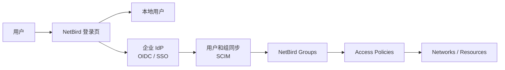

# 案例七：身份源、用户组同步与 MFA

> 本文用于规划 NetBird 的登录体系：什么时候只用本地用户，什么时候接企业 IdP，如何做 MFA 和用户组同步。

## 1. 最终效果

完成后你应该能做到：

- 小团队或测试环境使用 NetBird 本地用户快速上线。
- 生产环境可以接 Google Workspace、Microsoft Entra ID、Okta、JumpCloud、Keycloak、Authentik 等身份源。
- 用户组从 IdP 同步到 NetBird 后，直接用于访问策略。
- 管理员和关键用户启用 MFA。
- 离职、转岗、临时授权有清晰处理流程。

## 2. 工作原理

NetBird 自建新主线支持嵌入式 IdP，本地用户由 Management 服务内置能力管理。企业环境里，常见做法是：

1. OIDC / SSO 负责登录认证。
2. SCIM 或 IdP 同步负责用户和组生命周期。
3. NetBird Access Policies 使用同步后的用户组授权。
4. MFA 在本地用户或企业 IdP 中启用。



## 3. 选择哪种身份方案

| 场景 | 推荐方案 |
| --- | --- |
| 个人、自用、实验室 | 本地用户 |
| 小团队，暂无企业 IdP | 本地用户 + MFA + 备用管理员 |
| 已有 Google / Entra ID / Okta | 企业 IdP + 组同步 |
| 严格离职回收 | 企业 IdP + SCIM / 组同步 |
| 内网隔离或离线环境 | 本地用户 |

## 4. 本地用户上线步骤

### 4.1 首次管理员

部署完成后访问：

```text
https://netbird.example.com
```

新版主线默认进入 `/setup`，创建第一个管理员。

建议立即做：

1. 创建第一个管理员。
2. 创建第二个备用管理员。
3. 给管理员启用 MFA。
4. 禁止共享管理员账号。

### 4.2 邀请普通用户

Dashboard：

1. 进入 `Team > Users`。
2. 点击 `Add User`。
3. 选择 `Invite User`。
4. 填写邮箱、姓名、角色。
5. 可选：设置自动加入的组，例如 `developers`。
6. 复制 invite link，通过安全渠道发给用户。

用户完成邀请后：

```bash
netbird status
```

Dashboard 中检查：

- 用户已出现。
- 设备已登录。
- 用户或设备在预期组。

## 5. 企业 IdP 接入原则

不同 IdP 的具体参数不同，但统一原则是：

1. 先确认自建 NetBird Dashboard 可以正常登录。
2. 在 IdP 中创建 OIDC 应用。
3. 回调地址使用 NetBird Dashboard 提示的地址。
4. 在 NetBird Dashboard 中添加外部身份提供方。
5. 先用测试用户登录。
6. 再考虑组同步。

不要一开始就把生产用户全量导入。先用一个测试组，例如：

```text
netbird-pilot-users
```

## 6. 用户组同步设计

推荐把 IdP 组和 NetBird 权限模型对齐：

| IdP 组 | NetBird 组 | 用途 |
| --- | --- | --- |
| `idp-netbird-admins` | `netbird-admins` | 管理员 |
| `idp-platform-admins` | `platform-admins` | 平台运维 |
| `idp-developers` | `developers` | 开发者 |
| `idp-db-readers` | `db-readers` | 数据库只读 |
| `idp-security-auditors` | `security-auditors` | 安全审计 |

注意：

- 如果 NetBird 中已有同名本地组，IdP 同步可能不会按预期导入同名组。上线前先清理命名冲突。
- 组名建议有前缀或明确命名，避免和手工组混淆。
- 不要把 IdP 的大组如 `all-employees` 直接用于生产资源策略。

## 7. MFA 建议

### 7.1 本地用户

本地用户模式下：

- 管理员必须启用 MFA。
- 关键资源访问用户建议启用 MFA。
- 保留备用管理员，避免主账号丢失 MFA 后无法登录。

### 7.2 企业 IdP

企业 IdP 模式下：

- 优先在 IdP 中强制 MFA。
- NetBird 侧策略只使用同步组，不单独维护大量临时用户。
- 离职回收以 IdP 禁用账号和移出组为准，再检查 NetBird 是否还有旧 Peer。

## 8. 访问策略落地示例

资源组：

| 资源组 | 资源 |
| --- | --- |
| `prod-api-group` | `10.50.10.20/32` |
| `prod-db-group` | `10.50.20.15/32` |
| `bastion-group` | `10.50.30.10/32` |

策略：

| 策略名 | 源组 | 目标组 | 协议 | 端口 |
| --- | --- | --- | --- | --- |
| `developers-to-prod-api` | `developers` | `prod-api-group` | TCP | `443` |
| `platform-admins-to-bastion` | `platform-admins` | `bastion-group` | TCP | `22` |
| `security-to-prod-db` | `security-auditors` | `prod-db-group` | TCP | `5432` |

## 9. 验证

授权用户：

```bash
netbird status
curl -k -I https://10.50.10.20
nc -vz 10.50.30.10 22
```

非授权用户：

```bash
curl -k -I --connect-timeout 5 https://10.50.10.20
nc -vz -w 5 10.50.20.15 5432
```

预期：

- 授权用户成功。
- 非授权用户失败。
- 离开 IdP 组后，重新登录或策略刷新后访问失效。

## 10. 排障

### 10.1 用户能登录，但没有权限

检查：

- 用户是否同步到了正确组。
- Peer 是否加入了策略源组。
- 资源是否加入了策略目标组。
- 默认 `All -> All` 是否干扰判断。

### 10.2 IdP 登录失败

检查：

- OIDC 回调地址是否一致。
- Client ID / Secret 是否正确。
- 域名和 HTTPS 证书是否正常。
- 系统时间是否准确。

### 10.3 离职用户仍能访问

检查：

- IdP 账号是否已禁用。
- 用户是否仍在授权组。
- NetBird 中是否还有离线但未清理的 Peer。
- 是否存在 Setup Key 被滥用注册新设备。

## 11. 回滚

如果企业 IdP 接入失败：

1. 保留本地备用管理员。
2. 禁用新 IdP connector。
3. 移除测试同步组上的生产策略。
4. 回到本地用户模式验证：

```bash
netbird status
curl -I https://netbird.example.com
```

## 12. 官方参考

- 本地用户管理：https://docs.netbird.io/selfhosted/identity-providers/local
- 身份提供方说明：https://docs.netbird.io/selfhosted/identity-providers
- IdP 用户组同步：https://docs.netbird.io/manage/team/idp-sync
- Microsoft Entra ID SCIM：https://docs.netbird.io/manage/team/idp-sync/embedded/microsoft-entra-id-scim-sync
- Access Control：https://docs.netbird.io/manage/access-control/manage-network-access
