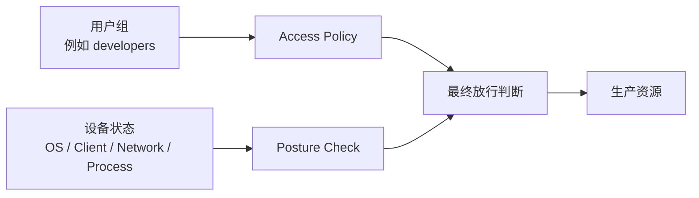

# 案例八：设备姿态检查与 Zero Trust 准入

> 本文用于在“用户组授权”之外，再增加设备状态约束。目标是避免“账号对了，但设备不可信”。

## 1. 最终效果

完成后可以做到：

- 只有指定用户组可以访问资源。
- 只有满足姿态检查的设备才真正放行。
- 普通员工、个人设备、过旧客户端、异常网络来源可以被挡住。
- 变更时同时验证授权用户和非授权用户。

## 2. 工作原理

Access Policy 决定“谁可以访问什么”，Posture Check 决定“设备是否满足条件”。



官方文档中 posture checks 可用于校验设备状态，例如客户端版本、操作系统、地理位置、网络 CIDR、特定进程等。具体可用检查项以你的 NetBird 版本和 Dashboard 实际显示为准。

## 3. 推荐分层

| 层级 | 例子 |
| --- | --- |
| 用户组 | `developers`、`platform-admins` |
| 设备组 | `managed-laptops` |
| 姿态检查 | 客户端版本、OS、办公网 CIDR、EDR 进程 |
| 资源组 | `prod-api-group`、`bastion-group` |
| 策略 | `developers -> prod-api-group -> TCP 443` + posture checks |

## 4. 创建测试资源

假设已有资源：

| 资源名 | 类型 | 值 | 资源组 |
| --- | --- | --- | --- |
| `prod-api` | IP | `10.50.10.20/32` | `prod-api-group` |
| `prod-bastion` | IP | `10.50.30.10/32` | `bastion-group` |

基础策略：

| 策略名 | 源组 | 目标组 | 协议 | 端口 |
| --- | --- | --- | --- | --- |
| `developers-to-prod-api` | `developers` | `prod-api-group` | TCP | `443` |
| `ops-to-bastion` | `platform-admins` | `bastion-group` | TCP | `22` |

先确保基础策略能工作，再加 posture checks。

## 5. 创建 Posture Check

Dashboard：

1. 进入 `Access Control > Posture Checks`。
2. 点击 `Create Posture Check`。
3. 选择检查类型。
4. 填写名称和说明。
5. 保存。

建议命名：

| 名称 | 用途 |
| --- | --- |
| `pc-managed-client-version` | 限制最低客户端版本 |
| `pc-corp-network-only` | 限制办公网或固定出口 |
| `pc-linux-routing-peer` | 只允许 Linux 路由节点 |
| `pc-edr-process-present` | 检查安全客户端进程 |

## 6. 常用姿态策略示例

### 6.1 最低客户端版本

适用场景：

- NetBird 新版本修复了安全或 DNS / Routing 行为。
- 不希望旧客户端继续访问生产资源。

操作：

1. 创建 client version posture check。
2. 设置最低版本，例如 `0.76.1` 或团队已验证版本。
3. 只绑定到生产资源策略，先不要影响所有资源。

验证：

```bash
netbird version
netbird status
curl -k -I https://10.50.10.20
```

### 6.2 办公网或固定出口

适用场景：

- 只允许来自公司办公网、堡垒出口、可信公网出口的设备访问。
- 阻止来自未知公共网络的访问。

示例来源：

```text
203.0.113.10/32
198.51.100.0/24
```

Dashboard 中创建 Peer Network Range 检查，以实际 UI 支持的 allow / block 动作为准。

验证：

```bash
curl https://ifconfig.me
netbird status
nc -vz 10.50.30.10 22
```

### 6.3 EDR / 安全客户端进程

适用场景：

- 只允许安装企业安全客户端的设备访问生产。

示例进程名：

```text
company-edr-agent
```

验证时：

```bash
ps aux | grep company-edr-agent
netbird status
curl -k -I https://10.50.10.20
```

不同操作系统进程名可能不同，先测试一小组设备。

## 7. 把 Posture Check 绑定到策略

进入 `Access Control > Policies`：

1. 打开 `developers-to-prod-api`。
2. 找到 posture checks 相关配置。
3. 选择 `pc-managed-client-version`。
4. 保存。
5. 对 `ops-to-bastion` 选择更严格组合，例如客户端版本 + EDR 进程。

建议从低风险资源开始试点，不要一口气绑定所有生产策略。

## 8. 验证矩阵

| 用户 | 设备状态 | 预期 |
| --- | --- | --- |
| `developers` | 满足 posture | 可以访问 API |
| `developers` | 不满足 posture | 不能访问 API |
| 非 `developers` | 满足 posture | 不能访问 API |
| `platform-admins` | 满足 posture | 可以 SSH 跳板机 |
| `platform-admins` | 不满足 posture | 不能 SSH 跳板机 |

授权设备：

```bash
netbird status
curl -k -I https://10.50.10.20
```

不满足 posture 的设备：

```bash
curl -k -I --connect-timeout 5 https://10.50.10.20
```

预期失败。

## 9. 排障

### 9.1 用户在正确组，但访问失败

检查：

- posture check 是否绑定到策略。
- 当前设备是否满足检查条件。
- 客户端版本是否过低。
- Dashboard 中该 Peer 的状态是否刷新。

### 9.2 本来能访问，上线 posture 后全员失败

处理：

1. 立即从策略中移除 posture check。
2. 确认基础策略恢复。
3. 只选测试组重新绑定。
4. 用验证矩阵逐项测。

### 9.3 误把办公网写成 Block

官方示例里 Peer Network Range 可以有 block 场景。你配置时必须确认当前动作是 allow 还是 block。

验证前先准备一个管理员设备，不要把自己锁在外面。

## 10. 回滚

1. 进入 `Access Control > Policies`。
2. 从受影响策略移除 posture checks。
3. 保存后重新测试：

```bash
netbird status
curl -k -I https://10.50.10.20
```

4. 如果仍失败，再检查用户组、资源组、默认策略。

## 11. 上线建议

- 第一阶段只做观察和小范围试点。
- 第二阶段绑定低风险系统。
- 第三阶段绑定生产 API。
- 第四阶段绑定 SSH / DB 等高风险资源。
- 每一步都验证授权和非授权设备。

## 12. 官方参考

- Posture Checks：https://docs.netbird.io/manage/access-control/posture-checks
- Access Control：https://docs.netbird.io/manage/access-control/manage-network-access
- Zero Trust Use Case：https://docs.netbird.io/use-cases/security/implement-zero-trust
- Peer Network Range 示例：https://docs.netbird.io/manage/access-control/posture-checks/connecting-from-the-office
