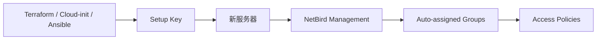

# 案例九：用 Setup Key 做自动化接入（Ansible / Cloud-init / Terraform）

> 本文用于把服务器、CI Runner、路由节点、临时容器自动加入 NetBird。核心原则是：用 Setup Key 做非交互式注册，用组和策略控制权限。

## 1. 最终效果

完成后可以做到：

- 新服务器启动时自动加入 NetBird。
- 路由节点自动进入对应 routing peer group。
- CI Runner 使用 ephemeral peers，离线后自动清理。
- Terraform / Cloud-init / Ansible 只负责注入 Setup Key，不手工登录 Dashboard。

## 2. 工作原理

Setup Key 是预认证注册令牌。机器第一次运行 `netbird up --setup-key ...` 时，会加入你的 NetBird 账号，并按 key 的 auto-assigned groups 自动分组。

本文只处理服务器和自动化工作负载。为具体人员发放一台设备的一年期、一次性连接凭据时，不需要创建控制台账号，参见 [客户端安装、升级与 Setup Key 接入](12-client-platform-onboarding.md)。人用 Key 和自动化 Key 不得复用。



## 3. Key 规划

不要全环境共用一个 key。

| Key 名称 | 用途 | Auto-assigned groups | 建议 |
| --- | --- | --- | --- |
| `nb-dev-servers` | 开发服务器 | `dev-servers` | 限制使用次数 |
| `nb-prod-routing-peers` | 生产路由节点 | `prod-routing-peers` | 严格限制次数 |
| `nb-ci-runners` | CI Runner | `ci-runners` | 开启 ephemeral peers |
| `nb-k8s-routing-peers` | K8S 路由 Pod | `k8s-routing-peers` | 开启 ephemeral peers |

Dashboard：

1. 进入 `Settings > Setup Keys`。
2. 创建 key。
3. 设置过期时间。
4. 设置 usage limit。
5. 选择 auto-assigned groups。
6. 短生命周期 workload 开启 ephemeral peers。

## 4. 通用安装脚本

保存为 `install-netbird-peer.sh`：

```bash
#!/usr/bin/env bash
set -euo pipefail

NETBIRD_MANAGEMENT_URL="${NETBIRD_MANAGEMENT_URL:-https://netbird.example.com}"
NETBIRD_SETUP_KEY="${NETBIRD_SETUP_KEY:?missing NETBIRD_SETUP_KEY}"

curl -fsSL https://pkgs.netbird.io/install.sh | sh

sudo netbird up \
  --management-url "$NETBIRD_MANAGEMENT_URL" \
  --setup-key "$NETBIRD_SETUP_KEY"

netbird status
```

执行：

```bash
chmod +x install-netbird-peer.sh
NETBIRD_SETUP_KEY="NBSETUP-DEV-SERVERS-REPLACE-ME" ./install-netbird-peer.sh
```

## 5. Cloud-init 示例

适用于云服务器首次启动。

保存为 `cloud-init-netbird.yaml`：

```yaml
#cloud-config
package_update: true
packages:
  - curl

write_files:
  - path: /root/install-netbird-peer.sh
    permissions: "0700"
    owner: root:root
    content: |
      #!/usr/bin/env bash
      set -euo pipefail
      curl -fsSL https://pkgs.netbird.io/install.sh | sh
      netbird up \
        --management-url "https://netbird.example.com" \
        --setup-key "NBSETUP-CLOUDINIT-REPLACE-ME"
      netbird status

runcmd:
  - [ bash, /root/install-netbird-peer.sh ]
```

注意：

- Cloud-init 里明文写 Setup Key 有泄露风险，生产环境优先用云厂商 Secret Manager 或临时 user-data。
- key 应设置短过期和 usage limit。

## 6. Ansible 示例

保存为 `install-netbird.yml`：

```yaml
- name: Install and enroll NetBird peer
  hosts: netbird_peers
  become: true
  vars:
    netbird_management_url: "https://netbird.example.com"
    netbird_setup_key: "NBSETUP-ANSIBLE-REPLACE-ME"
  tasks:
    - name: Install NetBird
      ansible.builtin.shell: |
        set -e
        curl -fsSL https://pkgs.netbird.io/install.sh | sh
      args:
        creates: /usr/bin/netbird

    - name: Enroll peer
      ansible.builtin.command:
        cmd: >-
          netbird up
          --management-url {{ netbird_management_url }}
          --setup-key {{ netbird_setup_key }}
      register: netbird_up
      changed_when: "'Connected' in netbird_up.stdout or netbird_up.rc == 0"

    - name: Show status
      ansible.builtin.command: netbird status
      register: netbird_status
      changed_when: false

    - name: Print status
      ansible.builtin.debug:
        var: netbird_status.stdout_lines
```

执行：

```bash
ansible-playbook -i inventory.ini install-netbird.yml
```

建议把 `netbird_setup_key` 放到 Ansible Vault，不要写明文。

## 7. Terraform / user_data 示例

Terraform 可以通过 `user_data` 注入 cloud-init。

示意：

```hcl
variable "netbird_setup_key" {
  type      = string
  sensitive = true
}

resource "aws_instance" "router" {
  ami           = "ami-xxxxxxxx"
  instance_type = "t3.small"

  user_data = templatefile("${path.module}/cloud-init-netbird.yaml.tpl", {
    netbird_management_url = "https://netbird.example.com"
    netbird_setup_key      = var.netbird_setup_key
  })

  tags = {
    Name = "netbird-routing-peer"
  }
}
```

模板 `cloud-init-netbird.yaml.tpl`：

```yaml
#cloud-config
package_update: true
runcmd:
  - curl -fsSL https://pkgs.netbird.io/install.sh | sh
  - netbird up --management-url "${netbird_management_url}" --setup-key "${netbird_setup_key}"
```

执行时通过安全方式传入：

```bash
terraform apply -var 'netbird_setup_key=NBSETUP-TERRAFORM-REPLACE-ME'
```

生产环境更推荐使用 Terraform Cloud/CI Secret，不在 shell history 留 key。

## 8. CI Runner / Ephemeral Peer

CI Runner、临时容器、短生命周期任务建议：

- 使用专用 Setup Key。
- 开启 ephemeral peers。
- 限制 key 的权限组，例如只加入 `ci-runners`。
- 策略只允许访问必要资源。

示例：

```bash
netbird up \
  --management-url https://netbird.example.com \
  --setup-key NBSETUP-CI-RUNNER-REPLACE-ME

./run-tests.sh
```

任务结束：

```bash
netbird down || true
```

## 9. 验证

在自动接入的机器上：

```bash
netbird status
netbird status -d
```

Dashboard：

- Peer 在线。
- Peer 自动加入正确组。
- 没有进入过大的权限组。

业务验证：

```bash
nc -vz 10.20.10.20 443
curl -k -I https://10.20.10.20
```

## 10. 排障

### 10.1 Setup Key 失效

检查：

- key 是否过期。
- key 使用次数是否耗尽。
- key 是否被 revoke。
- 机器时间是否异常。

### 10.2 自动加入了错误组

处理：

1. 修正 Setup Key 的 auto-assigned groups。
2. 删除错误注册的 Peer。
3. 重新注册。

### 10.3 CI Runner 离线 Peer 堆积

处理：

- 使用 ephemeral peers。
- 设置短生命周期 key。
- 定期清理离线 peers。

## 11. 回滚

自动化接入的回滚分两层：先撤访问权限，再清理机器上的 NetBird 客户端状态。

### 11.1 立即撤销访问

如果某个自动化 key 用错了，先在 Dashboard 执行：

1. 进入 `Setup Keys`。
2. Revoke 对应 key。
3. 进入 `Peers`，筛选这个 key 创建的 Peer。
4. 删除误注册的 Peer，或先从高权限组移除。
5. 检查相关策略没有把测试组放到生产资源上。

如果只是某一批机器错误加入了组：

1. 修正 Setup Key 的 auto-assigned groups。
2. 删除错误 Peer。
3. 重新执行自动化接入。

### 11.2 单台机器下线

在被接入机器上执行：

```bash
sudo netbird down || true
sudo systemctl stop netbird || true
sudo systemctl disable netbird || true
```

如果这台机器后续不再接入 NetBird，可以卸载客户端。不同发行版包管理器不同，先确认安装来源，再执行卸载。

Debian / Ubuntu 示例：

```bash
sudo apt-get remove -y netbird
```

RHEL / Rocky / AlmaLinux 示例：

```bash
sudo yum remove -y netbird
```

### 11.3 回滚 Cloud-init / Ansible / Terraform

Cloud-init：

- 新机器镜像里不要再写旧 Setup Key。
- 如果机器已经创建，先在 Dashboard 删除 Peer，再按单台机器下线。

Ansible：

- 从 inventory 或变量文件移除旧 key。
- 确认 playbook 不再把旧 key 写到日志。
- 重新执行修正后的 playbook。

Terraform：

- 从 `user_data` 变量中移除旧 key。
- 对已经启动的实例，不要只改 Terraform 代码；还要在实例和 Dashboard 两侧清理旧 Peer。

CI Runner：

- Revoke 旧 ephemeral key。
- 更新 CI secret。
- 重新跑一次流水线，确认 Runner 结束后 Peer 会自动消失。

## 12. 安全要求

- Setup Key 当作密钥处理。
- 每个用途一个 key。
- 生产路由节点 key 严格限制次数。
- 不把 key 提交到 Git。
- 不把 key 打印到 CI 日志。

## 13. 官方参考

- Setup Keys：https://docs.netbird.io/manage/peers/register-machines-using-setup-keys
- Linux 安装：https://docs.netbird.io/get-started/install/linux
- Docker 安装：https://docs.netbird.io/get-started/install/docker
- Public API Tokens：https://docs.netbird.io/manage/public-api
