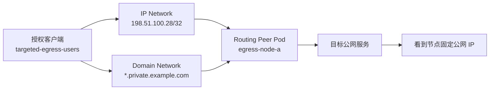

# 案例 18：Kubernetes 定向公网资源固定出口

> 目标：授权客户端只在访问指定公网 IP 或业务域名时，经由 Kubernetes 某个
> 固定公网出口节点访问；其他互联网流量保持原路径，同时不干扰节点上已有的
> Docker WireGuard、CNI、kube-proxy 和业务 Pod。

## 1. 最终效果

完成后：

- `targeted-egress-users` 访问 `198.51.100.28/32` 或
  `*.private.example.com` 时，经 `egress-node-a` 的公网 IP 出口。
- 只开放 TCP `80`、`443`、`30004-30006`，不授予其他端口。
- 非授权 Peer 不获得这两个 Network Resource。
- 客户端访问其他互联网地址时，不经过该 Routing Peer。
- Routing Peer 使用独立 Pod 网络命名空间和 Userspace 数据面，不占用宿主机
  WireGuard 端口，也不向宿主机安装 NetBird 路由或防火墙规则。
- 删除首次注册 Secret 后，Pod 重建仍复用原 Peer 身份。

这不是 Exit Node。Exit Node 会给客户端下发默认路由；本案例只发布两个精确的
Network Resource。

## 2. 工作原理



链路分为三段：

1. Policy 决定哪些客户端可以使用 IP 或 Domain Resource。
2. NetBird 把匹配流量送到专用 Routing Peer Pod。
3. Kubernetes 节点的正常 Pod 出站 SNAT 把流量转换成节点公网出口地址。

IP 和 Domain Resource 使用两个独立 Network。这样可以独立检查路由、DNS、
授权和流量计数，也能避免以后修改一个资源时无意扩大另一个资源的边界。

## 3. 适用边界

适合：

- 目标系统使用固定公网 IP 白名单。
- 只有少量公网 IP 或业务域名需要走固定出口。
- 指定 Kubernetes 节点已经具备获准的公网出口。
- 节点同时运行其他网络服务，需要把 NetBird 数据面隔离在 Pod 内。

不适合：

- 所有互联网流量都要统一出口：使用 Exit Node。
- 目标可以通过 VPC 私网访问：优先使用独立 VM 或 VPC Routing Peer。
- 节点公网出口不固定：先解决云 NAT、EIP 或防火墙出口一致性。
- 两个节点的公网出口不同但目标只放行一个 IP：不能直接扩成双副本。

## 4. 示例参数

| 项目 | 示例值 | 说明 |
| --- | --- | --- |
| Management URL | `https://netbird.example.com` | 自建 NetBird 地址 |
| Namespace | `netbird-routing` | 专用命名空间 |
| Deployment | `netbird-targeted-egress` | 单副本 Routing Peer |
| 固定节点 | `egress-node-a` | 已有获准公网出口的节点 |
| Routing Peer 组 | `targeted-egress-routing-peers` | 只包含本场景 Peer |
| 授权客户端组 | `targeted-egress-users` | 需要访问目标的设备 |
| IP 资源 | `198.51.100.28/32` | 文档保留地址 |
| Domain 资源 | `*.private.example.com` | 不包含根域名 |
| 允许端口 | TCP `80,443,30004-30006` | 按真实业务收窄 |
| NetBird 镜像 | `netbirdio/netbird:0.77.0` | 使用团队验证的固定标签 |

## 5. 上线前只读基线

### 5.1 核对节点和集群网络

```bash
kubectl get nodes -o wide
kubectl get nodes -o jsonpath='{range .items[*]}{.metadata.name}{"\t"}{.spec.podCIDR}{"\n"}{end}'
kubectl -n kube-system get pod -o wide
kubectl get pod -A -o wide
```

记录：

- CNI、kube-proxy 和 CoreDNS 的 Pod 状态、节点和重启次数。
- 目标节点上的业务 Pod 名称、`restartCount` 和开始时间。
- Pod CIDR、Service CIDR、客户端 LAN、其他 VPN 和 Docker subnet。

### 5.2 证明普通 Pod 已具备正确出口

先使用目标节点上现有的测试 Pod，不要先部署 NetBird：

```bash
kubectl -n <test-namespace> exec <existing-test-pod> -- \
  wget -S --spider --timeout=10 https://198.51.100.28 2>&1
kubectl -n <test-namespace> exec <existing-test-pod> -- \
  nslookup api.private.example.com
```

同时在目标系统或出口审计侧确认请求来源是预期的固定公网 IP。若普通 Pod 的
出口就不正确，先修复云 NAT、EIP 或节点出站，不能用 NetBird 掩盖问题。

### 5.3 记录同机 WireGuard 和 Docker 基线

```bash
docker ps --format 'table {{.Names}}\t{{.Status}}\t{{.Ports}}'
docker inspect <existing-wireguard-container> \
  --format 'started={{.State.StartedAt}} restarts={{.RestartCount}} network={{.HostConfig.NetworkMode}}'
ip route show table all
ip rule show
iptables-save > /tmp/iptables.before.netbird-targeted-egress
nft list ruleset > /tmp/nft.before.netbird-targeted-egress 2>/dev/null || true
```

重点确认已有 WireGuard 容器是否发布 UDP `51820`。本案例不使用 `hostNetwork`
或 `hostPort`，所以 Pod 内的 WireGuard 监听不会占用宿主机端口。

## 6. 先创建最小权限对象

Dashboard 中准备：

1. 创建 `targeted-egress-routing-peers`，只接收本场景 Routing Peer。
2. 创建短有效期、`Usage limit=1` 的一次性 Setup Key。
3. Setup Key 的 Auto-assigned groups 只选择
   `targeted-egress-routing-peers`。
4. 确认 `targeted-egress-users` 只包含获批设备。
5. 禁止使用长期、无限次、自动加入 `All` 的 Setup Key。

Setup Key 只负责首次注册，真正的长期身份保存在 `/var/lib/netbird`。

## 7. 准备独立身份目录

只在固定节点执行：

```bash
sudo install -d -o root -g root -m 700 /var/lib/netbird-targeted-egress
sudo stat -c '%a %U:%G %n' /var/lib/netbird-targeted-egress
```

目录必须预先存在且权限为 `700 root:root`。不得把现有宿主机 NetBird、其他
Routing Peer 或第二个 Pod 的 `/var/lib/netbird` 复制到这里。

## 8. 部署单节点 Routing Peer

保存为 `targeted-egress-routing-peer.yaml`：

```yaml
apiVersion: v1
kind: Namespace
metadata:
  name: netbird-routing
---
apiVersion: apps/v1
kind: Deployment
metadata:
  name: netbird-targeted-egress
  namespace: netbird-routing
spec:
  replicas: 1
  strategy:
    type: Recreate
  selector:
    matchLabels:
      app.kubernetes.io/name: netbird-targeted-egress
  template:
    metadata:
      labels:
        app.kubernetes.io/name: netbird-targeted-egress
    spec:
      automountServiceAccountToken: false
      terminationGracePeriodSeconds: 30
      affinity:
        nodeAffinity:
          requiredDuringSchedulingIgnoredDuringExecution:
            nodeSelectorTerms:
              - matchExpressions:
                  - key: kubernetes.io/hostname
                    operator: In
                    values:
                      - egress-node-a
      tolerations:
        - key: node-role.kubernetes.io/control-plane
          operator: Exists
          effect: NoSchedule
        - key: node-role.kubernetes.io/master
          operator: Exists
          effect: NoSchedule
      containers:
        - name: netbird
          image: netbirdio/netbird:0.77.0
          imagePullPolicy: IfNotPresent
          env:
            - name: NB_HOSTNAME
              value: targeted-egress-k8s
            - name: NB_MANAGEMENT_URL
              value: https://netbird.example.com
            - name: NB_SETUP_KEY
              valueFrom:
                secretKeyRef:
                  name: netbird-targeted-egress-setup
                  key: setup-key
                  optional: true
            - name: NB_USE_NETSTACK_MODE
              value: "true"
            - name: NB_NETSTACK_SKIP_PROXY
              value: "true"
            - name: NB_DISABLE_DNS
              value: "true"
            - name: NB_LOG_LEVEL
              value: info
          securityContext:
            allowPrivilegeEscalation: true
            runAsUser: 0
            capabilities:
              add:
                - NET_ADMIN
                - SYS_ADMIN
                - SYS_RESOURCE
          resources:
            requests:
              cpu: 50m
              memory: 64Mi
            limits:
              cpu: 500m
              memory: 256Mi
          readinessProbe:
            exec:
              command:
                - /bin/sh
                - -ec
                - netbird status --check ready
            initialDelaySeconds: 10
            periodSeconds: 15
            timeoutSeconds: 5
            failureThreshold: 6
          livenessProbe:
            exec:
              command:
                - /bin/sh
                - -ec
                - netbird status --check live
            initialDelaySeconds: 45
            periodSeconds: 30
            timeoutSeconds: 5
            failureThreshold: 5
          volumeMounts:
            - name: netbird-state
              mountPath: /var/lib/netbird
      volumes:
        - name: netbird-state
          hostPath:
            path: /var/lib/netbird-targeted-egress
            type: Directory
```

这个清单刻意做到：

- 单副本且 `Recreate`，避免同一身份目录被两个 Pod 并发挂载。
- 精确固定到唯一出口节点，不让调度器漂移到其他公网出口。
- 不使用宿主机网络、宿主机端口、宿主机 PID 或 IPC。
- Userspace Netstack 把隧道数据面留在 Pod 网络命名空间。
- `NB_NETSTACK_SKIP_PROXY=true`，本场景只做路由，不提供本地 SOCKS5 代理。
- `NB_DISABLE_DNS=true` 只阻止客户端改写 Pod 的系统 DNS；Domain Resource 的
  Routing Peer DNS 转发仍必须单独启用和验证。

## 9. 首次注册和 Secret 清理

在受控终端创建 Secret，不把 Key 写进 YAML、历史记录或日志：

```bash
kubectl create namespace netbird-routing --dry-run=client -o yaml | kubectl apply -f -
read -rsp 'NetBird Setup Key: ' NB_SETUP_KEY; echo
kubectl -n netbird-routing create secret generic netbird-targeted-egress-setup \
  --from-literal=setup-key="$NB_SETUP_KEY"
unset NB_SETUP_KEY
kubectl apply -f targeted-egress-routing-peer.yaml
kubectl -n netbird-routing rollout status deployment/netbird-targeted-egress --timeout=180s
```

确认 Dashboard 出现一个新 Peer，且只在
`targeted-egress-routing-peers` 后，先在 Dashboard 撤销一次性 Setup Key，再
立即清理 Kubernetes Secret：

```bash
kubectl -n netbird-routing delete secret netbird-targeted-egress-setup
kubectl -n netbird-routing exec deployment/netbird-targeted-egress -- netbird status -d
```

记录 Peer 名称和 NetBird IP。然后删除 Pod，验证身份复用：

```bash
kubectl -n netbird-routing delete pod \
  -l app.kubernetes.io/name=netbird-targeted-egress
kubectl -n netbird-routing rollout status deployment/netbird-targeted-egress --timeout=180s
kubectl -n netbird-routing exec deployment/netbird-targeted-egress -- netbird status -d
```

重建后应保持同一个 Peer 身份和 NetBird IP，且不再依赖 Setup Key Secret。

## 10. 创建两个 Network Resource

### 10.1 IP Network

在 `Networks` 创建 `targeted-egress-ip`：

| 配置 | 值 |
| --- | --- |
| Routing Peer | `targeted-egress-routing-peers` |
| Resource 类型 | IPv4 |
| Resource | `198.51.100.28/32` |
| Resource Group | `targeted-egress-ip-resources` |
| Masquerade | 开启 |
| Metric | 团队统一值 |

### 10.2 Domain Network

在 `Networks` 创建 `targeted-egress-domain`：

| 配置 | 值 |
| --- | --- |
| Routing Peer | `targeted-egress-routing-peers` |
| Resource 类型 | Domain |
| Resource | `*.private.example.com` |
| Resource Group | `targeted-egress-domain-resources` |
| Masquerade | 开启 |
| Metric | 与 IP Network 一致 |

通配符不包含根域 `private.example.com`。如果根域也要访问，必须显式创建第二个
Domain Resource。

在 `Settings > Networks` 打开 `Routing Peer DNS Resolution`。Domain Resource
依赖 Routing Peer 的 DNS 转发；DNS 能解析仍不等于 TCP、SNAT 和 Policy 正常。

## 11. 创建端口级 Policy

| Policy | Source | Destination | 协议 | 端口 |
| --- | --- | --- | --- | --- |
| `allow-targeted-egress-ip` | `targeted-egress-users` | `targeted-egress-ip-resources` | TCP | `80,443,30004-30006` |
| `allow-targeted-egress-domain` | `targeted-egress-users` | `targeted-egress-domain-resources` | TCP | `80,443,30004-30006` |

上线前搜索并收窄会覆盖这些资源的宽泛 `All -> All` Policy。不要为了方便把用户
组、资源组和 Routing Peer 组混成一个组。

## 12. 分阶段验收

### 12.1 Routing Peer 自身

```bash
kubectl -n netbird-routing get deployment,pod -o wide
kubectl -n netbird-routing exec deployment/netbird-targeted-egress -- netbird status -d
kubectl -n netbird-routing logs deployment/netbird-targeted-egress --since=10m
```

必须确认：

- Pod 只在 `egress-node-a`。
- `Interface type` 为 Userspace。
- Management、Signal 和 Relay 状态正常。
- 两个 Network 都选择了该 Routing Peer。
- Domain Router / DNS forwarder 初始化没有持续错误。

### 12.2 授权客户端

Windows 示例：

```powershell
& "$env:ProgramFiles\Netbird\netbird.exe" status -d
& "$env:ProgramFiles\Netbird\netbird.exe" networks list
Resolve-DnsName api.private.example.com
Get-NetRoute -AddressFamily IPv4 |
  Where-Object DestinationPrefix -eq '198.51.100.28/32'
curl.exe -vk --connect-timeout 10 https://198.51.100.28/
curl.exe -vk --connect-timeout 10 https://api.private.example.com/
```

请求前后比较 Routing Peer 的收发计数。计数增长，结合客户端 `/32` 路由和目标
侧来源 IP，才能证明流量确实经过指定出口。

### 12.3 非授权客户端

```powershell
& "$env:ProgramFiles\Netbird\netbird.exe" status -d
& "$env:ProgramFiles\Netbird\netbird.exe" networks list
Get-NetRoute -AddressFamily IPv4 |
  Where-Object DestinationPrefix -eq '198.51.100.28/32'
```

预期没有这两个 Network，也没有 NetBird 下发的目标 `/32` 路由。因为目标本身是
公网服务，非授权客户端的请求仍可能通过本地互联网成功；不能把“请求成功”直接
判定为策略泄漏。应确认请求前后 Routing Peer 计数不增长，并在目标侧确认来源
不是获准出口 IP。

### 12.4 宿主机和集群无回归

```bash
docker inspect <existing-wireguard-container> \
  --format 'started={{.State.StartedAt}} restarts={{.RestartCount}} network={{.HostConfig.NetworkMode}}'
ip route show table all
ip rule show
iptables-save > /tmp/iptables.after.netbird-targeted-egress
diff -u /tmp/iptables.before.netbird-targeted-egress \
  /tmp/iptables.after.netbird-targeted-egress || true
kubectl -n kube-system get pod -o wide
kubectl get pod -A -o wide
```

还要从目标节点上的普通业务 Pod 重做 DNS 和真实 TCP 外联，并核对监控
remote-write。验收不能只看 Pod Ready、Peer Connected 或 `ping`。

## 13. 常见故障

### 13.1 IP 可访问，域名不通

按顺序检查：

1. 通配符是否漏掉根域。
2. `Routing Peer DNS Resolution` 是否开启。
3. Routing Peer 日志中 Domain Router 和 DNS forwarder 是否正常。
4. 客户端解析结果是否落入其他 VPN、代理或浏览器 DoH 路径。
5. Domain Resource 的资源组和 Policy 是否正确。

### 13.2 客户端有 Network，但 TCP 超时

检查 Routing Peer Pod 到目标端口是否可达、Policy 端口、Masquerade、节点出口
安全组以及目标白名单。DNS 成功不能证明这些链路正常。

### 13.3 目标看到错误的公网 IP

先在同节点普通 Pod 中复测出口。常见原因是云 NAT 路径变化、节点没有绑定预期
EIP，或者 Pod 出站通过了统一 NAT Gateway。不要通过修改 CNI 或清空宿主机
iptables 临时绕过。

### 13.4 启动后同机 WireGuard 或业务网络异常

立即只隔离本 Deployment：

```bash
kubectl -n netbird-routing scale deployment/netbird-targeted-egress --replicas=0
```

观察业务是否在不重启 Docker、CNI、kube-proxy 和业务 Pod 的情况下恢复。再对比
路由、防火墙和容器重启次数。不要先重启整台节点。

### 13.5 Pod 重建后生成新 Peer

检查是否调度到错误节点、hostPath 是否改名或丢失、目录权限是否正确。不要把旧
身份目录复制给两个同时在线的 Pod。

## 14. 回滚

最小回滚只停止新 Routing Peer：

```bash
kubectl -n netbird-routing scale deployment/netbird-targeted-egress --replicas=0
kubectl -n netbird-routing get pod
```

然后在 Dashboard 中依次禁用两条 Policy、两个 Network 的 Routing Peer 和
Resource。复盘完成前保留 `/var/lib/netbird-targeted-egress`，不要急于删除身份。

若确认永久下线：

1. 删除 Dashboard 中对应 Peer。
2. 确认一次性 Setup Key 已撤销。
3. 删除 Deployment 和本场景 Network Resource。
4. 最后在指定节点单独备份或删除身份目录。

整个回滚不需要重启 Docker、已有 WireGuard、CNI、kube-proxy 或业务 Pod。

## 15. 高可用边界

本案例的约束是“固定公网出口”，不是“Pod 数量越多越好”。只有满足以下条件时
才能增加第二个 Routing Peer：

- 第二个节点经同一 NAT Gateway 或同一组已获批公网 IP 出口。
- 目标系统已经放行所有可能的出口 IP。
- 每个 Peer 有独立身份目录和独立 NetBird Peer。
- 先完成单 Peer 回归，再启用第二 Peer，并验证切换时来源 IP仍符合白名单。

否则保留单副本 `Recreate`，把快速重建、身份备份和节点恢复作为可用性方案。

## 16. 官方参考

- Networks：<https://docs.netbird.io/manage/networks>
- Routing Peer 工作原理：<https://docs.netbird.io/manage/networks/how-routing-peers-work>
- Network Routes / Exit Nodes：<https://docs.netbird.io/manage/network-routes>
- Access Control：<https://docs.netbird.io/manage/access-control/manage-network-access>
- Setup Keys：<https://docs.netbird.io/manage/peers/register-machines-using-setup-keys>
- Kubernetes Routing Peers：<https://docs.netbird.io/use-cases/kubernetes/routing-peers-and-kubernetes>
- 客户端环境变量：<https://docs.netbird.io/client/environment-variables>
- 资源连通性排障：<https://docs.netbird.io/help/troubleshooting-resource-connectivity>
