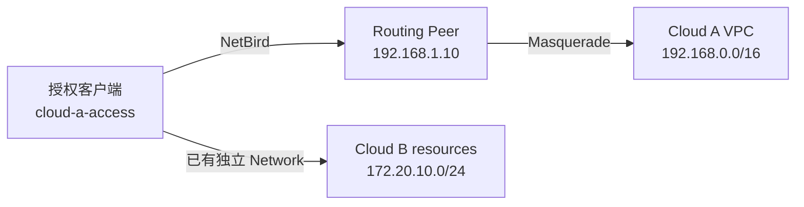

# 云 VPC 容器化 Routing Peer 运维手册

> 适用于在阿里云、华为云、腾讯云、AWS、GCP、Azure 或自建机房中，用一台长期在线的 Linux 主机把 NetBird 客户端接入私网资源。本文使用固定镜像标签、独立 Compose 项目和持久化身份目录，不保存长期 Setup Key。

## 1. 最终效果

完成后应满足：

- Routing Peer 与主机上的现有业务容器相互独立。
- 用户设备只有加入指定访问组后，才会收到目标 VPC 的路由。
- 目标 VPC 默认只看到 Routing Peer 的内网地址，通常不需要额外配置回程路由。
- Setup Key 过期或被撤销后，已经注册的 Peer 仍能继续连接。
- 删除并重建容器后，Peer 名称和 NetBird IP 保持不变。
- Compose 使用明确镜像标签，不使用 `latest`。

示例拓扑：



## 2. 关键概念

### 2.1 Setup Key 不是长期运行凭据

Setup Key 只在第一次注册机器时使用。它的过期时间限制的是“还能否注册新 Peer”，不会让已注册 Peer 到期掉线。

已注册容器的长期身份保存在 `/var/lib/netbird`。本文把它绑定到宿主机的 `/data/netbird-client/data`。只要该目录没有丢失、Dashboard 中的 Peer 没有被删除，重启主机或重建容器都不需要 Setup Key。

### 2.2 Network Resource Policy 不等于访问 Routing Peer 本机

Network Resource Policy 允许流量经过 Routing Peer 到达它后面的资源，属于转发链路。访问 Routing Peer 自己运行的 SSH、监控或管理服务属于输入链路，需要单独的 peer-to-peer Policy。

如果客户端用 Routing Peer 的局域网 IP 访问它自身，并且该 Peer 使用 userspace/netstack 转发，还需要显式开启 `NB_ENABLE_LOCAL_FORWARDING=true`。没有这项需求时保持关闭，避免扩大本机服务暴露面。

## 3. 示例参数

| 项目 | 示例值 |
| --- | --- |
| 部署目录 | `/data/netbird-client` |
| Compose 服务名 | `routing-peer` |
| 容器名 | `netbird-routing-peer` |
| 镜像 | `netbirdio/netbird:0.76.3` |
| Management URL | `https://netbird.example.com` |
| Routing Peer Group | `cloud-a-routing-peers` |
| 用户设备访问组 | `cloud-a-access` |
| 资源组 | `cloud-a-resources` |
| Network | `cloud-a-vpc` |
| Resource | `192.168.0.0/16` |
| Routing Peer LAN IP | `192.168.1.10` |

生产环境可以把同一版本镜像同步到内网仓库，例如：

```text
registry.example.com/netbird/netbird:0.76.3
```

无论使用公共仓库还是内网仓库，都要保留明确版本标签，并在变更记录中保存镜像 digest。

## 4. 上线前检查

先确认目标服务器的真实状态，不要直接启动容器：

```bash
hostname
docker version
docker compose version || docker-compose version
test -c /dev/net/tun && echo tun-ok
sysctl net.ipv4.ip_forward
ip -4 addr
ip route
docker ps --format '{{.Names}}|{{.Status}}|{{.Image}}'
ss -lntup
```

Routing Peer 必须能直接访问目标 VPC 资源：

```bash
ping -c 3 192.168.1.20
nc -vz 192.168.1.20 443
```

如果这里不通，先修复云安全组、子网路由、目标主机防火墙或应用监听。NetBird 不能替代 VPC 内部已经缺失的连通性。

上线前保存只读基线：

```bash
mkdir -p /data/netbird-client/backup
docker ps --format '{{.Names}}|{{.Status}}|{{.Image}}' \
  > /data/netbird-client/backup/pre-install-containers.txt
ip route > /data/netbird-client/backup/pre-install-routes.txt
iptables-save > /data/netbird-client/backup/pre-install-iptables.rules
```

## 5. 创建独立 Compose 项目

创建目录：

```bash
mkdir -p /data/netbird-client/data /data/netbird-client/backup
cd /data/netbird-client
```

`docker-compose.yml`：

```yaml
version: "2.4"

services:
  routing-peer:
    image: netbirdio/netbird:0.76.3
    container_name: netbird-routing-peer
    hostname: netbird-routing-peer
    restart: unless-stopped
    network_mode: host
    cap_add:
      - NET_ADMIN
      - SYS_ADMIN
      - SYS_RESOURCE
    devices:
      - /dev/net/tun:/dev/net/tun
    volumes:
      - /data/netbird-client/data:/var/lib/netbird
    environment:
      NB_MANAGEMENT_URL: https://netbird.example.com
      NB_SETUP_KEY: ${NB_SETUP_KEY:-}
      NB_ENABLE_LOCAL_FORWARDING: ${NB_ENABLE_LOCAL_FORWARDING:-false}
    mem_limit: 512m
    cpus: 1.0
    stop_grace_period: 15s
    healthcheck:
      test: ["CMD", "netbird", "status", "--check", "startup"]
      interval: 30s
      timeout: 10s
      retries: 3
      start_period: 20s
    logging:
      driver: json-file
      options:
        max-size: "10m"
        max-file: "3"
```

说明：

- `version: "2.4"` 兼容仍在使用 Docker Compose v1 的老服务器；现代 Compose 会忽略该字段。
- `network_mode: host` 让 Routing Peer 直接使用宿主机 VPC 网络。
- 三个 capability 和 `/dev/net/tun` 用于隧道、路由和防火墙管理。
- bind mount 让身份目录位置明确，便于备份、巡检和灾备恢复。
- 身份目录包含 Peer 私钥，备份必须加密并限制读取权限；只能在原 Peer 已离线时恢复同一身份，不能复制给两台同时在线的节点。
- 默认不启用本机地址转发。确实需要访问 Routing Peer 自身局域网 IP 时，再同时配置环境变量、Resource 和 peer-to-peer Policy。
- 资源与日志限制可防止新容器意外挤占同机业务。

先渲染配置并拉取固定镜像：

```bash
cd /data/netbird-client
docker compose config
docker compose pull
docker image inspect netbirdio/netbird:0.76.3 \
  --format 'id={{.Id}} digests={{json .RepoDigests}}'
```

如果预检确认服务器只有 Compose v1，把本节和后续命令中的 `docker compose` 明确替换为 `docker-compose`。不要用 `command-a || command-b` 掩盖真实的配置错误。

## 6. 首次注册并清除 Setup Key

### 6.1 创建专用 Key

在 Dashboard 的 `Settings > Setup Keys` 创建 Routing Peer 专用 Key：

- 使用 one-off key，或把 usage limit 设为实际节点数。
- 设置较短过期时间。
- Auto-assigned group 选择 `cloud-a-routing-peers`。
- 不与员工客户端、CI Runner 或其他 VPC 共用。

### 6.2 临时注入

交互式终端用隐藏输入，避免把真实 Key 写进 shell history：

```bash
cd /data/netbird-client
read -rsp 'NetBird Setup Key: ' NB_SETUP_KEY
echo
export NB_SETUP_KEY
docker compose up -d routing-peer
docker exec netbird-routing-peer netbird status
```

确认输出至少包含：

```text
Management: Connected
Signal: Connected
NetBird IP: 100.x.x.x/16
```

### 6.3 从容器环境中移除 Key

仅执行 `unset` 不会修改已经创建的容器环境，必须再重建一次容器：

```bash
unset NB_SETUP_KEY
docker compose up -d --force-recreate routing-peer
docker inspect --format '{{range .Config.Env}}{{println .}}{{end}}' \
  netbird-routing-peer | grep '^NB_SETUP_KEY='
```

期望结果：

```text
NB_SETUP_KEY=
```

不要把真实 Setup Key 写入 `.env`、Compose、工单、Git 仓库或聊天记录。

## 7. Docker Compose v1 重建兼容处理

旧服务器可能运行 `docker-compose` v1。若 `--force-recreate` 报容器名冲突，先确认冲突容器就是本项目的 Routing Peer：

```bash
docker ps -a --filter name=netbird-routing-peer \
  --format '{{.ID}}|{{.Names}}|{{.Status}}|{{.Image}}'
docker inspect --format '{{json .Config.Labels}}' netbird-routing-peer
```

如果 Compose 能识别该服务：

```bash
cd /data/netbird-client
docker-compose stop -t 15 routing-peer
docker-compose rm -f routing-peer
docker-compose up -d routing-peer
```

如果容器来自旧目录、旧 Compose project 或手工命令，Compose 可能显示 `No stopped containers`。在已经核对容器名和镜像后，只删除这个 Routing Peer 容器：

```bash
docker stop -t 15 netbird-routing-peer
docker rm netbird-routing-peer
cd /data/netbird-client
docker-compose up -d routing-peer
```

这个操作不会删除 `/data/netbird-client/data`，因此不需要重新使用 Setup Key。禁止在这一步运行 `docker compose down -v`、`docker volume prune` 或跨项目的 `--remove-orphans`。

## 8. Dashboard 配置

### 8.1 创建三个职责分离的组

| Group | 成员 | 用途 |
| --- | --- | --- |
| `cloud-a-routing-peers` | VPC Routing Peer | 数据平面路由节点 |
| `cloud-a-access` | 获得访问权限的客户端 Peer | Policy 源组 |
| `cloud-a-resources` | VPC Network Resources | Policy 目标组 |

把新容器 Peer 加入 `cloud-a-routing-peers`。把需要访问该 VPC 的 Windows、macOS 或 Linux Peer 加入 `cloud-a-access`。

人员加入组织或用户组后，仍要在 `Peers` 页面确认其实际设备已经进入 `cloud-a-access`，并在客户端确认 Network 已下发。不要只根据账号已创建就判断授权完成。

### 8.2 创建 Network 和 Resource

进入 `Network Routing > Networks`：

| 字段 | 示例值 |
| --- | --- |
| Network | `cloud-a-vpc` |
| Resource | `192.168.0.0/16` |
| Resource Group | `cloud-a-resources` |
| Routing Peer Group | `cloud-a-routing-peers` |
| Metric | `1000` |
| Masquerade | 开启 |

最小权限场景优先从业务主机 `/32` 开始。只有同一子网中的主机确实共享相同授权边界时，才扩大到较大的 CIDR。

### 8.3 创建 Policy

创建单向访问策略：

```text
Name: cloud-a-vpc-access
Source: cloud-a-access
Destination: cloud-a-resources
Protocol / Ports: 只填写业务实际需要的协议和端口
```

如果业务明确要求访问整个 VPC 的所有协议，可以在审批后选择 `ALL`。同时检查并逐步移除遗留的 `All -> All` 策略，否则新建的最小权限组可能被旧策略绕过。

## 9. 验证

### 9.1 Routing Peer

```bash
docker inspect --format '{{.State.Health.Status}}' netbird-routing-peer
docker exec netbird-routing-peer netbird status --check startup
docker exec netbird-routing-peer netbird status
docker exec netbird-routing-peer netbird status -d
docker stats --no-stream netbird-routing-peer
```

确认：

- 容器为 `healthy`。
- Management、Signal 和 Relay 可用。
- `Networks` 显示目标 VPC 网段。
- 容器没有持续重启。

### 9.2 Windows 授权客户端

管理员 PowerShell：

```powershell
& "$env:ProgramFiles\Netbird\netbird.exe" status
& "$env:ProgramFiles\Netbird\netbird.exe" networks list
Get-NetRoute -AddressFamily IPv4 |
  Where-Object DestinationPrefix -In @('192.168.0.0/16', '172.20.10.20/32')
Test-NetConnection 192.168.1.20 -Port 443
Test-NetConnection 172.20.10.20 -Port 22
```

多云客户端应同时看到各自的 Network，不应因为新增 Cloud A 而丢失 Cloud B 的既有路由。

Linux / macOS 可以使用：

```bash
netbird networks list
ip route 2>/dev/null || netstat -rn
nc -vz 192.168.1.20 443
```

不要只用 `ping` 验收。至少验证一个真实 TCP、HTTPS、SSH 或数据库端口。

### 9.3 非授权客户端

选择一个不在 `cloud-a-access` 的测试 Peer：

```bash
netbird networks list
nc -vz 192.168.1.20 443
```

期望：看不到 `cloud-a-vpc`，业务连接失败。授权用户成功和非授权用户失败必须同时记录。

### 9.4 无 Key 重建演练

先记录身份：

```bash
docker exec netbird-routing-peer netbird status \
  | grep -E 'NetBird IP|Networks|Management|Signal'
```

确认 `NB_SETUP_KEY` 为空后，只重建 Routing Peer，再次执行相同命令。重建前后的 NetBird IP 应一致，目标 Network 应自动恢复。

### 9.5 Routing Peer 自身地址

如果 VPC 后端都能访问，唯独 Routing Peer 自己的 LAN IP 不能访问，先不要误判为整条 VPC 路由失败。分别检查：

1. Network Resource 是否覆盖该 LAN IP。
2. 是否存在 `cloud-a-access -> cloud-a-routing-peers` 的 peer-to-peer Policy。
3. userspace/netstack 路由节点是否需要 `NB_ENABLE_LOCAL_FORWARDING=true`。

若没有访问 Routing Peer 本机服务的业务需求，保持默认关闭并使用独立管理入口。

### 9.6 与宿主机 iptables / nftables 冲突

如果 Routing Peer 启动后，同机其他容器或 K8S Pod 出现外联、远端 NodePort、
监控 remote-write 超时，而 DNS、ClusterIP 或 Pod IP 仍然正常，不要把
`netbird status` 显示 Connected 当作宿主机网络无影响的证明。

先保存基线并观察实际数据面：

```bash
iptables-save > /data/netbird-client/backup/incident-iptables.rules
nft list ruleset > /data/netbird-client/backup/incident-nftables.rules
ip route show > /data/netbird-client/backup/incident-routes.txt
netbird status
```

CentOS 7、旧内核和 legacy iptables 环境尤其需要防止 nftables / iptables
后端混用。NetBird 社区 issue #2015 的处置建议是用
`NB_SKIP_NFTABLES_CHECK=true` 绕过不可用的 nftables 探测；但在 K8S 节点上，
更稳妥的隔离方式通常是让容器化 Routing Peer 使用完整用户态数据面：

```yaml
environment:
  NB_USE_NETSTACK_MODE: "true"
```

Kubernetes 清单对应写法：

```yaml
env:
  - name: NB_USE_NETSTACK_MODE
    value: "true"
```

上线顺序应当是：先仅保留一台 Routing Peer、确认 `Interface type:
Userspace` 和真实业务 TCP、再恢复第二台。持久化文件之外还应准备一个只隔离
故障节点的回滚入口；不要用重启 Flannel、kube-proxy 或业务 Pod 掩盖问题。
用户态模式有吞吐上限，峰值带宽要求较高时应做压测，并用多个独立 Peer
扩展容量。

## 10. 与其他 VPN 共存

Windows 同时运行 NetBird 和另一个 WireGuard VPN 通常可行，关键是路由不能冲突：

```powershell
Get-NetRoute -AddressFamily IPv4 |
  Sort-Object DestinationPrefix, RouteMetric |
  Format-Table DestinationPrefix, InterfaceAlias, RouteMetric
```

检查：

- 两套 VPN 是否发布相同 CIDR。
- 本地 LAN `/24` 是否比 NetBird 的 `/16` 更具体。
- 是否存在另一个 VPN 的 `0.0.0.0/0` 抢占默认路由。
- DNS 是否被另一客户端全局覆盖。

优先使用 `/32` 或小 CIDR 可以降低冲突概率。

## 11. 不影响同机业务的验收

部署前后比较：

```bash
docker ps --format '{{.Names}}|{{.Status}}|{{.Image}}'
ss -lntup
docker stats --no-stream
```

要求：

- 不重启、不重建现有业务容器。
- 不修改业务 Compose 项目。
- Routing Peer 只新增自己的容器、状态目录和必要转发规则。
- CPU、内存和日志增长符合预期。

## 12. 回滚

先在 Dashboard 禁用 `cloud-a-vpc-access`，阻断新流量；再禁用 Routing Peer 或 Network。

只停止容器，保留身份以便快速恢复：

```bash
cd /data/netbird-client
docker compose stop routing-peer
```

恢复：

```bash
cd /data/netbird-client
docker compose up -d routing-peer
```

确认永久下线且不再需要原 Peer 身份后，才删除 Dashboard Peer 和 `/data/netbird-client/data`。删除身份目录后重新上线必须使用新的 Setup Key。

## 13. 高可用和持续维护

生产关键 VPC 不应长期依赖单台 Routing Peer：

- 在不同可用区部署至少两台节点。
- 主备模式使用不同 metric，数值较低者为主节点。
- 同 metric 更适合按延迟选择，不等同于主备优先级。
- 两台节点使用独立状态目录和独立 Peer 身份。
- 配置 Routing Peer 离线告警。
- 每月检查固定镜像是否落后于稳定版，并按升级流程分阶段更新。

## 14. 官方参考

- Setup Keys：https://docs.netbird.io/manage/peers/register-machines-using-setup-keys
- Setup Key 注册服务器：https://docs.netbird.io/manage/peers/access-infrastructure/setup-keys-add-servers-to-network
- Docker 客户端：https://docs.netbird.io/get-started/install/docker
- Routing Peer 原理：https://docs.netbird.io/manage/networks/how-routing-peers-work
- Networks：https://docs.netbird.io/manage/networks
- Masquerade：https://docs.netbird.io/manage/networks/masquerade
- Access Control：https://docs.netbird.io/manage/access-control/manage-network-access
- Client 环境变量：https://docs.netbird.io/client/environment-variables
- CentOS 7 nftables / iptables 同类问题：https://github.com/netbirdio/netbird/issues/2015
