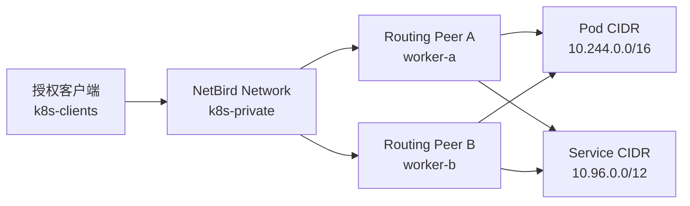

# Kubernetes 集群内 Routing Peer 生产运维手册

> 目标：让授权的 NetBird 客户端访问 Kubernetes Pod CIDR、Service CIDR
> 或指定 Service，同时不把 Routing Peer 的网络变更扩散到 CNI、kube-proxy
> 和业务工作负载。

本文给出两条路径：

- 现代集群优先使用官方 Kubernetes Operator，通过 `NetworkRouter` 和
  `NetworkResource` 暴露具体 Service。
- 不适合引入 Operator 的旧集群，使用受控节点上的手工 DaemonSet，并把
  上线、验证、隔离和恢复都声明化。

手工方案不是默认替代 Operator，也不是让每个节点都运行 NetBird。它用于
旧版本 Kubernetes、暂时不能引入 CRD / webhook，或确实需要整个 Pod / Service
CIDR 的环境。

## 1. 最终效果

示例完成后：

- `k8s-routing-peers` 中的两个独立 Peer 位于不同 Kubernetes 节点。
- `k8s-clients` 只能按策略访问 `k8s-pods`、`k8s-services` 中指定端口。
- Masquerade 保持开启，集群无需添加 NetBird Overlay 回程路由。
- 删除一个 Routing Peer Pod 或隔离一个节点后，另一个 Peer 继续提供路由。
- Routing Peer 重建复用节点上的身份目录，不会无限生成离线 Peer。
- 启动和恢复都来自同一份 YAML，不依赖临时在线 Patch。

## 2. 先选方案

| 场景 | 推荐方案 | 原因 |
| --- | --- | --- |
| 只暴露少量 ClusterIP Service | 官方 Operator | 自动创建 Network、Resource 和稳定 DNS |
| 现代多节点集群，需要标准 HA | 官方 Operator | 默认多副本、节点分散和 PDB |
| 旧 Kubernetes，暂不引入 CRD / webhook | 手工 DaemonSet | 依赖少，变更面可控 |
| 需要整个 Pod CIDR / Service CIDR | 手工 Routing Peer | 可按资源组和端口统一授权 |
| 只需要 Kubernetes API | VPC / VM Routing Peer | 不必向集群加入高权限 Pod |
| 需要访问大量 VPC 主机和云数据库 | VPC / VM Routing Peer | 集群内 Pod 不是合适的通用 VPC 网关 |
| 指定公网 IP / 域名需要固定节点出口 | 单节点隔离 Deployment | 精确资源、固定公网出口，不接管其他互联网流量 |

官方 Operator 的入门与 HA 示例见：

- <https://docs.netbird.io/manage/integrations/kubernetes>
- <https://docs.netbird.io/use-cases/kubernetes/route-to-a-kubernetes-service>

最后一种场景使用独立的单节点安全模型，见
[案例 18：Kubernetes 定向公网资源固定出口](../cases/18-kubernetes-targeted-public-egress.md)
和 [ADR-004](../decisions/ADR-004-targeted-public-egress-routing-peer-isolation.md)。

## 3. 工作原理和故障边界



客户端流量在 Routing Peer 解密，再进入集群 Pod 网络。Masquerade 开启时，
后端看到的来源是 Routing Peer 所在网络命名空间的地址，不需要知道客户端的
NetBird IP。

需要分清三条链路：

1. 客户端到 Routing Peer：由 NetBird 隧道、Routing Peer 组和 Network 决定。
2. Routing Peer 到 Pod / Service：由 CNI、kube-proxy、NetworkPolicy 和目标端口决定。
3. 集群 Pod 自身出站：由 CNI、宿主机 SNAT、云路由和防火墙决定。

`netbird status` 显示 Connected 只证明第一条链路的一部分，不代表后两条正常。

## 4. 示例参数

| 项目 | 示例值 |
| --- | --- |
| 管理端 | `https://netbird.example.com` |
| 命名空间 | `netbird-routing` |
| 路由 Peer 组 | `k8s-routing-peers` |
| 授权客户端组 | `k8s-clients` |
| Network | `k8s-private` |
| Pod 资源组 | `k8s-pods` |
| Service 资源组 | `k8s-services` |
| Pod CIDR | `10.244.0.0/16` |
| Service CIDR | `10.96.0.0/12` |
| 路由节点 | `worker-a`、`worker-b` |
| 固定客户端镜像 | `netbirdio/netbird:0.77.0` |

复制时必须换成真实网段、节点名、端口和团队已验证的固定镜像版本。

## 5. 上线前只读检查

### 5.1 记录集群和网络基线

```bash
kubectl version
kubectl get nodes -o wide
kubectl get nodes \
  -o custom-columns='NAME:.metadata.name,INTERNAL-IP:.status.addresses[0].address,POD-CIDR:.spec.podCIDR'
kubectl get svc kubernetes -o wide
kubectl -n kube-system get cm kubeadm-config -o yaml \
  | grep -E 'podSubnet|serviceSubnet|controlPlaneEndpoint' || true
kubectl -n kube-system get pod -o wide
```

确认：

- Pod CIDR 和 Service CIDR 不与客户端本地网络、其他 VPN 或 VPC 网段冲突。
- CNI、kube-proxy 当前健康。
- 两个候选节点处于不同故障域，且不是唯一控制平面节点。
- 候选节点上的普通 Pod 能访问目标 Pod、ClusterIP、远端 NodePort 和必要外部端点。

### 5.2 保存候选节点基线

在每个候选节点执行：

```bash
BACKUP_DIR="/var/tmp/netbird-routing-preflight-$(date +%Y%m%d-%H%M%S)"
install -d -m 700 "$BACKUP_DIR"
ip addr show > "$BACKUP_DIR/ip-addr.txt"
ip route show table all > "$BACKUP_DIR/ip-route-all.txt"
ip rule show > "$BACKUP_DIR/ip-rule.txt"
sysctl net.ipv4.ip_forward > "$BACKUP_DIR/sysctl.txt"
iptables-save > "$BACKUP_DIR/iptables.rules" 2>/dev/null || true
nft list ruleset > "$BACKUP_DIR/nftables.rules" 2>/dev/null || true
```

这些文件用于对比，不要直接把整份旧规则回灌到正在运行的 Kubernetes 节点。

### 5.3 建立业务基线

不要只测 `ping`。从候选节点上的现有测试 Pod 验证真实协议：

```bash
kubectl -n demo exec deploy/example -- \
  curl --noproxy '*' -fsS --connect-timeout 5 http://10.96.10.20:8080/health
kubectl -n demo exec deploy/example -- \
  curl --noproxy '*' -fsS --connect-timeout 5 http://10.244.4.20:8080/health
kubectl -n demo exec deploy/example -- \
  curl --noproxy '*' -fsS --connect-timeout 5 http://10.60.0.12:30080/health
kubectl -n monitoring logs deploy/metrics-agent --since=10m \
  | grep -Ei 'timeout|refused|remote.?write|error' || true
```

替换示例地址。最好同时记录监控 remote-write 的成功计数、错误计数和待发送队列。

## 6. NetBird 侧对象

### 6.1 Groups

创建：

| Group | 成员 |
| --- | --- |
| `k8s-routing-peers` | 仅两个 Routing Peer |
| `k8s-clients` | 需要访问集群的客户端 |
| `k8s-pods` | Pod CIDR 资源 |
| `k8s-services` | Service CIDR 资源 |

不要把 Routing Peer、普通客户端和资源混在一个组，也不要使用 `All`。

### 6.2 Setup Key

手工双节点 DaemonSet 需要在首次注册时让两个 Peer 使用同一个 Secret。创建：

- Name：`k8s-routing-peers-bootstrap`
- Type：Reusable
- Usage limit：`2`
- Expires：尽量短，例如 24 小时
- Auto-assigned groups：`k8s-routing-peers`
- Ephemeral：关闭

NetBird 对普通场景优先推荐 One-off Key。这里使用短期、限定两次的 Reusable
Key，是为了让一个 DaemonSet Secret 只完成两个预期节点的首次注册。注册成功并
确认身份已持久化后删除 Kubernetes Secret，并撤销后台 Key。

如果计划自动扩容或经常更换节点，应优先使用官方 Operator / Ephemeral Peer
模型，不要把长期无限次 Key 留在集群里。

### 6.3 Network Resources 和 Policies

创建 Network `k8s-private`，添加两个 Routing Peer，然后添加：

| Resource | 类型 | 值 | Group |
| --- | --- | --- | --- |
| `k8s-pod-cidr` | IP Range | `10.244.0.0/16` | `k8s-pods` |
| `k8s-service-cidr` | IP Range | `10.96.0.0/12` | `k8s-services` |

Masquerade 保持开启。分别创建最小权限策略，例如：

| Source | Destination | 协议 / 端口 |
| --- | --- | --- |
| `k8s-clients` | `k8s-pods` | TCP `8080`, `8848` |
| `k8s-clients` | `k8s-services` | TCP `443`, `8848` |

不要为了省事把两个大网段所有端口直接授权给 `All`。如果只需要几个 Service，
优先用 Operator 创建具体 `NetworkResource`。

域名资源应放在独立 Network。官方明确说明，Domain 与覆盖它解析结果的 IP Range
放在同一 Network 时，策略可能因目标 IP 重叠而相互覆盖。

## 7. 手工 DaemonSet 持久化清单

在受版本控制或受控运维目录创建：

```text
netbird-routing-peer/
├── 00-namespace.yaml
├── 10-daemonset.yaml
└── README.md
```

`00-namespace.yaml`：

```yaml
apiVersion: v1
kind: Namespace
metadata:
  name: netbird-routing
```

先给两个目标节点打专用标签：

```bash
kubectl label node worker-a netbird.io/routing-peer=true --overwrite
kubectl label node worker-b netbird.io/routing-peer=true --overwrite
kubectl get node -l netbird.io/routing-peer=true
```

分别登录 `worker-a`、`worker-b`，预先创建只允许 root 读取的身份目录：

```bash
sudo install -d -o root -g root -m 700 /var/lib/netbird-k8s-routing-peer
sudo stat -c '%a %U:%G %n' /var/lib/netbird-k8s-routing-peer
```

预期权限为 `700 root:root`。后续清单要求目录已经存在，避免 kubelet 用较宽的
默认权限自动创建包含 Peer 身份的目录。

`10-daemonset.yaml`：

```yaml
apiVersion: apps/v1
kind: DaemonSet
metadata:
  name: netbird-k8s-routing-peer
  namespace: netbird-routing
  labels:
    app.kubernetes.io/name: netbird-k8s-routing-peer
spec:
  selector:
    matchLabels:
      app.kubernetes.io/name: netbird-k8s-routing-peer
  updateStrategy:
    type: RollingUpdate
    rollingUpdate:
      maxUnavailable: 1
  template:
    metadata:
      labels:
        app.kubernetes.io/name: netbird-k8s-routing-peer
    spec:
      automountServiceAccountToken: false
      terminationGracePeriodSeconds: 30
      affinity:
        nodeAffinity:
          requiredDuringSchedulingIgnoredDuringExecution:
            nodeSelectorTerms:
              - matchExpressions:
                  - key: netbird.io/routing-peer
                    operator: In
                    values:
                      - "true"
      containers:
        - name: netbird
          image: netbirdio/netbird:0.77.0
          imagePullPolicy: IfNotPresent
          env:
            - name: NODE_NAME
              valueFrom:
                fieldRef:
                  fieldPath: spec.nodeName
            - name: NB_HOSTNAME
              value: k8s-router-$(NODE_NAME)
            - name: NB_MANAGEMENT_URL
              value: https://netbird.example.com
            - name: NB_SETUP_KEY
              valueFrom:
                secretKeyRef:
                  name: netbird-setup-key
                  key: setup-key
                  optional: true
            - name: NB_LOG_LEVEL
              value: info
          securityContext:
            allowPrivilegeEscalation: true
            capabilities:
              add:
                - NET_ADMIN
                - SYS_ADMIN
                - SYS_RESOURCE
          resources:
            requests:
              cpu: 50m
              memory: 64Mi
            limits:
              cpu: 500m
              memory: 256Mi
          readinessProbe:
            exec:
              command:
                - /bin/sh
                - -ec
                - netbird status --check ready
            initialDelaySeconds: 10
            periodSeconds: 15
            timeoutSeconds: 5
            failureThreshold: 6
          livenessProbe:
            exec:
              command:
                - /bin/sh
                - -ec
                - netbird status --check live
            initialDelaySeconds: 45
            periodSeconds: 30
            timeoutSeconds: 5
            failureThreshold: 5
          volumeMounts:
            - name: tun
              mountPath: /dev/net/tun
            - name: netbird-state
              mountPath: /var/lib/netbird
      volumes:
        - name: tun
          hostPath:
            path: /dev/net/tun
            type: CharDevice
        - name: netbird-state
          hostPath:
            path: /var/lib/netbird-k8s-routing-peer
            type: Directory
```

说明：

- 不使用 `hostNetwork`，减少 Routing Peer 与宿主机网络命名空间的耦合。
- DaemonSet 只在显式标签节点运行，不会覆盖整个集群。
- 每个节点使用自己的、权限为 `0700` 的 hostPath，因此两个 Pod 是两个独立
  Peer 身份；目录不存在时 Pod 会明确失败，不会静默创建新身份。
- `NB_SETUP_KEY` 为 optional；删除 Secret 后，Pod 重建可复用节点身份。
- 如果节点磁盘丢失或换机，需要重新发 Key，不能复制同一身份给两台在线节点。
- 私有镜像仓库应使用 `imagePullSecrets`，并固定内部镜像的明确版本或 digest。

## 8. 创建 Secret

不要把 Setup Key 写进 YAML。使用终端临时变量：

```bash
kubectl apply -f 00-namespace.yaml
read -rsp 'NetBird Setup Key: ' NB_SETUP_KEY; echo
kubectl -n netbird-routing create secret generic netbird-setup-key \
  --from-literal=setup-key="$NB_SETUP_KEY" \
  --dry-run=client -o yaml | kubectl apply -f -
unset NB_SETUP_KEY
```

更高要求环境应从 Vault、云 Secret Manager 或 GitOps 密文控制器注入，不在 CI
日志中输出 Secret 清单。

## 9. 分阶段上线

不要一次让两个节点同时进入数据面。

### 9.1 先只启用第一个节点

```bash
kubectl label node worker-b netbird.io/routing-peer-
kubectl apply -f 10-daemonset.yaml
kubectl -n netbird-routing rollout status daemonset/netbird-k8s-routing-peer --timeout=180s
kubectl -n netbird-routing get pod -o wide
```

检查：

```bash
POD="$(kubectl -n netbird-routing get pod \
  -l app.kubernetes.io/name=netbird-k8s-routing-peer \
  -o jsonpath='{.items[0].metadata.name}')"
kubectl -n netbird-routing exec "$POD" -- netbird status
kubectl -n netbird-routing logs "$POD" --tail=200
```

在 Dashboard 确认 Peer 自动进入 `k8s-routing-peers`，并把它添加为
`k8s-private` 的 Routing Peer。然后从授权客户端验证一个 Pod IP 和一个
ClusterIP，从非授权客户端确认失败。

### 9.2 恢复第二个节点

第一阶段和业务基线都正常后：

```bash
kubectl label node worker-b netbird.io/routing-peer=true --overwrite
kubectl -n netbird-routing rollout status daemonset/netbird-k8s-routing-peer --timeout=180s
kubectl -n netbird-routing get pod -o wide
```

第二个 Peer 注册后，同样加入 Network。相同 metric 表示客户端按延迟选择并在
Peer 故障时切换，不等同于把一条连接负载均衡到多个 Peer；不同 metric 表示
明确的主备优先级。

## 10. 验收矩阵

### 10.1 Routing Peer

```bash
for pod in $(kubectl -n netbird-routing get pod \
  -l app.kubernetes.io/name=netbird-k8s-routing-peer -o name); do
  echo "===== $pod ====="
  kubectl -n netbird-routing exec "$pod" -- netbird status
done
```

确认两个实例：

- Management、Signal 均 Connected。
- `Networks` 包含预期 Pod CIDR 和 Service CIDR。
- Peer 名称和 NetBird IP 不重复。
- 没有持续的 firewall、netlink、route manager 错误。

### 10.2 授权客户端

```bash
netbird status -d
netbird networks list
nc -vz 10.244.4.20 8080
nc -vz 10.96.10.20 8080
curl --noproxy '*' -fsS --connect-timeout 5 http://10.96.10.20:8080/health
```

### 10.3 非授权客户端

```bash
nc -vz -w 5 10.244.4.20 8080
nc -vz -w 5 10.96.10.20 8080
```

预期失败，并确认它未获得 `k8s-private` Network。

### 10.4 集群无回归

重新执行第 5 节的业务基线，重点确认：

- Routing Peer 所在节点的业务 Pod 仍可访问远端 NodePort。
- Pod 外联仍经过 CNI / 宿主机 SNAT。
- DNS 查询成功不等于 TCP 正常，两个层次分别验证。
- vmagent、Prometheus Agent 或其他 remote-write 组件继续发送，队列没有增长。
- CNI、kube-proxy 和业务 Pod 不因本次上线发生重启。

## 11. 旧内核 / CentOS 7 兼容模式

现代 Linux 默认使用内核路由和 nftables / iptables，吞吐通常更好。不要把
Netstack 无条件设成所有环境的默认值。

如果满足以下证据链，可以在故障节点上测试 Netstack：

1. Routing Peer 启动前，普通 Pod 的远端 NodePort 和外联正常。
2. 启动后，同节点多个 Pod 新连接超时，监控 remote-write 同时中断。
3. DNS、ClusterIP 或 Pod IP 仍可能正常，说明不是单纯 CoreDNS 故障。
4. 隔离该节点的 Routing Peer 后，业务 Pod 无需重启就恢复。
5. `iptables`、`nftables`、conntrack 或日志指向混合后端 / SNAT 异常。

社区 issue #2015 记录了 CentOS 7 / 旧 Linux 上 NetBird 启动后其他容器断网的
同类问题。官方还提供 `NB_SKIP_NFTABLES_CHECK=true`，用于 nftables 已安装但
内核不支持的情况；它仍会使用 iptables，不等于完全隔离内核数据面。

更强的兼容隔离是在 DaemonSet 环境变量中加入：

```yaml
- name: NB_USE_NETSTACK_MODE
  value: "true"
```

先只在一个 Routing Peer 上修改并滚动验证。成功标准：

```text
Interface type: Userspace
```

Netstack 会使用 gVisor 用户态 TCP/IP 栈，避开原生 TUN / 内核路由数据面，
但峰值吞吐低于内核模式。它适合旧内核兼容和故障隔离，不替代容量测试。

不要同时随意加入 `NB_ENABLE_LOCAL_FORWARDING`。只有客户端确实需要访问
Routing Peer 自身 LAN 地址上的服务时才开启，并配套 LAN IP Resource 与
peer-to-peer Policy。

## 12. 快速隔离和恢复

### 12.1 只隔离一个可疑节点

```bash
kubectl label node worker-b netbird.io/routing-peer-
kubectl -n netbird-routing get pod -o wide --watch
```

这只删除 worker-b 上的 Routing Peer Pod，worker-a 继续服务。立即从 worker-b
上的业务 Pod 重测 NodePort、外联和监控写入；不要先重启业务 Pod，以便保留
因果证据。

恢复声明状态：

```bash
kubectl label node worker-b netbird.io/routing-peer=true --overwrite
kubectl -n netbird-routing rollout status daemonset/netbird-k8s-routing-peer --timeout=180s
```

### 12.2 停止全部手工 Routing Peer

```bash
kubectl delete -f 10-daemonset.yaml --ignore-not-found
```

这不会删除 Namespace、Secret 或节点身份目录。恢复：

```bash
kubectl apply -f 10-daemonset.yaml
kubectl -n netbird-routing rollout status daemonset/netbird-k8s-routing-peer --timeout=180s
```

### 12.3 首次注册完成后清理 Key

先记录两个 Peer 的 NetBird IP 和所在节点。删除 Secret 后，只重建一个 Peer：

```bash
kubectl -n netbird-routing get pod \
  -l app.kubernetes.io/name=netbird-k8s-routing-peer -o wide
kubectl -n netbird-routing delete secret netbird-setup-key
POD="$(kubectl -n netbird-routing get pod \
  -l app.kubernetes.io/name=netbird-k8s-routing-peer \
  --field-selector spec.nodeName=worker-a -o name)"
test -n "$POD"
kubectl -n netbird-routing delete "$POD"
kubectl -n netbird-routing rollout status \
  daemonset/netbird-k8s-routing-peer --timeout=180s
```

确认 `worker-a` 上新 Pod 使用原 NetBird IP 恢复 `Connected`，且授权客户端仍能访问
Pod IP 和 ClusterIP；再按相同步骤重建 `worker-b` 上的 Pod。两个节点均通过后，在
Dashboard 撤销 `k8s-routing-peers-bootstrap`。不要删除节点身份目录。

如果单节点重建失败，不要删除另一个 Peer 或身份目录。重新创建受限 Setup Key 和
Secret，先恢复该节点，再检查它挂载的 `/var/lib/netbird` 是否为空、损坏或被多个
Peer 共用。

## 13. 排障顺序

### 13.1 先分清 DNS 和 TCP

```bash
getent hosts app.internal.example.com
nc -vz 10.96.10.20 8080
curl --noproxy '*' -v --connect-timeout 5 http://10.96.10.20:8080/health
```

- 解析失败：查 Domain Resource、Routing Peer DNS、CoreDNS / 上游 DNS。
- 解析成功但握手超时：查 route、policy、CNI、SNAT、防火墙。
- TCP 已连接但返回 TLS / HTTP / 认证错误：网络已经交付到应用端。

### 13.2 ClusterIP 通、远端 NodePort 或外联不通

这是 SNAT / FORWARD / kube-proxy 路径问题的强信号：

```bash
iptables -t nat -nvL POSTROUTING
nft list ruleset
conntrack -L -p tcp 2>/dev/null | tail -50
ip route show table all
ip rule show
```

比较 Routing Peer 启动前后规则和计数。不要直接清空 iptables、重启 Docker、
Flannel 或 kube-proxy。

### 13.3 只通同节点 Pod

检查 CNI 跨节点封装、云安全组、MTU、NetworkPolicy，并分别测试每个节点的 Pod
CIDR。Routing Peer 只部署在两个节点，不代表它只能访问那两个节点上的 Pod；
正常 CNI 应能把流量转到整个集群。

### 13.4 Peer Connected 但资源不通

按顺序确认：

1. 客户端 `netbird status -d` 是否显示正确 `Networks`。
2. Routing Peer 是否在正确组并被添加到 Network。
3. 资源 CIDR、资源组和 Policy 端口是否正确。
4. Routing Peer Pod 自己是否能连接目标 `IP:port`。
5. 后端 NetworkPolicy、防火墙和监听地址是否允许。

## 14. 日常维护

每周至少检查：

```bash
kubectl -n netbird-routing get daemonset,pod -o wide
kubectl -n netbird-routing get event --sort-by=.lastTimestamp | tail -30
kubectl -n netbird-routing logs \
  -l app.kubernetes.io/name=netbird-k8s-routing-peer --since=24h \
  | grep -Ei 'error|panic|firewall|netlink|route' || true
```

并记录：

- 两个 Peer 是否位于不同节点。
- 当前镜像是否仍为团队批准的固定版本。
- 身份目录是否纳入加密备份；同一身份绝不同时恢复到两个节点。
- Network Resources、Policies 和 Setup Keys 是否有临时对象未清理。
- 监控 remote-write 成功计数是否持续增长、待发送队列是否为零。

升级时先只更新一个 Peer，完成真实协议和集群无回归验证后再更新第二个。不要
因为 Pod 显示 Ready 就跳过业务验证。

### 14.1 同步固定镜像到私有仓库

生产集群不能访问 Docker Hub 时，在能访问官方仓库且受控的机器拉取固定标签，
核对镜像后再推送到私有仓库。能同时访问两个仓库时：

```bash
docker pull netbirdio/netbird:0.77.0
docker image inspect netbirdio/netbird:0.77.0 \
  --format '{{.Id}} {{json .RepoDigests}}'
docker tag netbirdio/netbird:0.77.0 \
  registry.example.com/netbird/netbird:0.77.0
docker push registry.example.com/netbird/netbird:0.77.0
docker image inspect registry.example.com/netbird/netbird:0.77.0 \
  --format '{{.Id}} {{json .RepoDigests}}'
```

如果拉取机不能访问私有仓库，使用 `docker save` 导出、SHA256 校验和受控传输，
再在已登录私有仓库的机器执行 `docker load`、`tag`、`push`。传输完成后删除临时
归档，不要把仓库凭据或镜像 tar 提交到文档仓库。

### 14.2 双 Peer 手动逐个升级

DaemonSet 的普通 RollingUpdate 会在第一个 Pod 通过 readiness 后继续更新第二个。
但 NetBird readiness 不等于 Network Resources 和真实转发已经收敛。维护窗口内可
临时使用 `OnDelete`，每次只删除一个 Pod：

```bash
kubectl -n netbird-routing get daemonset,pod -o wide
kubectl -n netbird-routing get daemonset netbird-k8s-routing-peer -o yaml \
  > daemonset.before-upgrade.yaml

kubectl -n netbird-routing patch daemonset netbird-k8s-routing-peer \
  --type merge \
  -p '{"spec":{"updateStrategy":{"type":"OnDelete","rollingUpdate":null}}}'
kubectl -n netbird-routing set image daemonset/netbird-k8s-routing-peer \
  netbird=registry.example.com/netbird/netbird:0.77.0

kubectl -n netbird-routing delete pod <peer-on-worker-a>
```

第一个 Peer 重建后，至少核对：

```bash
kubectl -n netbird-routing exec <new-peer-on-worker-a> -- netbird status
kubectl -n netbird-routing exec <new-peer-on-worker-a> -- netbird status -d
kubectl -n netbird-routing exec <new-peer-on-worker-a> -- \
  sha256sum /var/lib/netbird/default.json
kubectl -n netbird-routing exec <new-peer-on-worker-a> -- \
  nc -zvw5 10.96.0.1 443
kubectl get nodes
kubectl -n kube-system get pod -o wide
```

升级前后身份文件哈希、NetBird IP、FQDN 和 `Networks` 应一致；还要验证 Pod IP、
ClusterIP、远端 NodePort、Pod 外联与监控 remote-write。全部通过后才删除第二个
旧 Pod。两个 Peer 都完成后，把源清单镜像改成新固定标签，恢复原
`RollingUpdate` / `maxUnavailable: 1` 并执行 `kubectl apply`。

实测中 Routing Peer 在 readiness 成功后曾短暂显示 `Networks: -`。因此不要用
`rollout status`、`Pod Ready` 或 `netbird status --check ready` 单独作为升级完成
条件。

## 15. 官方和社区参考

- Kubernetes Operator：<https://docs.netbird.io/manage/integrations/kubernetes>
- Kubernetes Routing Peer：<https://docs.netbird.io/use-cases/kubernetes/routing-peer>
- 手工部署 Routing Peers：<https://docs.netbird.io/use-cases/kubernetes/routing-peers-and-kubernetes>
- Routing Peer 工作原理：<https://docs.netbird.io/manage/networks/how-routing-peers-work>
- Routing Peer 容量：<https://docs.netbird.io/manage/networks/sizing-routing-peers>
- 客户端环境变量：<https://docs.netbird.io/client/environment-variables>
- 资源连通性排障：<https://docs.netbird.io/help/troubleshooting-resource-connectivity>
- CentOS 7 / 容器网络同类问题：<https://github.com/netbirdio/netbird/issues/2015>
