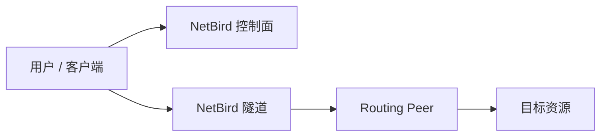

# 案例模板：填写场景名称

> 使用前请复制本模板到 `docs/cases/NN-topic.md`，并删除本提示。

## 1. 最终效果

写清楚用户照文档做完以后能访问什么、不能访问什么。

- 能访问：
- 不能访问：
- 验收标准：

## 2. 工作原理

用 3 到 5 条解释为什么这么做。



## 3. 示例参数

| 项目 | 示例值 | 你需要替换成 |
| --- | --- | --- |
| NetBird 域名 | `netbird.example.com` | 你的自建域名 |
| 路由节点 | `10.20.0.10` | 你的路由节点 |
| 目标资源 | `10.20.10.20:443` | 你的目标资源 |
| 用户组 | `example-users` | 你的用户组 |
| 资源组 | `example-resources` | 你的资源组 |

## 4. 上线前检查

在路由节点执行：

```bash
ip route
nc -vz 10.20.10.20 443
curl -k -I https://10.20.10.20
```

预期：

- 路由节点能访问目标资源。
- 目标服务监听预期端口。
- 后端防火墙允许路由节点来源。

## 5. 创建 Setup Key 和路由节点

Dashboard：

1. 打开 `Settings > Setup Keys`。
2. 创建 `example-routing-peer`。
3. Auto-assigned groups 添加 `example-routing-peers`。

路由节点：

```bash
curl -fsSL https://pkgs.netbird.io/install.sh | sh
sudo netbird up \
  --management-url https://netbird.example.com \
  --setup-key NBSETUP-EXAMPLE-REPLACE-ME
```

## 6. 创建 Network 和资源

| 资源名 | 类型 | 值 | 资源组 |
| --- | --- | --- | --- |
| `example-service` | IP | `10.20.10.20/32` | `example-resources` |

## 7. 创建访问策略

| 策略名 | 源组 | 目标组 | 协议 | 端口 |
| --- | --- | --- | --- | --- |
| `example-users-to-example-service` | `example-users` | `example-resources` | TCP | `443` |

## 8. 授权用户验证

```bash
netbird status
nc -vz 10.20.10.20 443
curl -k -I https://10.20.10.20
```

预期成功。

## 9. 非授权用户验证

```bash
nc -vz -w 5 10.20.10.20 443
curl -k -I --connect-timeout 5 https://10.20.10.20
```

预期失败。

## 10. 排障

### 10.1 路由节点不通

检查：

- 云安全组
- 本机防火墙
- 服务监听地址
- 路由表

### 10.2 授权用户不通

检查：

- 用户组
- 资源组
- 策略端口
- Routing Peer 在线状态

### 10.3 非授权用户也能通

检查：

- 默认 `All -> All`
- 资源是否加入 `All`
- 用户是否误加入授权组

## 11. 回滚

1. 禁用策略。
2. 禁用资源。
3. 移除用户组。
4. 下线路由节点：

```bash
sudo netbird down
sudo systemctl stop netbird
```

## 12. 扩展做法

- 高可用 Routing Peer。
- Domain Resource。
- Posture checks。
- 自动化部署。

## 13. 官方参考

- Routing Peers：https://docs.netbird.io/manage/networks/how-routing-peers-work
- Networks：https://docs.netbird.io/manage/networks
- Access Control：https://docs.netbird.io/manage/access-control/manage-network-access
